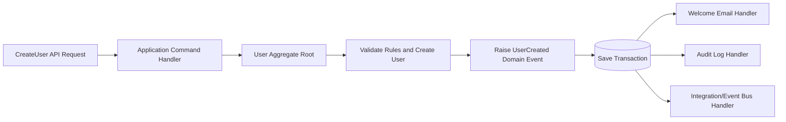

# Aggregate And Aggregate Root  

In Domain-Driven Design (DDD), an **Aggregate** is a group of related domain objects
(entities and value objects) that are treated as one consistency boundary.

An **Aggregate Root** is the main entity in that aggregate.
It is the only object external code should use to modify anything inside the aggregate.

## What is an Aggregate?

An aggregate contains: 

- One aggregate root (for example, `Order`)
- Child entities/value objects (for example, `OrderItem`)
- Business rules that must stay consistent together

If a rule must always be valid, enforce it through the aggregate root.

## Why it matters

- Protects business rules (invariants) in one place.
- Prevents invalid state changes by controlling access to child entities.
- Defines a clear transaction boundary.

## Quick Real-World View

`Order` + its `OrderItem` rows form one aggregate.
You do not update `OrderItem` directly from outside.
Instead, you call methods on `Order`, and `Order` decides if the change is valid.

## Simple Example: Order Aggregate

Assume we have:

- `Order` (aggregate root)
- `OrderItem` (child entity)

Rule:

- You cannot add an item with quantity `<= 0`.
- You cannot remove items after the order is submitted.
- You cannot submit an order with no items.

```csharp
public class Order
{
    private readonly List<OrderItem> _items = new();

    public Guid Id { get; private set; }
    public IReadOnlyCollection<OrderItem> Items => _items.AsReadOnly();
    public bool IsSubmitted { get; private set; }

    public Order(Guid id)
    {
        Id = id;
    }

    public void AddItem(Guid productId, int quantity)
    {
        if (IsSubmitted)
            throw new InvalidOperationException("Cannot add items to a submitted order.");

        if (quantity <= 0)
            throw new ArgumentException("Quantity must be greater than zero.");

        var existing = _items.FirstOrDefault(i => i.ProductId == productId);
        if (existing is not null)
        {
            existing.IncreaseQuantity(quantity);
            return;
        }

        _items.Add(new OrderItem(productId, quantity));
    }

    public void RemoveItem(Guid productId)
    {
        if (IsSubmitted)
            throw new InvalidOperationException("Cannot remove items from a submitted order.");

        _items.RemoveAll(i => i.ProductId == productId);
    }

    public void Submit()
    {
        if (_items.Count == 0)
            throw new InvalidOperationException("Order must contain at least one item before submission.");

        IsSubmitted = true;
    }
}

public class OrderItem
{
    public Guid ProductId { get; private set; }
    public int Quantity { get; private set; }

    public OrderItem(Guid productId, int quantity)
    {
        if (quantity <= 0)
            throw new ArgumentException("Quantity must be greater than zero.");

        ProductId = productId;
        Quantity = quantity;
    }

    public void IncreaseQuantity(int amount)
    {
        if (amount <= 0)
            throw new ArgumentException("Increase amount must be greater than zero.");

        Quantity += amount;
    }
}
```

## Example Flow

```csharp
var order = new Order(Guid.NewGuid());

order.AddItem(productId: Guid.Parse("11111111-1111-1111-1111-111111111111"), quantity: 2);
order.AddItem(productId: Guid.Parse("22222222-2222-2222-2222-222222222222"), quantity: 1);

order.Submit(); // Valid: order has items

// order.RemoveItem(...) here would throw because the order is already submitted.
```

## Key Point

`Order` is the aggregate root. External code should call `Order.AddItem`, `Order.RemoveItem`, and `Order.Submit` instead of directly editing `OrderItem`.
That way, all business rules stay consistent.

## Domain Event (Brief)

A Domain Event represents something important that already happened in the domain,
for example: `OrderSubmitted`, `UserRegistered`, or `RoleAssigned`.

Why use Domain Events:

- Decoupling: the aggregate root keeps core business rules, while other reactions happen separately.
- Clean side effects: send email, write audit logs, publish integrations, or update read models outside the aggregate.
- Better modeling: the event names capture business language and meaningful history.

In practice, the aggregate root raises the event when state changes successfully.
Application/infrastructure handlers then process the event after the transaction,
so domain logic stays focused and easier to maintain.

## Real Example

Imagine your SaaS system creates a new user inside a tenant.

Business action:

- Tenant admin creates a user
- `User` aggregate root validates the rules
- User is created successfully
- Domain event `UserCreated` is raised

What the aggregate root should do:

- Validate domain rules
- Change its own state
- Raise `UserCreated`

What the aggregate root should not do directly:

- Send welcome email
- Write audit log
- Notify another microservice
- Update reporting/read model

Those are side effects and should happen in event handlers, not inside the aggregate root.

### Example Flow

1. API receives `CreateUser` request.
2. Application handler calls `User.Create(...)`.
3. `User` aggregate root checks business rules.
4. `User` aggregate root adds `UserCreated` domain event.
5. Transaction is saved.
6. Event handlers react:
   - Send welcome email
   - Write audit entry
   - Publish integration event if needed

### Small Example Code

```csharp
public sealed class User : AggregateRoot
{
    private User(Guid tenantId, string email, string fullName)
    {
        TenantId = tenantId;
        Email = email;
        FullName = fullName;
        IsActive = true;
    }

    public Guid TenantId { get; private set; }
    public string Email { get; private set; }
    public string FullName { get; private set; }
    public bool IsActive { get; private set; }

    public static User Create(Guid tenantId, string email, string fullName)
    {
        if (tenantId == Guid.Empty)
            throw new ArgumentException("TenantId is required.");

        if (string.IsNullOrWhiteSpace(email))
            throw new ArgumentException("Email is required.");

        var user = new User(tenantId, email, fullName);

        user.AddDomainEvent(new UserCreatedDomainEvent(user.Id, user.TenantId, user.Email));

        return user;
    }
}
```

Here, `User` only knows that a user was created.
It does not know how email sending or auditing works.
That separation keeps the domain model clean.

## Simple Drawing

Plain text version:



### Main Idea From The Drawing

The aggregate root is responsible for business correctness.
The event handlers are responsible for reactions after the business change happened.
This keeps responsibilities separate and avoids tightly coupled domain code.

## Related Docs

- [BaseEntity](./BaseEntity.md)
- [ValueObject](./ValueObject.md)
- [Error](./Error.md)
