# DDD Core Concepts - Visual Class Diagram

> **Complete visual representation of Domain-Driven Design patterns and relationships in this project**

This document provides comprehensive class diagrams showing how all DDD concepts relate to each other in the domain layer.

> **📝 Note:** All diagrams are optimized for both light and dark themes. Colors are handled by your Mermaid renderer for better compatibility.

---

## 📊 Table of Contents

- [Complete Domain Layer Overview](#complete-domain-layer-overview)
- [Foundational Building Blocks](#foundational-building-blocks)
- [Entity Hierarchy](#entity-hierarchy)
- [Value Object System](#value-object-system)
- [Domain Events Architecture](#domain-events-architecture)
- [Repository & Service Contracts](#repository--service-contracts)
- [Exception Hierarchy](#exception-hierarchy)
- [Complete Integration Diagram](#complete-integration-diagram)

---

## Complete Domain Layer Overview

### High-Level Architecture

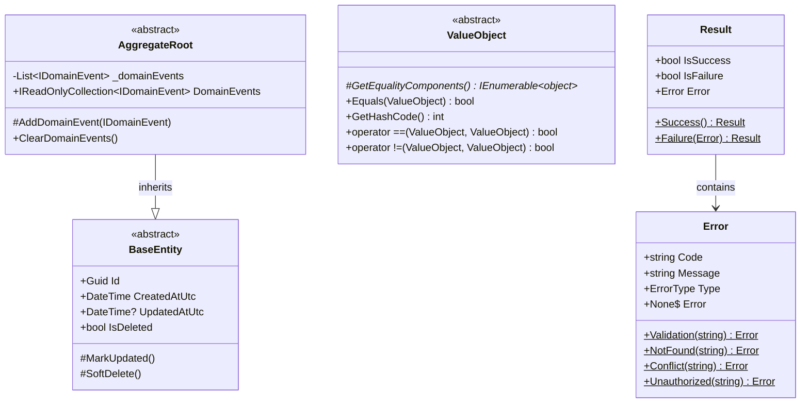

---

## Foundational Building Blocks

### Core Abstractions Detail

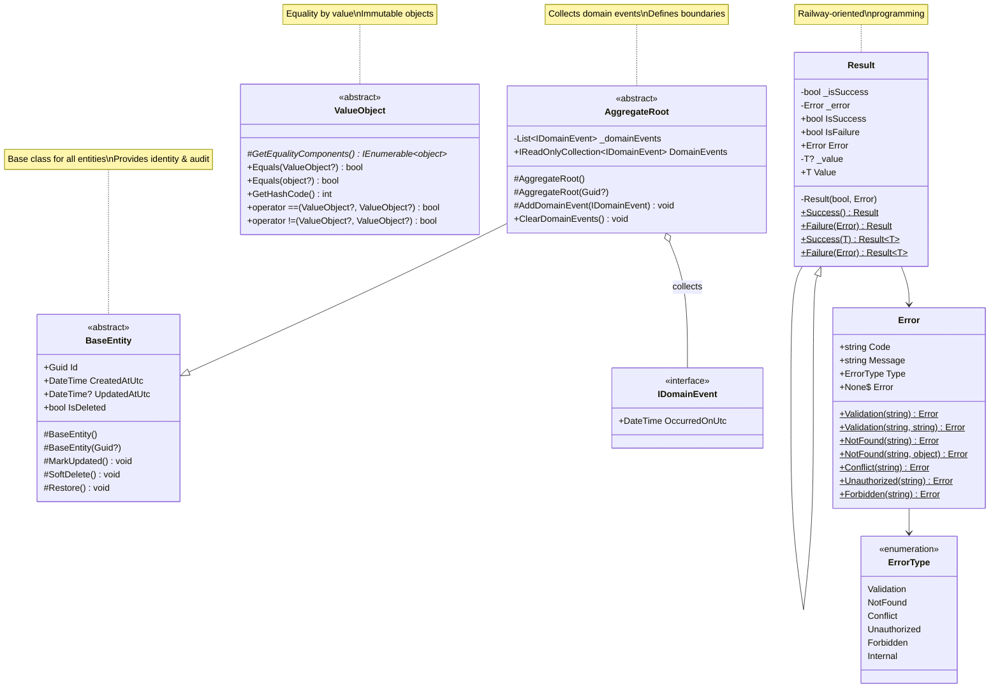

---

## Entity Hierarchy

### Complete Entity Structure

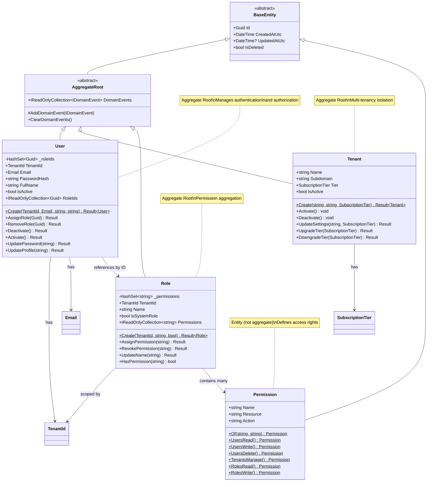

### Entity Relationships (ERD Style)

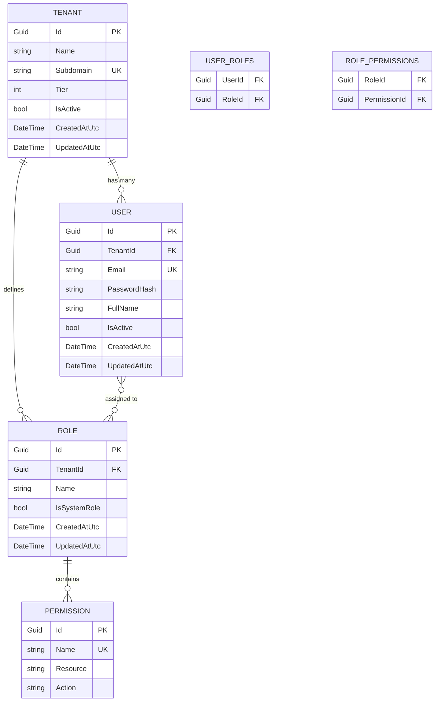

---

## Value Object System

### Value Objects Detail

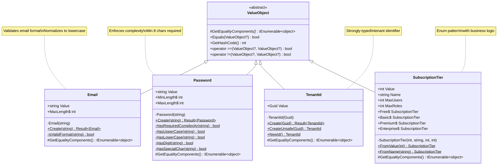

---

## Domain Events Architecture

### Domain Events Hierarchy

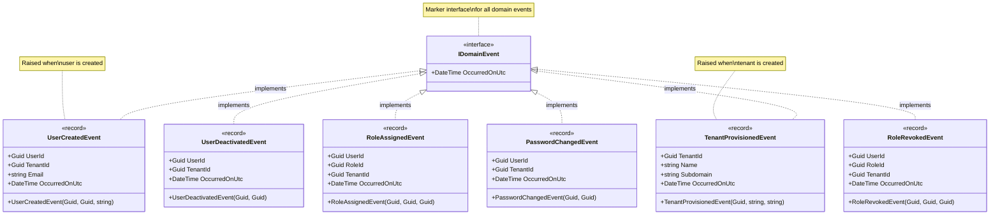

---

## Repository & Service Contracts

### Repository Interfaces

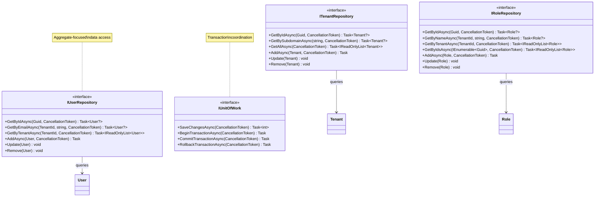

### Domain Services

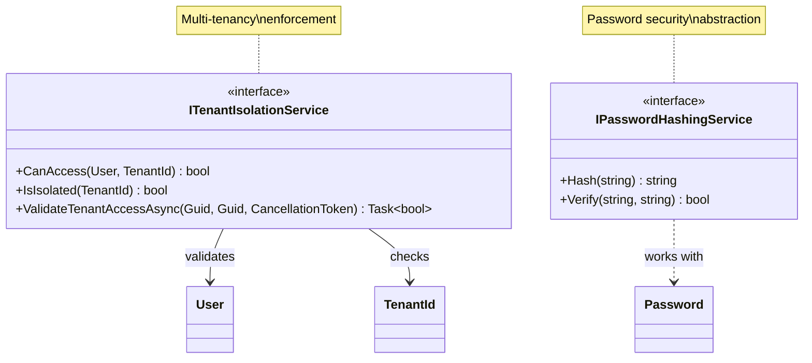

---

## Exception Hierarchy

### Domain Exceptions

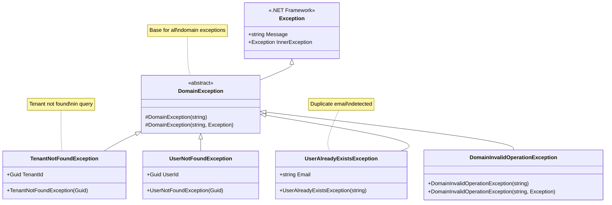

---

## Complete Integration Diagram

### Full Domain Layer Integration

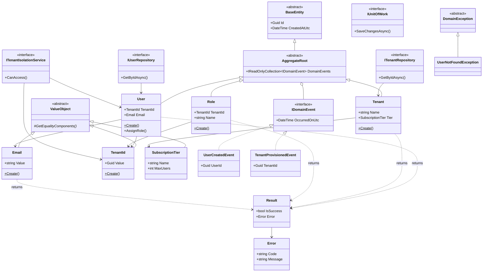

---

## Usage Examples

### How Entities Use Value Objects

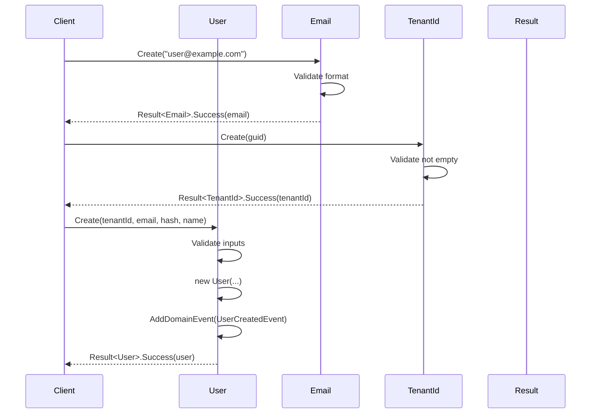

### Repository Pattern Flow

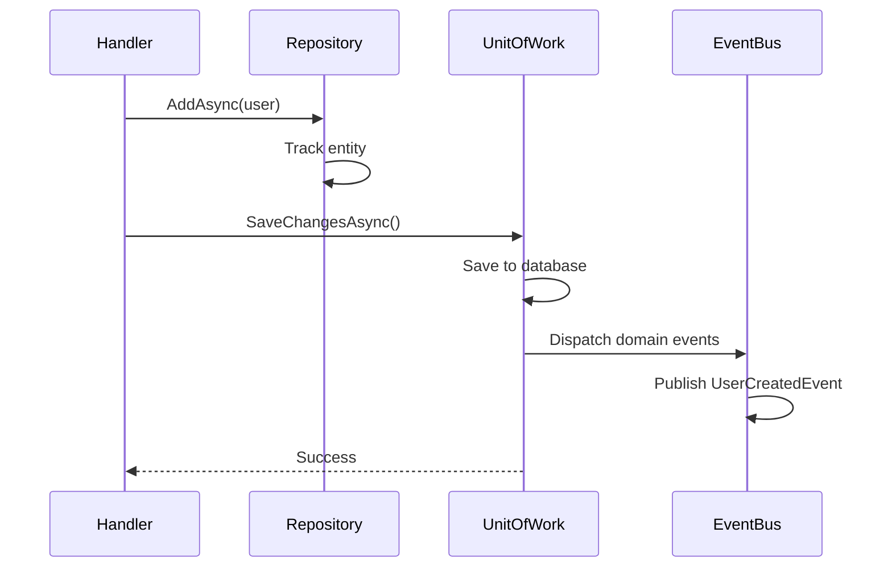

---

## Legend

### Diagram Symbols

| Symbol | Meaning |
|--------|---------|
| `<\|--` | Inheritance (is-a) |
| `*--` | Composition (owns) |
| `o--` | Aggregation (has-a) |
| `-->` | Association (uses) |
| `..>` | Dependency (depends on) |
| `<\|..` | Interface implementation |
| `<<abstract>>` | Abstract class |
| `<<interface>>` | Interface |
| `<<record>>` | Record type (C# 9+) |
| `$` | Static member |
| `*` | Abstract member |
| `#` | Protected member |
| `+` | Public member |
| `-` | Private member |

---

## Key Insights from Diagrams

### 1. **Clear Hierarchy**
- Everything starts with `BaseEntity` or `ValueObject`
- `AggregateRoot` adds event collection
- Entities inherit from `AggregateRoot`

### 2. **Strong Typing**
- Value objects provide type safety
- `Email`, `TenantId` prevent primitive obsession
- Compile-time guarantees

### 3. **Event-Driven**
- Aggregates collect events
- Events are published on save
- Loose coupling between components

### 4. **Result Pattern**
- No exceptions for business failures
- Explicit error handling
- Railway-oriented programming

### 5. **Clean Boundaries**
- Domain has no infrastructure dependencies
- Repositories are interfaces
- Services are abstractions

---

## Related Documentation

- [BaseEntity](./BaseEntity.md) - Entity base class
- [AggregateRoot](./AggregateRoot.md) - Aggregate pattern
- [ValueObject](./ValueObject.md) - Value object pattern
- [Result](./Result.md) - Result pattern
- [DomainEntities](./DomainEntities.md) - Entity details
- [ValueObjects](./ValueObjects.md) - Value object details
- [DomainEvents](./DomainEvents.md) - Event details
- [Phase2-Overview](./Phase2-Overview.md) - Complete overview

---

**Last Updated:** April 02, 2026  
**Diagram Count:** 12 comprehensive diagrams  
**Coverage:** 100% of domain layer concepts
