# Domain Entities - Deep Dive

## 📖 Table of Contents
- [What are Domain Entities?](#what-are-domain-entities)
- [Entity Design Principles](#entity-design-principles)
- [The Four Core Entities](#the-four-core-entities)
- [Entity Relationships](#entity-relationships)
- [Best Practices](#best-practices)

---

## What are Domain Entities?

**Domain Entities** are objects that have a **unique identity** and **lifecycle**. Unlike value objects, entities are:

- Identified by their ID (not by their attributes)
- Mutable (can change state over time)
- Responsible for maintaining invariants
- Capable of raising domain events

### Entity vs Value Object

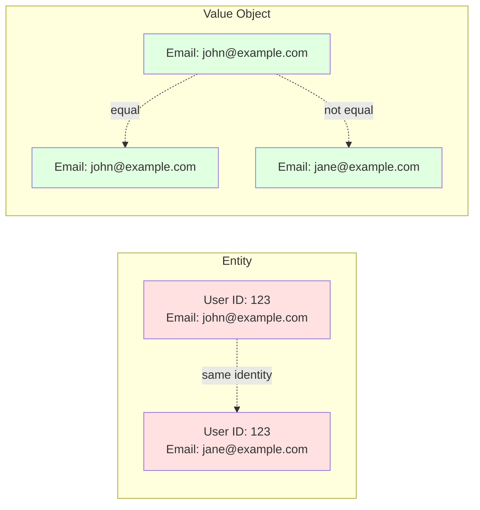

**Key Difference:** Two entities with the same ID are the same entity, even if their properties differ. Two value objects are equal only if all their properties match.

---

## Entity Design Principles

### 1. Encapsulation
```csharp
// ❌ BAD: Public setters expose internals
public class User
{
    public Guid Id { get; set; }
    public string Email { get; set; }
    public bool IsActive { get; set; }
}

// ✅ GOOD: Private setters, public methods
public class User : AggregateRoot
{
    public Guid Id { get; private set; }
    public Email Email { get; private set; }
    public bool IsActive { get; private set; }

    public Result Deactivate()
    {
        if (!IsActive) return Result.Success();
        IsActive = false;
        AddDomainEvent(new UserDeactivatedEvent(Id));
        return Result.Success();
    }
}
```

### 2. Aggregate Roots
Only **aggregate roots** can be accessed from outside. Internal entities must go through the root.

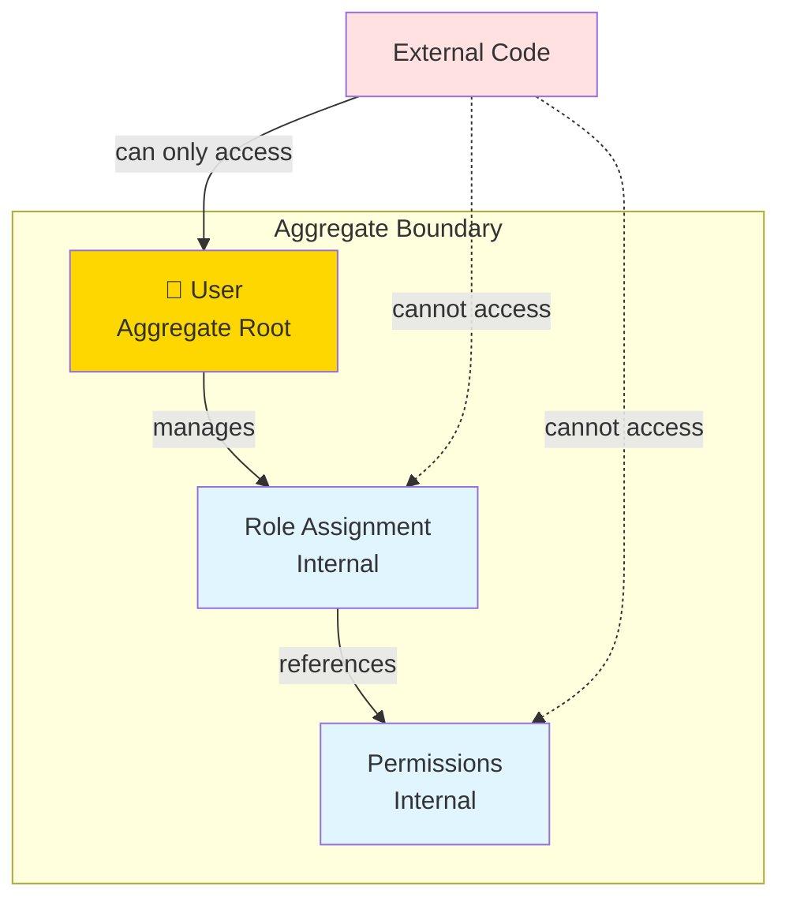

### 3. Factory Methods
Use static factory methods to enforce creation rules:

```csharp
public static Result<User> Create(
    TenantId tenantId, 
    Email email, 
    string passwordHash, 
    string fullName)
{
    // Validation
    if (string.IsNullOrWhiteSpace(passwordHash))
        return Result<User>.Failure(Error.Validation("Password hash is required."));

    if (string.IsNullOrWhiteSpace(fullName))
        return Result<User>.Failure(Error.Validation("Full name is required."));

    // Create entity
    var user = new User(tenantId, email, passwordHash, fullName.Trim());

    // Raise domain event
    user.AddDomainEvent(new UserCreatedEvent(user.Id, user.TenantId.Value, user.Email.Value));

    return Result<User>.Success(user);
}
```

### 4. Domain Events
Entities raise events for significant state changes:

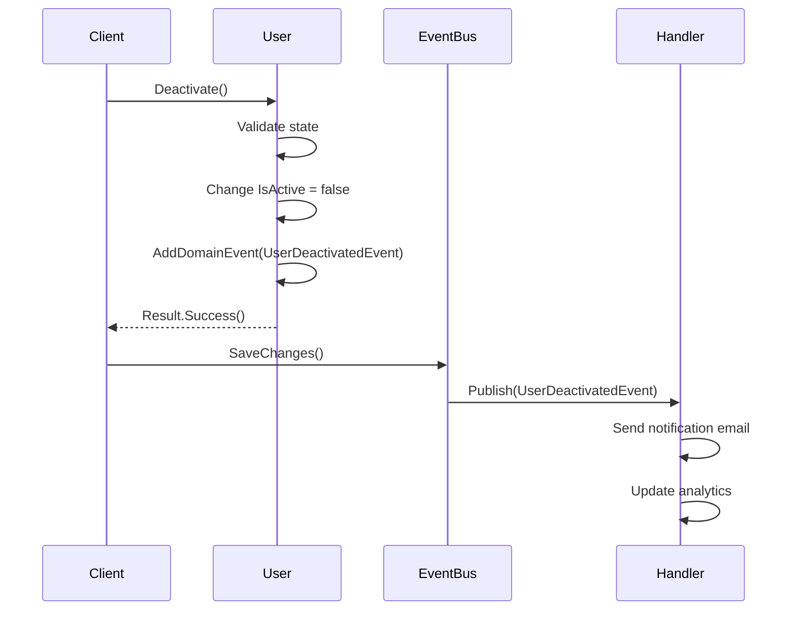

---

## The Four Core Entities

### 1. 👤 User Entity

**Purpose:** Manages user authentication, authorization, and lifecycle within a tenant.

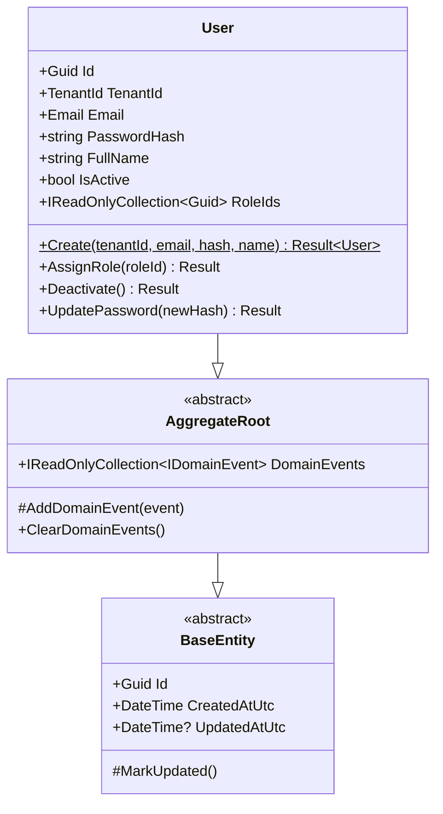

**Key Responsibilities:**
- ✅ User authentication (password management)
- ✅ Role assignment within tenant
- ✅ Account activation/deactivation
- ✅ User profile management

**Business Rules:**
```csharp
// Cannot assign role to inactive user
public Result AssignRole(Guid roleId)
{
    if (!IsActive)
        return Result.Failure(Error.Conflict("Cannot assign role to inactive user."));

    if (roleId == Guid.Empty)
        return Result.Failure(Error.Validation("RoleId cannot be empty."));

    if (_roleIds.Add(roleId))
    {
        MarkUpdated();
        AddDomainEvent(new RoleAssignedEvent(Id, roleId, TenantId.Value));
    }

    return Result.Success();
}
```

**Domain Events:**
- `UserCreatedEvent` - New user registered
- `UserDeactivatedEvent` - User account disabled
- `RoleAssignedEvent` - Role granted to user
- `PasswordChangedEvent` - Password updated

---

### 2. 🏢 Tenant Entity

**Purpose:** Represents a customer organization with isolated data and configuration.

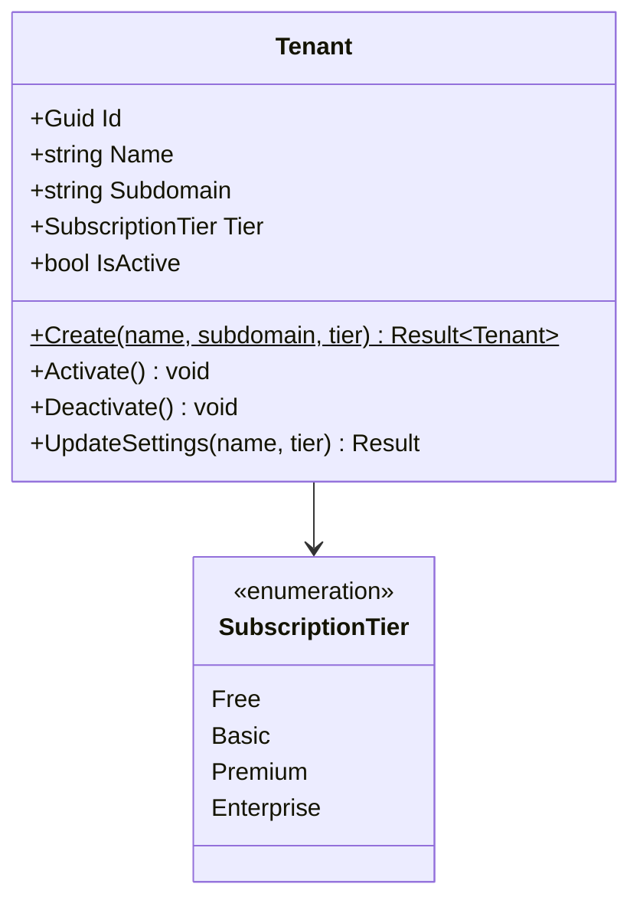

**Key Responsibilities:**
- ✅ Tenant provisioning and configuration
- ✅ Subscription tier management
- ✅ Tenant activation/deactivation
- ✅ Subdomain uniqueness

**Business Rules:**
```csharp
public static Result<Tenant> Create(string name, string subdomain, SubscriptionTier tier)
{
    if (string.IsNullOrWhiteSpace(name))
        return Result<Tenant>.Failure(Error.Validation("Tenant name is required."));

    // Subdomain must be valid URL-safe string
    if (string.IsNullOrWhiteSpace(subdomain) || subdomain.Contains(' '))
        return Result<Tenant>.Failure(Error.Validation("Subdomain is invalid."));

    var tenant = new Tenant(
        name.Trim(), 
        subdomain.Trim().ToLowerInvariant(), 
        tier);

    tenant.AddDomainEvent(new TenantProvisionedEvent(tenant.Id, tenant.Name, tenant.Subdomain));

    return Result<Tenant>.Success(tenant);
}
```

**Domain Events:**
- `TenantProvisionedEvent` - New tenant created

**Multi-Tenancy Pattern:**
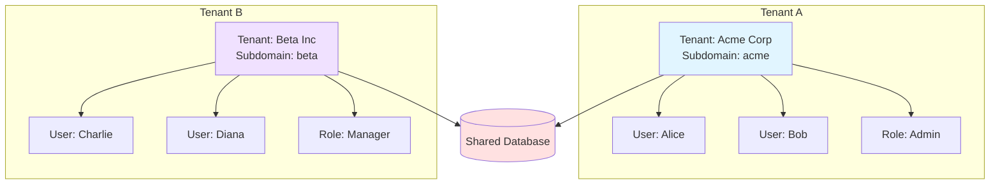

---

### 3. 🎭 Role Entity

**Purpose:** Manages permissions within a tenant scope.

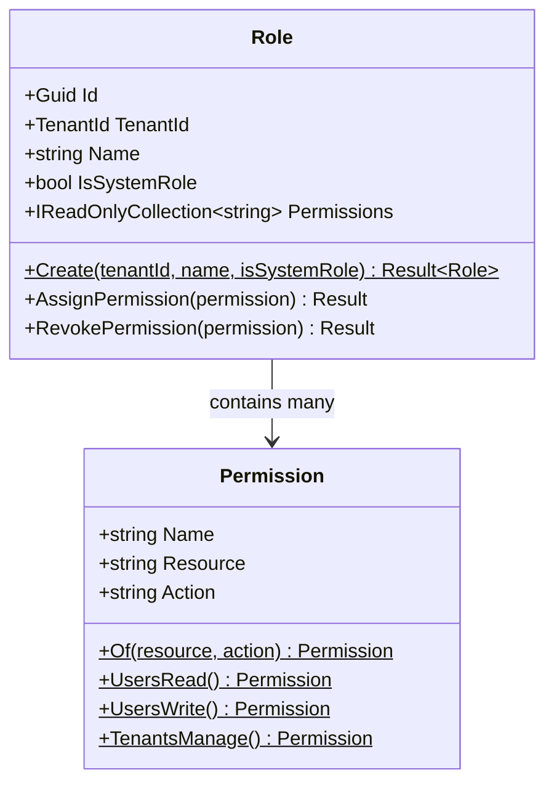

**Key Responsibilities:**
- ✅ Permission aggregation
- ✅ Role naming and identification
- ✅ System vs custom role distinction
- ✅ Tenant-scoped role isolation

**Business Rules:**
```csharp
// System roles cannot have permissions revoked
public Result RevokePermission(string permission)
{
    if (IsSystemRole)
        return Result.Failure(
            Error.Conflict("Cannot revoke permissions from a system role."));

    if (_permissions.Remove(permission.Trim()))
        MarkUpdated();

    return Result.Success();
}
```

**Permission Model:**
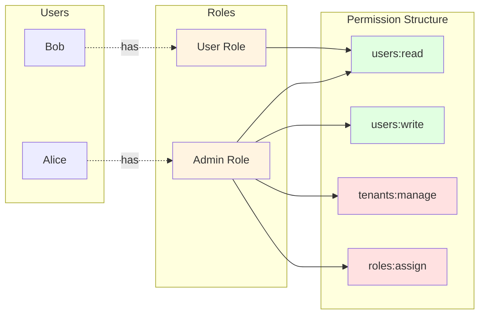

---

### 4. 🔐 Permission Entity

**Purpose:** Defines canonical permissions using resource:action pattern.

```csharp
public sealed class Permission : BaseEntity
{
    public string Name { get; private set; }      // "users:read"
    public string Resource { get; private set; }  // "users"
    public string Action { get; private set; }    // "read"

    public static Permission Of(string resource, string action)
    {
        var normalizedResource = resource.Trim().ToLowerInvariant();
        var normalizedAction = action.Trim().ToLowerInvariant();
        return new Permission(
            $"{normalizedResource}:{normalizedAction}", 
            normalizedResource, 
            normalizedAction);
    }

    // Predefined permissions
    public static Permission UsersRead() => Of("users", "read");
    public static Permission UsersWrite() => Of("users", "write");
    public static Permission TenantsManage() => Of("tenants", "manage");
}
```

**Permission Hierarchy:**
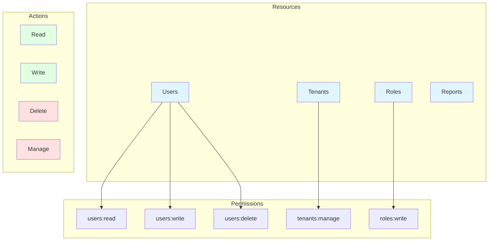

---

## Entity Relationships

### Complete Domain Model

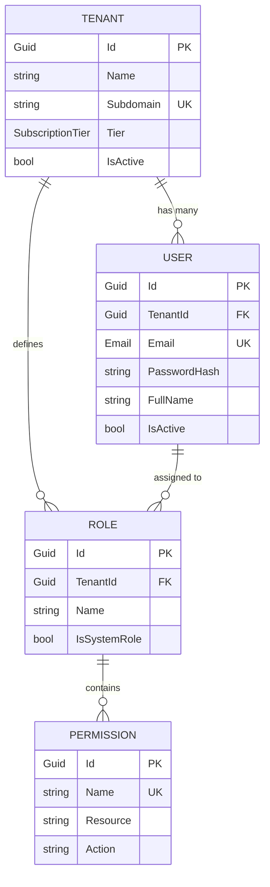

### Aggregate Boundaries

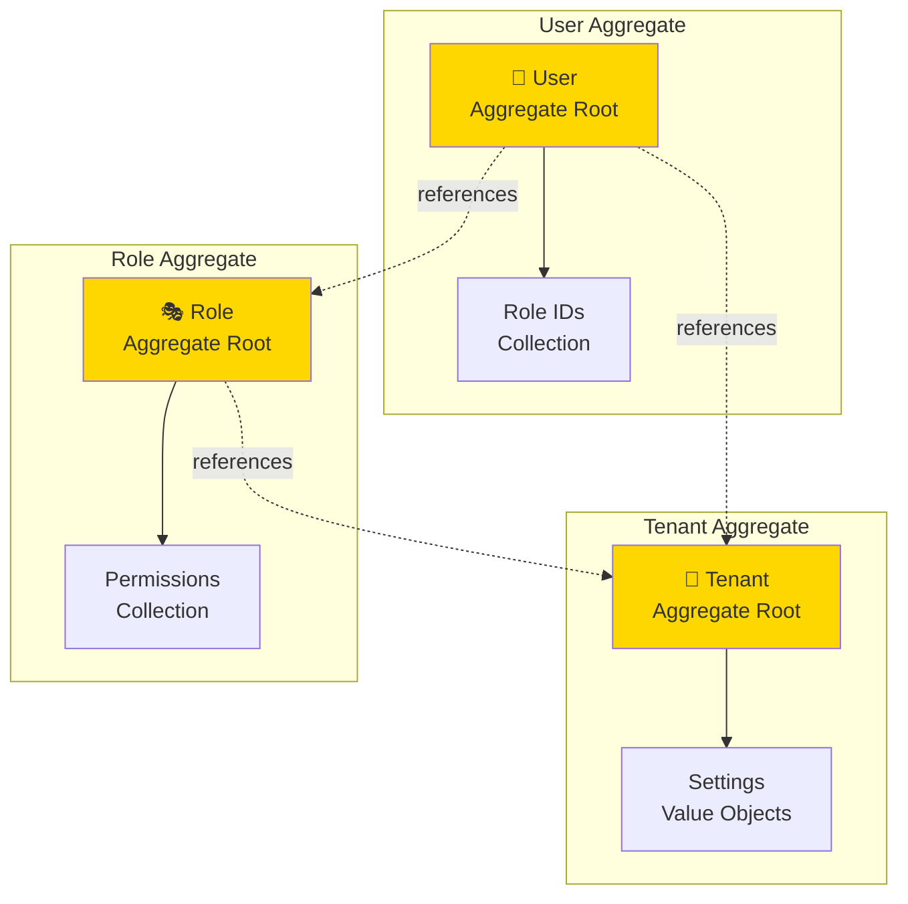

---

## Best Practices

### ✅ DO

1. **Use Factory Methods**
   ```csharp
   var userResult = User.Create(tenantId, email, hash, "John Doe");
   if (userResult.IsSuccess)
       await _repository.AddAsync(userResult.Value);
   ```

2. **Encapsulate State Changes**
   ```csharp
   public Result Deactivate()
   {
       IsActive = false;
       MarkUpdated();
       AddDomainEvent(new UserDeactivatedEvent(Id, TenantId.Value));
       return Result.Success();
   }
   ```

3. **Validate Invariants**
   ```csharp
   if (!IsActive)
       return Result.Failure(Error.Conflict("User is not active."));
   ```

4. **Raise Domain Events**
   ```csharp
   AddDomainEvent(new UserCreatedEvent(Id, TenantId.Value, Email.Value));
   ```

### ❌ DON'T

1. **Don't Use Public Setters**
   ```csharp
   // ❌ Exposes internal state
   public string Email { get; set; }
   ```

2. **Don't Create Anemic Models**
   ```csharp
   // ❌ Just a data container
   public class User
   {
       public Guid Id { get; set; }
       public string Email { get; set; }
   }
   ```

3. **Don't Access Other Aggregates Directly**
   ```csharp
   // ❌ Crossing aggregate boundaries
   var role = user.Tenant.Roles.First();
   ```

4. **Don't Perform Infrastructure Operations**
   ```csharp
   // ❌ Database access in entity
   public void Save() => _dbContext.SaveChanges();
   ```

---

## Summary

| Aspect | Description |
|--------|-------------|
| **Identity** | Entities have unique IDs |
| **Lifecycle** | Created, modified, deleted |
| **Encapsulation** | Private setters, public methods |
| **Validation** | Factory methods + business rules |
| **Events** | Raise events for state changes |
| **Boundaries** | Respect aggregate boundaries |
| **Purity** | No infrastructure dependencies |

---

**Next:** Learn about [Value Objects](./ValueObjects.md) for type safety and immutability.

**Last Updated:** April 02, 2026
