# Domain Events - Deep Dive

## 📖 Table of Contents
- [What are Domain Events?](#what-are-domain-events)
- [Why Use Domain Events?](#why-use-domain-events)
- [The Six Domain Events](#the-six-domain-events)
- [Event Handling Patterns](#event-handling-patterns)
- [Best Practices](#best-practices)

---

## What are Domain Events?

**Domain Events** are immutable objects that represent something significant that happened in the domain. They:

- Capture **important state changes**
- Are **raised by aggregate roots**
- Are **handled asynchronously**
- Enable **loose coupling** between aggregates
- Support **event sourcing** patterns

### Event-Driven Architecture

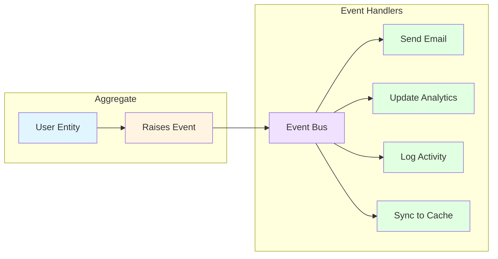

---

## Why Use Domain Events?

### Benefits

1. **🔗 Loose Coupling**
   - Aggregates don't know about side effects
   - Easy to add new handlers without changing entities

2. **📝 Audit Trail**
   - Events record what happened and when
   - Can reconstruct state from events

3. **🔄 Integration**
   - Notify external systems
   - Trigger workflows

4. **🧪 Testability**
   - Assert events were raised
   - Test handlers independently

### Without Events ❌

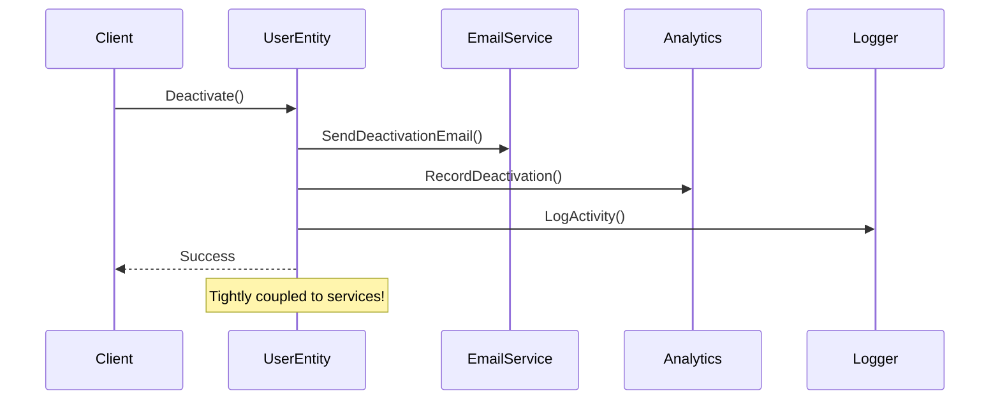

### With Events ✅

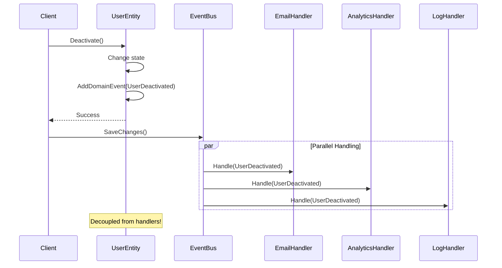

---

## The Six Domain Events

### 1. 👤 UserCreatedEvent

**Raised When:** A new user is successfully created and added to a tenant.

```csharp
public sealed record UserCreatedEvent(
    Guid UserId, 
    Guid TenantId, 
    string Email) : IDomainEvent
{
    public DateTime OccurredOnUtc { get; } = DateTime.UtcNow;
}
```

**Usage:**
```csharp
public static Result<User> Create(TenantId tenantId, Email email, string passwordHash, string fullName)
{
    // ... validation ...

    var user = new User(tenantId, email, passwordHash, fullName.Trim());

    // Raise domain event
    user.AddDomainEvent(new UserCreatedEvent(
        user.Id, 
        user.TenantId.Value, 
        user.Email.Value));

    return Result<User>.Success(user);
}
```

**Event Flow:**

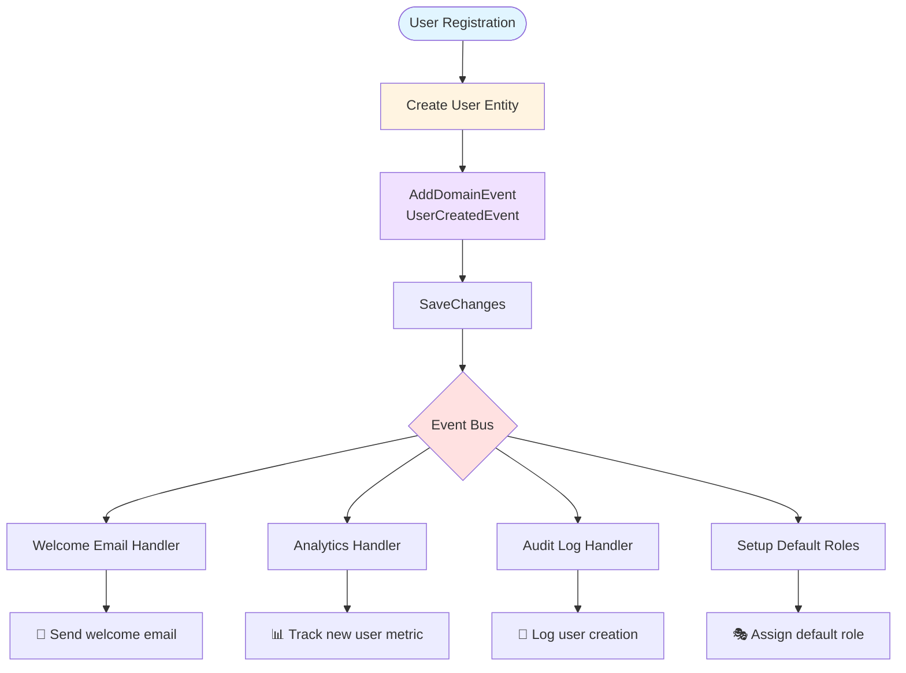

---

### 2. 🚫 UserDeactivatedEvent

**Raised When:** A user account is deactivated (soft delete).

```csharp
public sealed record UserDeactivatedEvent(
    Guid UserId, 
    Guid TenantId) : IDomainEvent
{
    public DateTime OccurredOnUtc { get; } = DateTime.UtcNow;
}
```

**Usage:**
```csharp
public Result Deactivate()
{
    if (!IsActive)
        return Result.Success();

    IsActive = false;
    MarkUpdated();

    AddDomainEvent(new UserDeactivatedEvent(Id, TenantId.Value));

    return Result.Success();
}
```

**Handler Examples:**

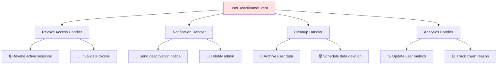

---

### 3. 🎭 RoleAssignedEvent

**Raised When:** A role is assigned to a user.

```csharp
public sealed record RoleAssignedEvent(
    Guid UserId, 
    Guid RoleId, 
    Guid TenantId) : IDomainEvent
{
    public DateTime OccurredOnUtc { get; } = DateTime.UtcNow;
}
```

**Usage:**
```csharp
public Result AssignRole(Guid roleId)
{
    if (!IsActive)
        return Result.Failure(Error.Conflict("Cannot assign role to inactive user."));

    if (_roleIds.Add(roleId))
    {
        MarkUpdated();
        AddDomainEvent(new RoleAssignedEvent(Id, roleId, TenantId.Value));
    }

    return Result.Success();
}
```

**Permission Cascade:**

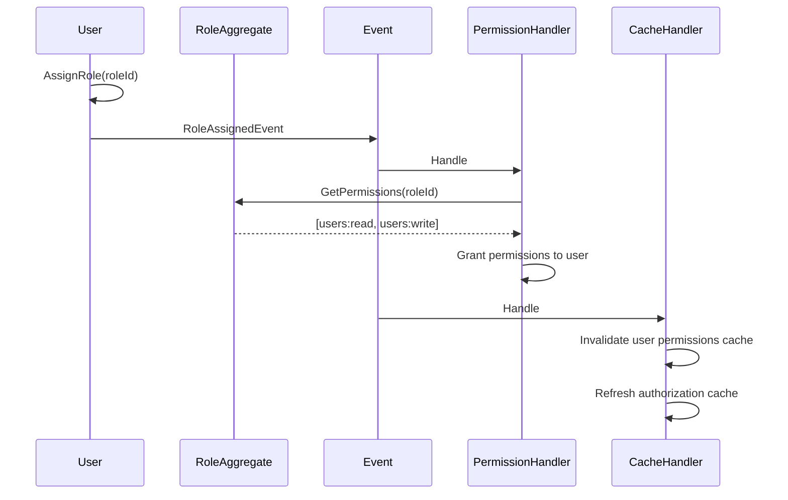

---

### 4. 🔑 PasswordChangedEvent

**Raised When:** A user's password is updated.

```csharp
public sealed record PasswordChangedEvent(
    Guid UserId, 
    Guid TenantId) : IDomainEvent
{
    public DateTime OccurredOnUtc { get; } = DateTime.UtcNow;
}
```

**Usage:**
```csharp
public Result UpdatePassword(string newPasswordHash)
{
    if (string.IsNullOrWhiteSpace(newPasswordHash))
        return Result.Failure(Error.Validation("New password hash is required."));

    PasswordHash = newPasswordHash;
    MarkUpdated();

    AddDomainEvent(new PasswordChangedEvent(Id, TenantId.Value));

    return Result.Success();
}
```

**Security Flow:**

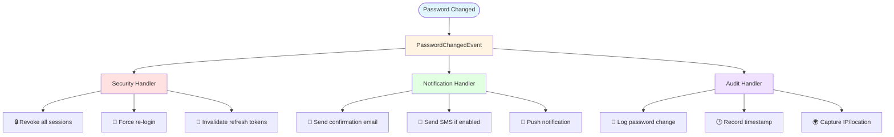

---

### 5. 🏢 TenantProvisionedEvent

**Raised When:** A new tenant is created and provisioned.

```csharp
public sealed record TenantProvisionedEvent(
    Guid TenantId, 
    string Name, 
    string Subdomain) : IDomainEvent
{
    public DateTime OccurredOnUtc { get; } = DateTime.UtcNow;
}
```

**Usage:**
```csharp
public static Result<Tenant> Create(string name, string subdomain, SubscriptionTier tier)
{
    // ... validation ...

    var tenant = new Tenant(
        name.Trim(), 
        subdomain.Trim().ToLowerInvariant(), 
        tier);

    tenant.AddDomainEvent(new TenantProvisionedEvent(
        tenant.Id, 
        tenant.Name, 
        tenant.Subdomain));

    return Result<Tenant>.Success(tenant);
}
```

**Provisioning Workflow:**

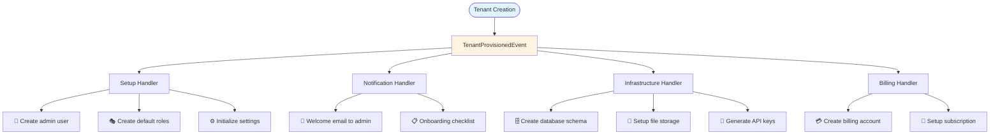

---

### 6. 🔄 Additional Events (Implicit)

While not explicitly created in Day 4, these events are commonly needed:

```csharp
// User role removal
public sealed record RoleRevokedEvent(
    Guid UserId, 
    Guid RoleId, 
    Guid TenantId) : IDomainEvent
{
    public DateTime OccurredOnUtc { get; } = DateTime.UtcNow;
}

// Tenant settings updated
public sealed record TenantSettingsUpdatedEvent(
    Guid TenantId, 
    string NewName, 
    SubscriptionTier NewTier) : IDomainEvent
{
    public DateTime OccurredOnUtc { get; } = DateTime.UtcNow;
}
```

---

## Event Handling Patterns

### Pattern 1: Immediate Consistency

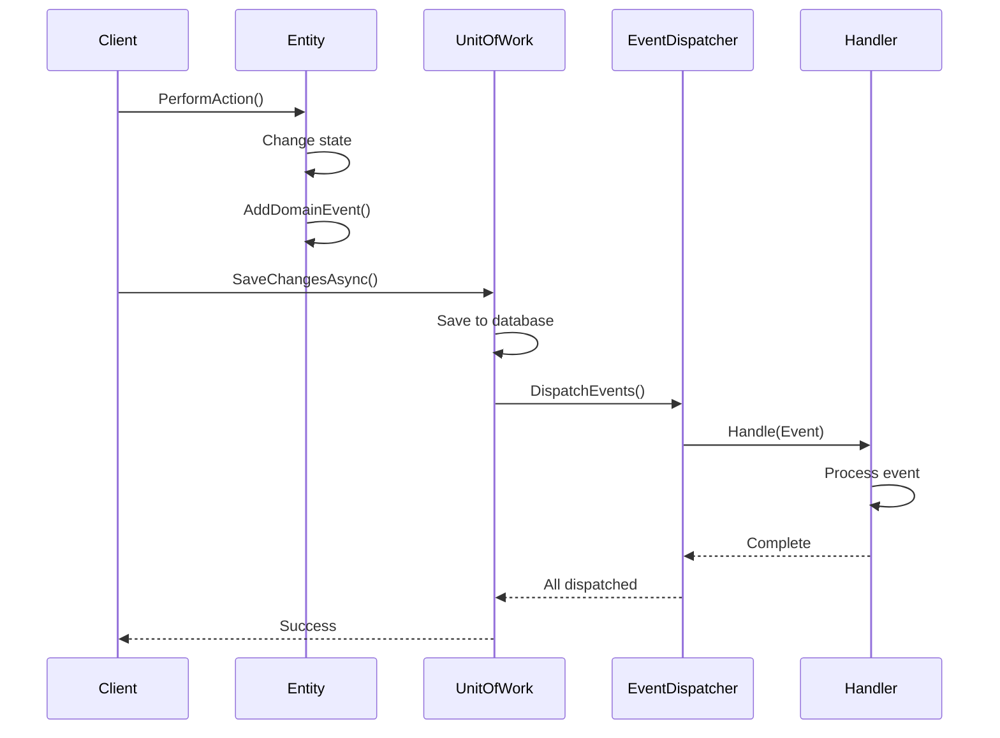

### Pattern 2: Eventual Consistency

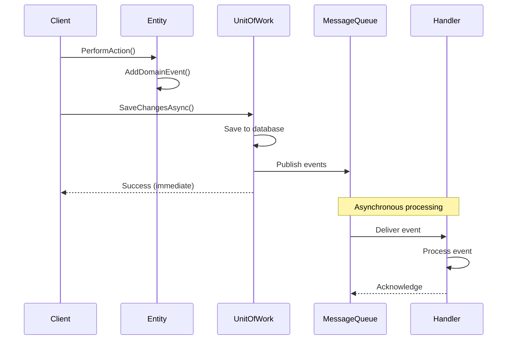

### Pattern 3: Event Sourcing

```mermaid
flowchart LR
    subgraph "Event Store"
        E1[Event 1:<br/>UserCreated]
        E2[Event 2:<br/>RoleAssigned]
        E3[Event 3:<br/>PasswordChanged]
        E4[Event 4:<br/>UserDeactivated]
    end

    subgraph "Replay"
        Replay[Event Replay]
        State[Current State]
    end

    E1 --> Replay
    E2 --> Replay
    E3 --> Replay
    E4 --> Replay

    Replay --> State

    style E1 fill:#e1ffe1
    style E2 fill:#e1ffe1
    style E3 fill:#fff4e1
    style E4 fill:#ffe1e1
```

---

## IDomainEvent Interface

```csharp
namespace Domain.Events;

public interface IDomainEvent
{
    DateTime OccurredOnUtc { get; }
}
```

**Purpose:**
- Marker interface for all domain events
- Provides timestamp for event ordering
- Used by infrastructure for event dispatching

**Implementation in AggregateRoot:**

```csharp
public abstract class AggregateRoot : BaseEntity
{
    private readonly List<IDomainEvent> _domainEvents = new();

    public IReadOnlyCollection<IDomainEvent> DomainEvents => 
        _domainEvents.AsReadOnly();

    protected void AddDomainEvent(IDomainEvent @event)
    {
        if (@event is null)
            throw new ArgumentNullException(nameof(@event));

        _domainEvents.Add(@event);
    }

    public void ClearDomainEvents() => _domainEvents.Clear();
}
```

**Event Collection Flow:**

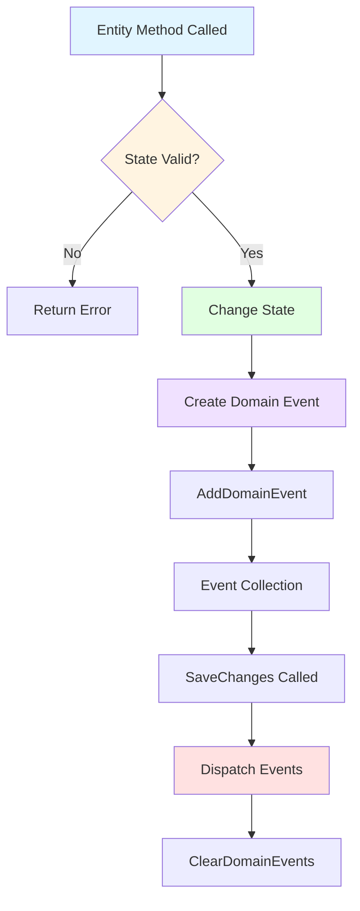

---

## Best Practices

### ✅ DO

1. **Use Record Types**
   ```csharp
   public sealed record UserCreatedEvent(...) : IDomainEvent;
   ```
   - Immutable by default
   - Value equality
   - Concise syntax

2. **Include Relevant Data**
   ```csharp
   public sealed record UserCreatedEvent(
       Guid UserId,      // Who
       Guid TenantId,    // Where
       string Email)     // What
       : IDomainEvent;
   ```

3. **Name Events in Past Tense**
   ```csharp
   UserCreated ✅       // Something that happened
   CreateUser  ❌       // Command, not event
   UserCreating ❌      // Not past tense
   ```

4. **Keep Events Small**
   ```csharp
   // ✅ Essential data only
   public sealed record UserDeactivatedEvent(Guid UserId, Guid TenantId);

   // ❌ Too much data
   public sealed record UserDeactivatedEvent(
       Guid UserId, Guid TenantId, string Email, string FullName, 
       List<Guid> RoleIds, DateTime CreatedAt, ...);
   ```

5. **Raise Events from Aggregates**
   ```csharp
   public Result Deactivate()
   {
       IsActive = false;
       AddDomainEvent(new UserDeactivatedEvent(Id, TenantId.Value));
       return Result.Success();
   }
   ```

### ❌ DON'T

1. **Don't Mutate Events**
   ```csharp
   // ❌ Events must be immutable
   public class UserCreatedEvent
   {
       public Guid UserId { get; set; }  // ❌ Mutable
   }
   ```

2. **Don't Handle Events in Entities**
   ```csharp
   // ❌ Entity shouldn't handle its own events
   public Result Deactivate()
   {
       IsActive = false;
       SendDeactivationEmail();  // ❌ Side effect
       return Result.Success();
   }
   ```

3. **Don't Include Behavior**
   ```csharp
   // ❌ Events are data, not behavior
   public sealed record UserCreatedEvent(...)
   {
       public void SendWelcomeEmail() { ... }  // ❌ No!
   }
   ```

4. **Don't Reference Other Aggregates**
   ```csharp
   // ❌ Event shouldn't hold aggregate references
   public sealed record RoleAssignedEvent(User User, Role Role);

   // ✅ Use IDs instead
   public sealed record RoleAssignedEvent(Guid UserId, Guid RoleId);
   ```

---

## Event Timeline Example

```mermaid
gantt
    title User Lifecycle Events
    dateFormat  HH:mm:ss

    section User Registration
    UserCreatedEvent           :done, 10:00:00, 1s
    Welcome Email Sent         :done, 10:00:01, 2s
    Default Role Assigned      :done, 10:00:03, 1s

    section Active Usage
    RoleAssignedEvent (Admin)  :done, 10:05:00, 1s
    PasswordChangedEvent       :done, 10:15:00, 1s
    Sessions Revoked           :done, 10:15:01, 1s

    section Account Closure
    UserDeactivatedEvent       :done, 11:00:00, 1s
    Access Revoked             :done, 11:00:01, 1s
    Deactivation Notice Sent   :done, 11:00:02, 2s
```

---

## Summary

Domain Events provide:

- 📢 **Communication** - Between aggregates
- 🔗 **Decoupling** - Loose coupling
- 📝 **Audit** - Complete history
- 🔄 **Integration** - External systems
- 🧪 **Testability** - Assert events
- 📊 **Analytics** - Track behavior

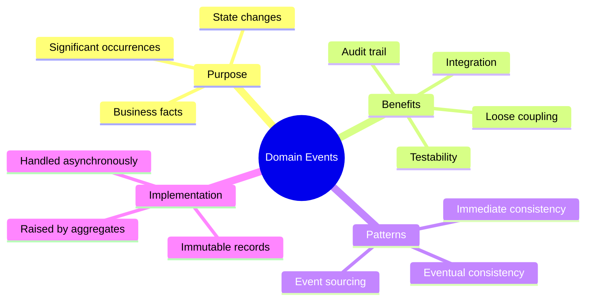

---

**Next:** Learn about [Domain Exceptions](./DomainExceptions.md) for error handling.

**Last Updated:** April 02, 2026
