# Domain Exceptions & Repository Interfaces - Deep Dive

## 📖 Table of Contents
- [Domain Exceptions](#domain-exceptions)
- [Repository Interfaces](#repository-interfaces)
- [Domain Services](#domain-services)
- [Integration Patterns](#integration-patterns)
- [Best Practices](#best-practices)

---

## Domain Exceptions

### What are Domain Exceptions?

**Domain Exceptions** are exceptions that represent violations of **business rules** or **domain invariants**. They:

- Inherit from a common `DomainException` base class
- Represent **expected exceptional cases** in the domain
- Are **meaningful** to the business
- Should be **caught and handled** appropriately

### Exception Hierarchy

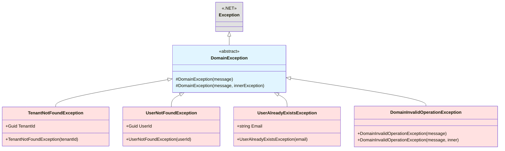

---

### The Five Domain Exceptions

#### 1. 🏗️ DomainException (Base Class)

```csharp
namespace Domain.Exceptions;

public abstract class DomainException : Exception
{
    protected DomainException(string message) : base(message)
    {
    }

    protected DomainException(string message, Exception innerException) 
        : base(message, innerException)
    {
    }
}
```

**Purpose:**
- Base class for all domain exceptions
- Provides consistent exception handling
- Can be caught to handle all domain errors

**Usage Pattern:**
```csharp
try
{
    // Domain operation
}
catch (DomainException ex)
{
    // Handle all domain exceptions
    _logger.LogWarning(ex, "Domain rule violation");
    return BadRequest(ex.Message);
}
```

---

#### 2. 🏢 TenantNotFoundException

```csharp
namespace Domain.Exceptions;

public sealed class TenantNotFoundException : DomainException
{
    public TenantNotFoundException(Guid tenantId)
        : base($"Tenant '{tenantId}' was not found.")
    {
        TenantId = tenantId;
    }

    public Guid TenantId { get; }
}
```

**When to Throw:**
```csharp
public async Task<Tenant> GetTenantAsync(Guid tenantId)
{
    var tenant = await _repository.GetByIdAsync(tenantId);

    if (tenant is null)
        throw new TenantNotFoundException(tenantId);

    return tenant;
}
```

**Exception Flow:**

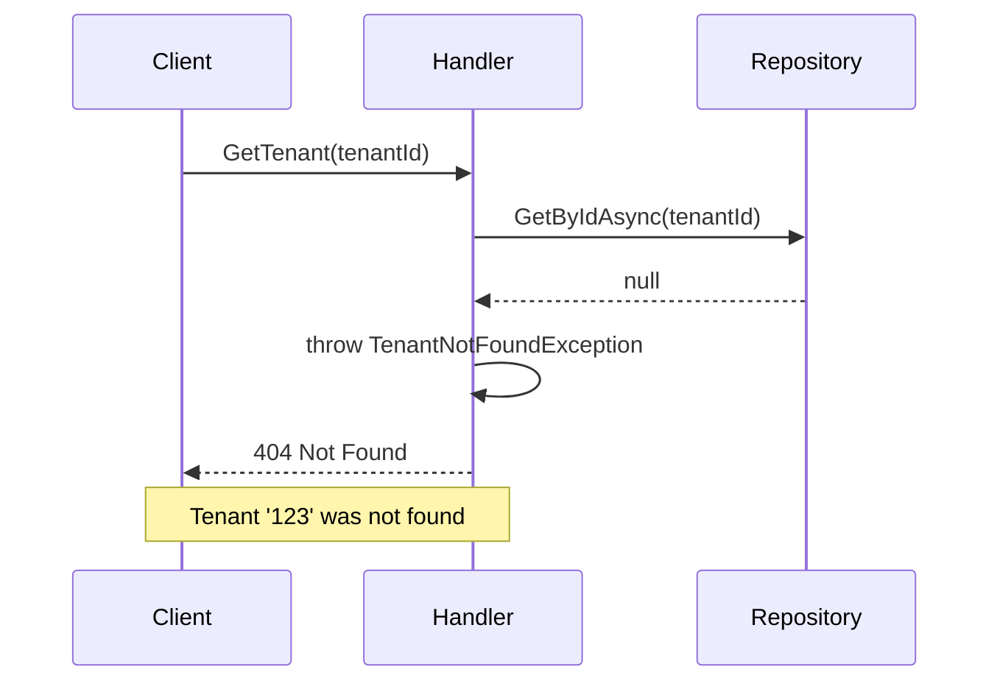

---

#### 3. 👤 UserNotFoundException

```csharp
namespace Domain.Exceptions;

public sealed class UserNotFoundException : DomainException
{
    public UserNotFoundException(Guid userId)
        : base($"User '{userId}' was not found.")
    {
        UserId = userId;
    }

    public Guid UserId { get; }
}
```

**When to Throw:**
```csharp
public async Task<User> GetUserByIdAsync(Guid userId)
{
    var user = await _repository.GetByIdAsync(userId);

    if (user is null)
        throw new UserNotFoundException(userId);

    return user;
}
```

**Multi-Tenant Context:**

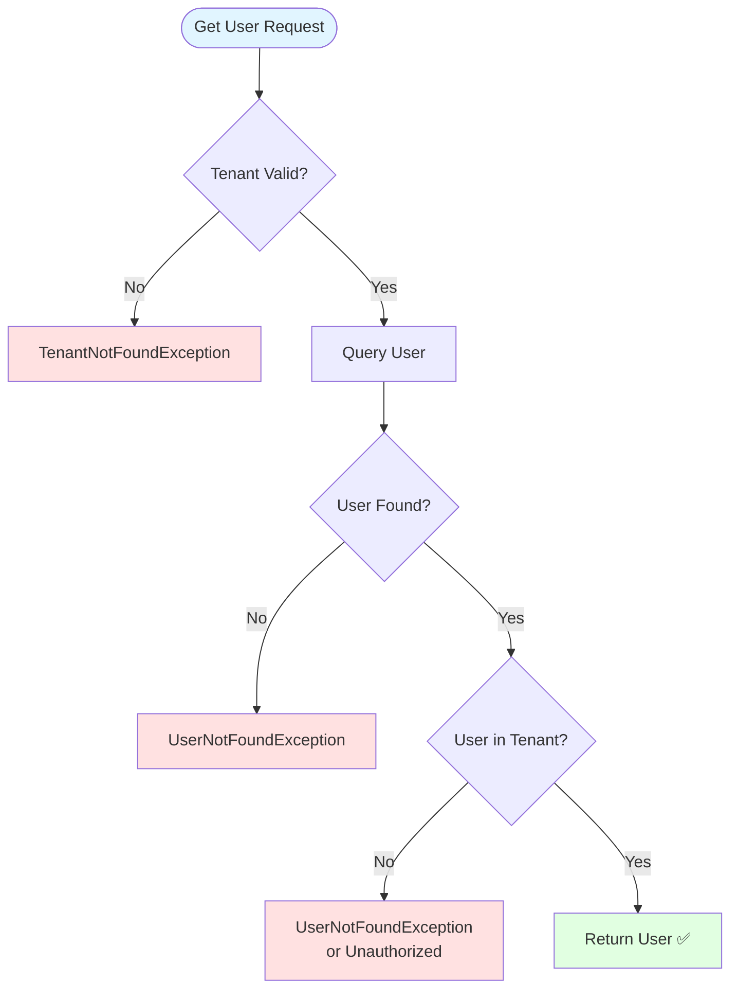

---

#### 4. 🚫 UserAlreadyExistsException

```csharp
namespace Domain.Exceptions;

public sealed class UserAlreadyExistsException : DomainException
{
    public UserAlreadyExistsException(string email)
        : base($"User with email '{email}' already exists.")
    {
        Email = email;
    }

    public string Email { get; }
}
```

**When to Throw:**
```csharp
public async Task<User> CreateUserAsync(CreateUserCommand command)
{
    var existingUser = await _repository.GetByEmailAsync(
        command.TenantId, 
        command.Email);

    if (existingUser is not null)
        throw new UserAlreadyExistsException(command.Email);

    // Create new user...
}
```

**Duplicate Detection Flow:**

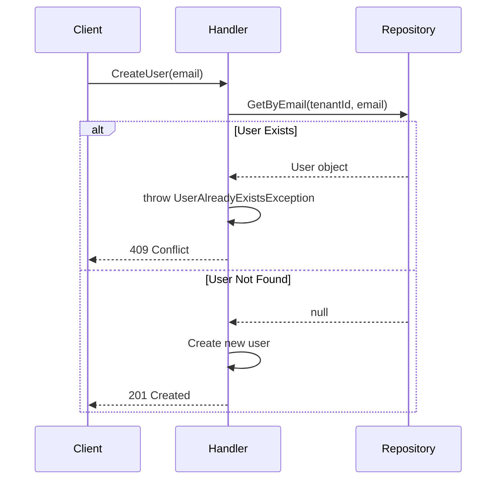

---

#### 5. ⚠️ DomainInvalidOperationException

```csharp
namespace Domain.Exceptions;

public sealed class DomainInvalidOperationException : DomainException
{
    public DomainInvalidOperationException(string message)
        : base(message)
    {
    }

    public DomainInvalidOperationException(string message, Exception innerException)
        : base(message, innerException)
    {
    }
}
```

**When to Throw:**
```csharp
public Result Deactivate()
{
    if (!IsActive)
        throw new DomainInvalidOperationException("User is already inactive.");

    IsActive = false;
    return Result.Success();
}

public Result AssignRole(Guid roleId)
{
    if (!IsActive)
        throw new DomainInvalidOperationException(
            "Cannot assign role to inactive user.");

    // Assign role...
}
```

---

### Exception vs Result Pattern

#### When to Use Exceptions ❌

```csharp
// For exceptional, unexpected cases
public User GetUserById(Guid userId)
{
    var user = _repository.GetByIdAsync(userId);

    if (user is null)
        throw new UserNotFoundException(userId);  // ✅ Exceptional case

    return user;
}
```

#### When to Use Result Pattern ✅

```csharp
// For expected business rule violations
public Result<User> Create(string email, string password)
{
    if (string.IsNullOrEmpty(email))
        return Result<User>.Failure(
            Error.Validation("Email is required."));  // ✅ Expected validation

    // Create user...
}
```

**Decision Tree:**

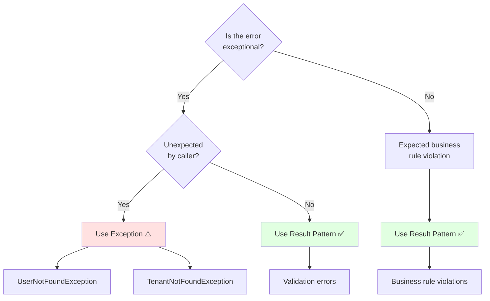

---

## Repository Interfaces

### What are Repository Interfaces?

**Repository Interfaces** define contracts for data access without exposing implementation details. They:

- Live in the **Domain layer**
- Define **aggregate-focused** operations
- Hide persistence details
- Enable **testing** with mocks
- Support **Clean Architecture** dependency inversion

### Repository Pattern

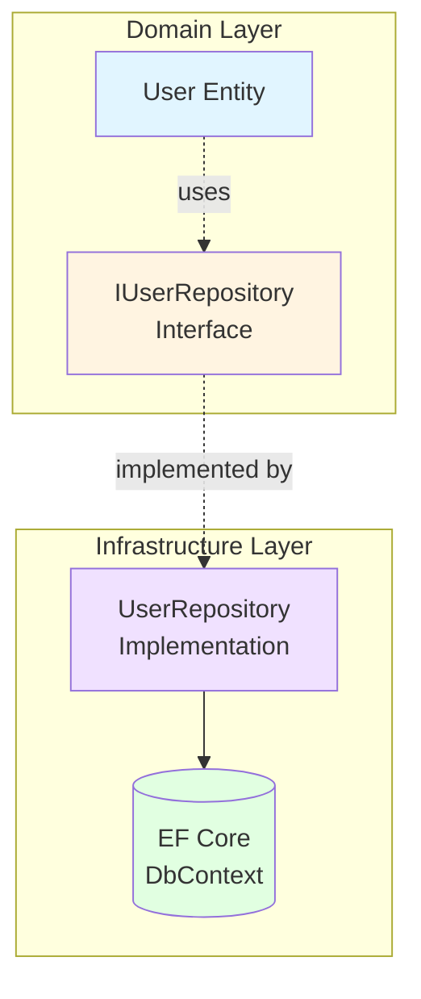

---

### The Four Repository Interfaces

#### 1. 👤 IUserRepository

```csharp
using Domain.Entities;
using Domain.ValueObjects;

namespace Domain.Repositories;

public interface IUserRepository
{
    Task<User?> GetByIdAsync(Guid userId, CancellationToken ct = default);
    Task<User?> GetByEmailAsync(TenantId tenantId, string email, CancellationToken ct = default);
    Task<IReadOnlyList<User>> GetByTenantAsync(TenantId tenantId, CancellationToken ct = default);
    Task AddAsync(User user, CancellationToken ct = default);
    void Update(User user);
    void Remove(User user);
}
```

**Operations:**

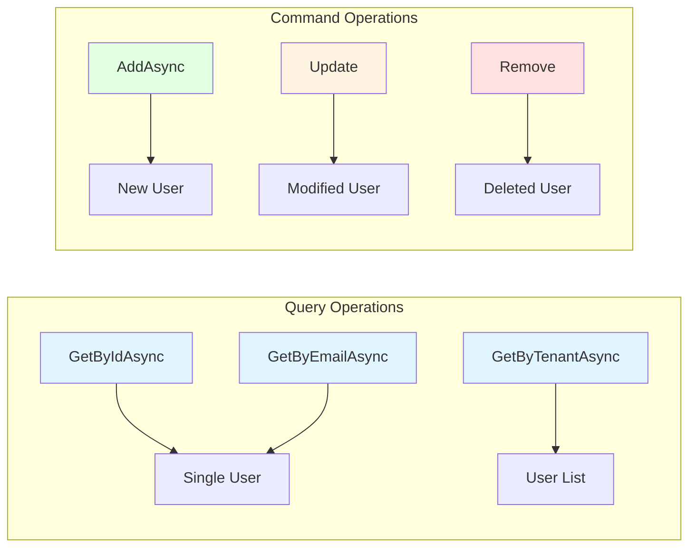

**Usage Example:**
```csharp
// Query
var user = await _userRepository.GetByEmailAsync(tenantId, "user@example.com");

// Command
var newUser = User.Create(tenantId, email, hash, "John Doe").Value;
await _userRepository.AddAsync(newUser);
await _unitOfWork.SaveChangesAsync();
```

---

#### 2. 🏢 ITenantRepository

```csharp
using Domain.Entities;

namespace Domain.Repositories;

public interface ITenantRepository
{
    Task<Tenant?> GetByIdAsync(Guid tenantId, CancellationToken ct = default);
    Task<Tenant?> GetBySubdomainAsync(string subdomain, CancellationToken ct = default);
    Task<IReadOnlyList<Tenant>> GetAllAsync(CancellationToken ct = default);
    Task AddAsync(Tenant tenant, CancellationToken ct = default);
    void Update(Tenant tenant);
    void Remove(Tenant tenant);
}
```

**Subdomain Lookup:**

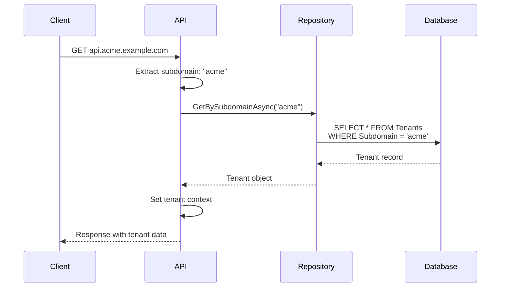

---

#### 3. 🎭 IRoleRepository

```csharp
using Domain.Entities;
using Domain.ValueObjects;

namespace Domain.Repositories;

public interface IRoleRepository
{
    Task<Role?> GetByIdAsync(Guid roleId, CancellationToken ct = default);
    Task<Role?> GetByNameAsync(TenantId tenantId, string name, CancellationToken ct = default);
    Task<IReadOnlyList<Role>> GetByTenantAsync(TenantId tenantId, CancellationToken ct = default);
    Task<IReadOnlyList<Role>> GetByIdsAsync(IEnumerable<Guid> roleIds, CancellationToken ct = default);
    Task AddAsync(Role role, CancellationToken ct = default);
    void Update(Role role);
    void Remove(Role role);
}
```

**Batch Operations:**

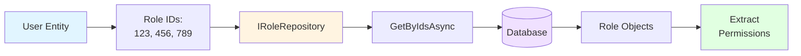

---

#### 4. 💾 IUnitOfWork

```csharp
namespace Domain.Repositories;

public interface IUnitOfWork
{
    Task<int> SaveChangesAsync(CancellationToken ct = default);
    Task BeginTransactionAsync(CancellationToken ct = default);
    Task CommitTransactionAsync(CancellationToken ct = default);
    Task RollbackTransactionAsync(CancellationToken ct = default);
}
```

**Purpose:**
- Coordinates changes across multiple repositories
- Ensures **atomic transactions**
- Dispatches **domain events**
- Manages **database transactions**

**Transaction Pattern:**

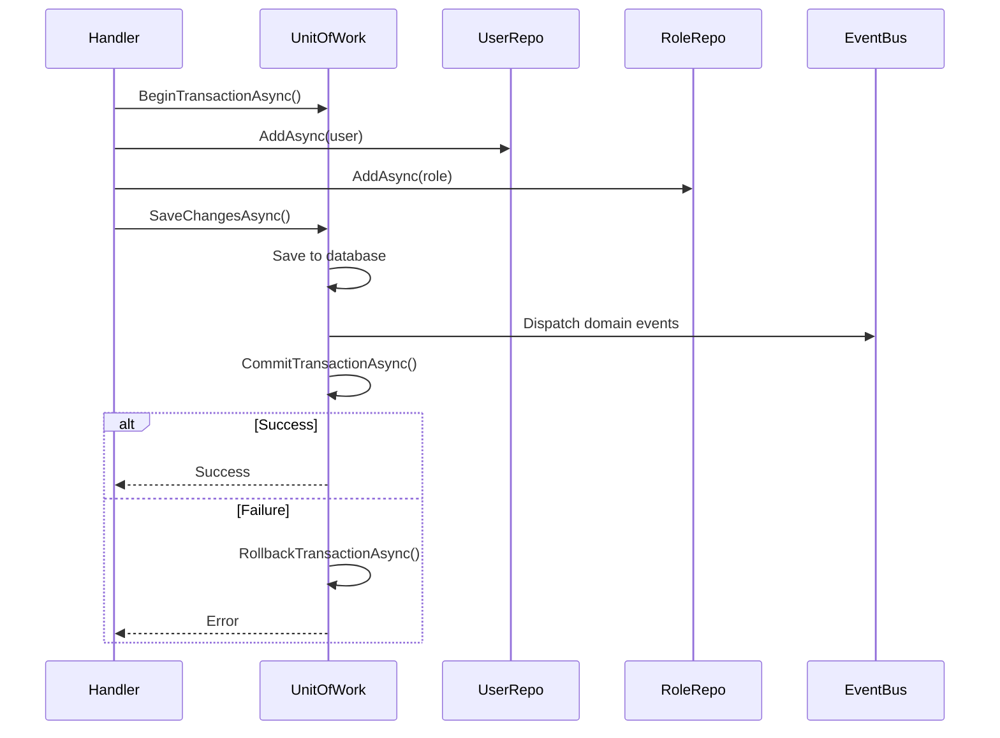

**Usage Example:**
```csharp
await _unitOfWork.BeginTransactionAsync();

try
{
    var user = User.Create(...).Value;
    await _userRepository.AddAsync(user);

    var role = Role.Create(...).Value;
    await _roleRepository.AddAsync(role);

    await _unitOfWork.SaveChangesAsync();  // Saves + dispatches events
    await _unitOfWork.CommitTransactionAsync();
}
catch
{
    await _unitOfWork.RollbackTransactionAsync();
    throw;
}
```

---

## Domain Services

### What are Domain Services?

**Domain Services** encapsulate domain logic that:

- Doesn't naturally fit in an entity
- Operates on **multiple aggregates**
- Requires **external dependencies**
- Represents **domain concepts** (not technical services)

---

### The Two Domain Services

#### 1. 🔒 ITenantIsolationService

```csharp
using Domain.Entities;
using Domain.ValueObjects;

namespace Domain.Services;

public interface ITenantIsolationService
{
    bool CanAccess(User actor, TenantId tenantId);
    bool IsIsolated(TenantId tenantId);
    Task<bool> ValidateTenantAccessAsync(Guid userId, Guid tenantId, CancellationToken ct = default);
}
```

**Purpose:**
- Enforce multi-tenancy boundaries
- Validate cross-tenant access
- Implement tenant isolation rules

**Isolation Flow:**

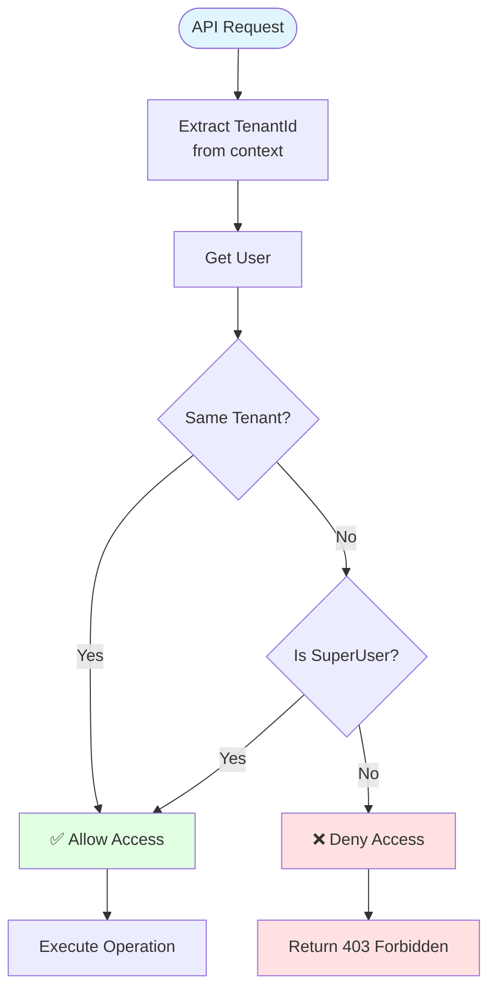

**Usage Example:**
```csharp
public async Task<User> GetUserAsync(Guid userId)
{
    var user = await _repository.GetByIdAsync(userId);

    if (!_tenantIsolationService.CanAccess(_currentUser, user.TenantId))
        throw new UnauthorizedAccessException("Cannot access user from different tenant.");

    return user;
}
```

---

#### 2. 🔐 IPasswordHashingService

```csharp
namespace Domain.Services;

public interface IPasswordHashingService
{
    string Hash(string plainTextPassword);
    bool Verify(string plainTextPassword, string passwordHash);
}
```

**Purpose:**
- Abstract password hashing algorithm
- Enable algorithm changes without domain changes
- Support testing with fake implementations

**Authentication Flow:**

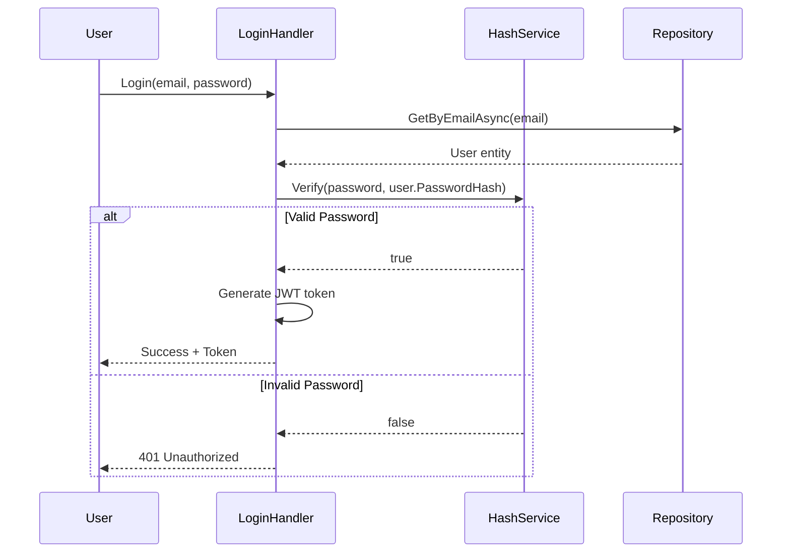

**Usage Example:**
```csharp
// Registration
var passwordHash = _passwordHashingService.Hash(command.Password);
var user = User.Create(tenantId, email, passwordHash, fullName).Value;

// Login
var user = await _repository.GetByEmailAsync(tenantId, command.Email);
var isValid = _passwordHashingService.Verify(command.Password, user.PasswordHash);

if (!isValid)
    return Result.Failure(Error.Unauthorized("Invalid credentials."));
```

---

## Integration Patterns

### Complete Request Flow

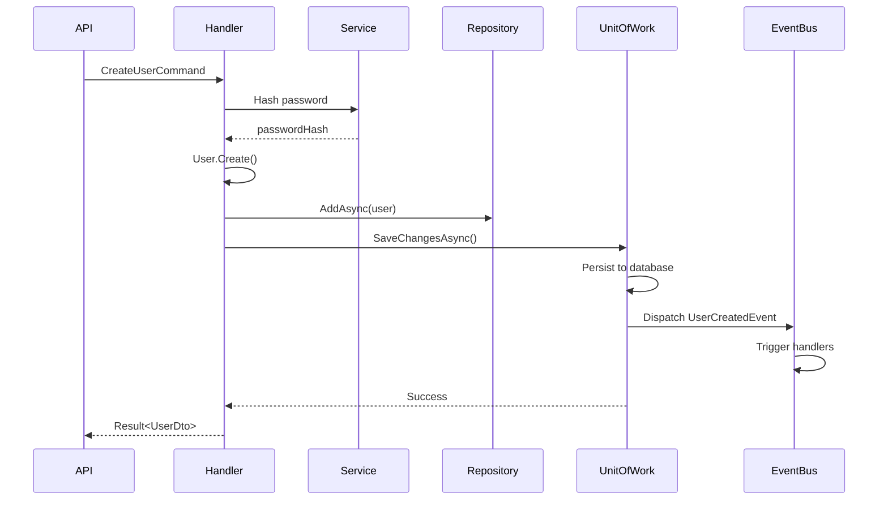

---

## Best Practices

### ✅ DO

1. **Define Interfaces in Domain**
   ```csharp
   // Domain/Repositories/IUserRepository.cs
   namespace Domain.Repositories;

   public interface IUserRepository { ... }
   ```

2. **Implement in Infrastructure**
   ```csharp
   // Infrastructure/Persistence/UserRepository.cs
   namespace Infrastructure.Persistence;

   public class UserRepository : IUserRepository { ... }
   ```

3. **Use Aggregate-Focused Methods**
   ```csharp
   Task<User?> GetByIdAsync(Guid userId);  // ✅ Returns aggregate root
   Task<string> GetEmailByIdAsync(Guid userId);  // ❌ Returns partial data
   ```

4. **Return Domain Types**
   ```csharp
   Task<User> GetByIdAsync(Guid userId);  // ✅ Domain entity
   Task<UserDto> GetByIdAsync(Guid userId);  // ❌ DTO in domain
   ```

### ❌ DON'T

1. **Don't Put Logic in Repositories**
   ```csharp
   // ❌ Business logic in repository
   public interface IUserRepository
   {
       Task<bool> ValidateUserCanLogin(Guid userId);
   }

   // ✅ Business logic in entity/service
   user.CanLogin();
   ```

2. **Don't Expose IQueryable**
   ```csharp
   // ❌ Exposes implementation details
   IQueryable<User> GetUsers();

   // ✅ Well-defined contract
   Task<IReadOnlyList<User>> GetByTenantAsync(TenantId tenantId);
   ```

3. **Don't Reference Infrastructure**
   ```csharp
   // ❌ Domain depends on infrastructure
   using Microsoft.EntityFrameworkCore;

   public interface IUserRepository
   {
       DbSet<User> Users { get; }
   }
   ```

---

## Summary

### Domain Exceptions
- ✅ Meaningful business errors
- ✅ Hierarchical structure
- ✅ Include relevant context
- ✅ Used for exceptional cases

### Repository Interfaces
- ✅ Aggregate-focused operations
- ✅ Hide persistence details
- ✅ Enable testing
- ✅ Support dependency inversion

### Domain Services
- ✅ Cross-aggregate logic
- ✅ Domain concepts
- ✅ Abstract technical concerns
- ✅ Testable contracts

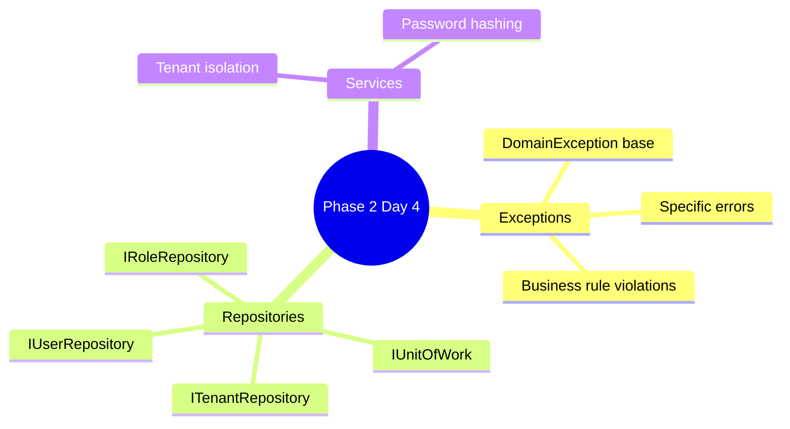

---

**Phase 2 Complete!** Next: [Phase 3 - Application Layer](../IMPLEMENTATION_PLAN.md#phase-3)

**Last Updated:** April 02, 2026
