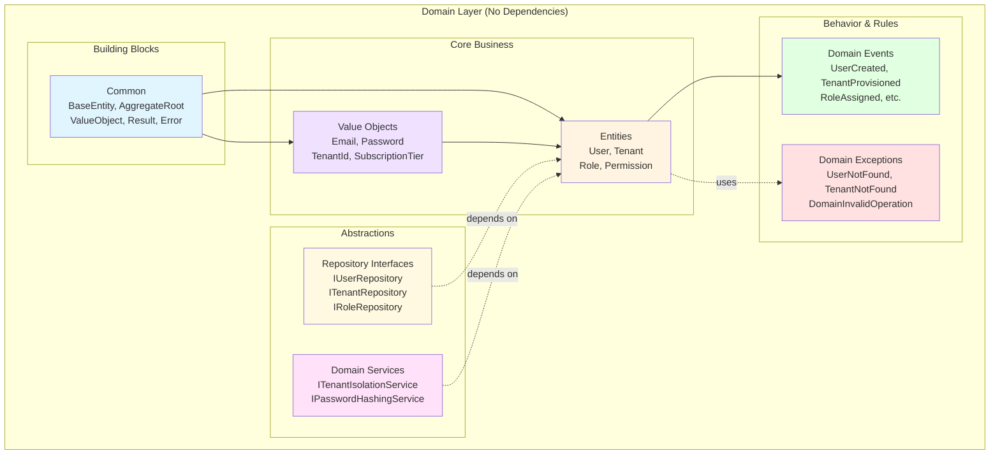
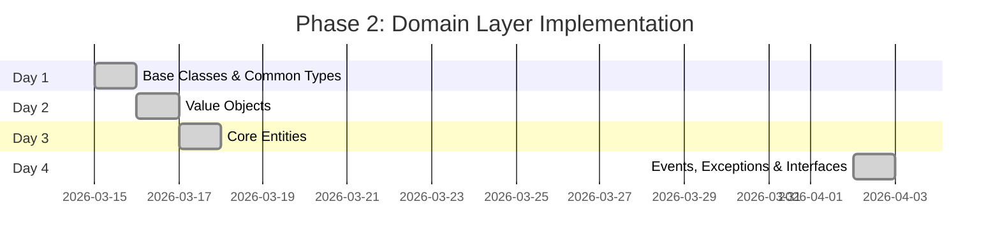
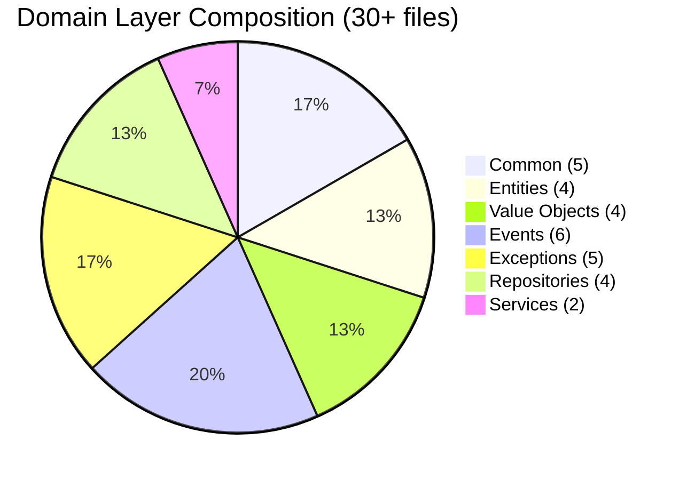

# Phase 2: Domain Entities & Value Objects - Complete Overview

## 📋 Table of Contents
- [Introduction](#introduction)
- [Architecture Overview](#architecture-overview)
- [Phase 2 Timeline](#phase-2-timeline)
- [Day-by-Day Breakdown](#day-by-day-breakdown)
- [Success Criteria](#success-criteria)

---

## Introduction

**Phase 2** establishes the **Domain Layer** - the heart of the application following **Domain-Driven Design (DDD)** principles. This phase creates:

- **Rich Domain Entities** with encapsulated business logic
- **Value Objects** for type safety and immutability
- **Domain Events** for tracking state changes
- **Repository Interfaces** for data persistence abstraction
- **Domain Exceptions** for business rule violations
- **Domain Services** for cross-cutting concerns

**Duration:** 4 days  
**Status:** ✅ Completed  
**Priority:** 🔴 Critical

---

## Architecture Overview

---

## Phase 2 Timeline

---

## Day-by-Day Breakdown

### 📅 Day 1: Foundation - Base Classes & Common Types
**Purpose:** Create building blocks for all domain objects

| Component | Description | Status |
|-----------|-------------|--------|
| `BaseEntity.cs` | Base class with ID, timestamps, and soft delete | ✅ |
| `AggregateRoot.cs` | Adds domain event support | ✅ |
| `ValueObject.cs` | Equality comparison for value objects | ✅ |
| `Result.cs` | Result pattern for error handling | ✅ |
| `Error.cs` | Structured error representation | ✅ |

**Key Concepts:**
- Entity identity and lifecycle
- Aggregate boundaries
- Value object equality
- Railway-oriented programming

---

### 📅 Day 2: Type Safety - Value Objects
**Purpose:** Create strongly-typed, immutable domain primitives

| Value Object | Validation Rules | Status |
|--------------|------------------|--------|
| `Email.cs` | Valid email format, max 256 chars | ✅ |
| `Password.cs` | Min 8 chars, complexity requirements | ✅ |
| `TenantId.cs` | Non-empty GUID wrapper | ✅ |
| `SubscriptionTier.cs` | Enum: Free, Basic, Premium, Enterprise | ✅ |

**Benefits:**
- Compile-time type safety
- Centralized validation
- Self-documenting code
- Immutability guarantees

---

### 📅 Day 3: Business Logic - Core Entities
**Purpose:** Implement aggregates with encapsulated business rules

| Entity | Aggregate Root | Responsibilities | Status |
|--------|----------------|------------------|--------|
| `User.cs` | ✅ | Authentication, role management, lifecycle | ✅ |
| `Tenant.cs` | ✅ | Provisioning, settings, activation | ✅ |
| `Role.cs` | ✅ | Permission management | ✅ |
| `Permission.cs` | ❌ | Permission definitions | ✅ |

**Design Principles:**
- Rich domain model (not anemic)
- Encapsulation (private setters)
- Factory methods for creation
- Domain events for state changes

---

### 📅 Day 4: Infrastructure - Events, Exceptions & Interfaces
**Purpose:** Complete domain layer with events, errors, and abstractions

#### Domain Events (6 events)
- `UserCreatedEvent`, `UserDeactivatedEvent`
- `RoleAssignedEvent`, `PasswordChangedEvent`
- `TenantProvisionedEvent`

#### Domain Exceptions (5 exceptions)
- `DomainException` (base)
- `UserNotFoundException`, `TenantNotFoundException`
- `UserAlreadyExistsException`, `DomainInvalidOperationException`

#### Repository Interfaces (4 repositories)
- `IUserRepository`, `ITenantRepository`
- `IRoleRepository`, `IUnitOfWork`

#### Domain Services (2 services)
- `ITenantIsolationService` - Multi-tenancy access control
- `IPasswordHashingService` - Password security

---

## Success Criteria

### ✅ Completed Criteria

1. **Encapsulation**
   - ✅ All entities use private setters
   - ✅ State changes through methods only
   - ✅ Factory methods for creation

2. **Immutability**
   - ✅ Value objects are immutable
   - ✅ Collections exposed as read-only

3. **Business Rules**
   - ✅ Validation in factory methods
   - ✅ Invariants protected in entities
   - ✅ Rich behavior (not anemic)

4. **Domain Events**
   - ✅ Events defined for state changes
   - ✅ Events raised from aggregates

5. **Clean Architecture**
   - ✅ No infrastructure dependencies
   - ✅ No framework coupling
   - ✅ Pure domain logic

6. **Build & Quality**
   - ✅ Compiles without errors
   - ✅ No external dependencies
   - ✅ Follows DDD principles

---

## Domain Layer Statistics

---

## Next Steps

With Phase 2 complete, you're ready for:

**Phase 3: Application Layer Setup (MediatR)**
- MediatR configuration
- CQRS implementation
- FluentValidation infrastructure
- AutoMapper profiles

---

## References

- [Domain-Driven Design by Eric Evans](https://domainlanguage.com/ddd/)
- [Clean Architecture by Robert C. Martin](https://blog.cleancoder.com/uncle-bob/2012/08/13/the-clean-architecture.html)
- [Microsoft DDD Pattern](https://learn.microsoft.com/en-us/dotnet/architecture/microservices/microservice-ddd-cqrs-patterns/)

---

**Last Updated:** April 02, 2026  
**Phase Status:** ✅ Completed
