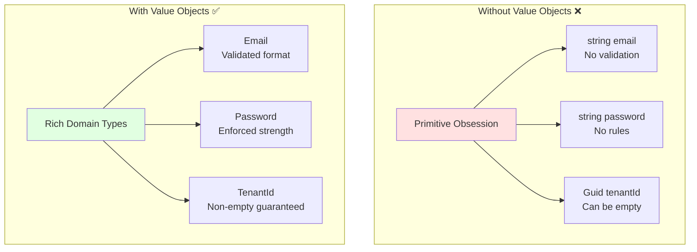
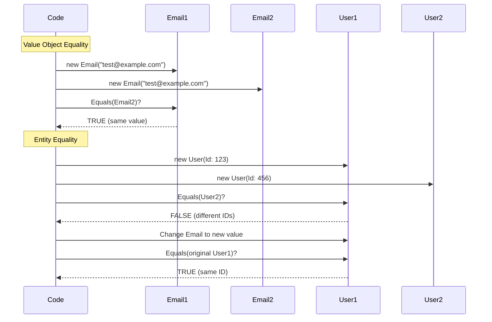
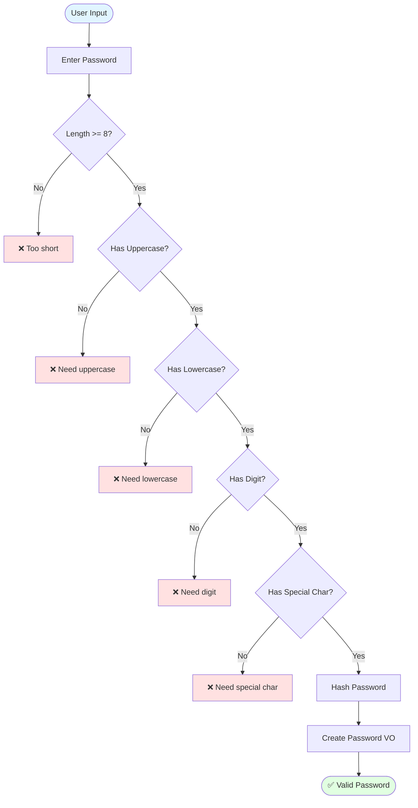
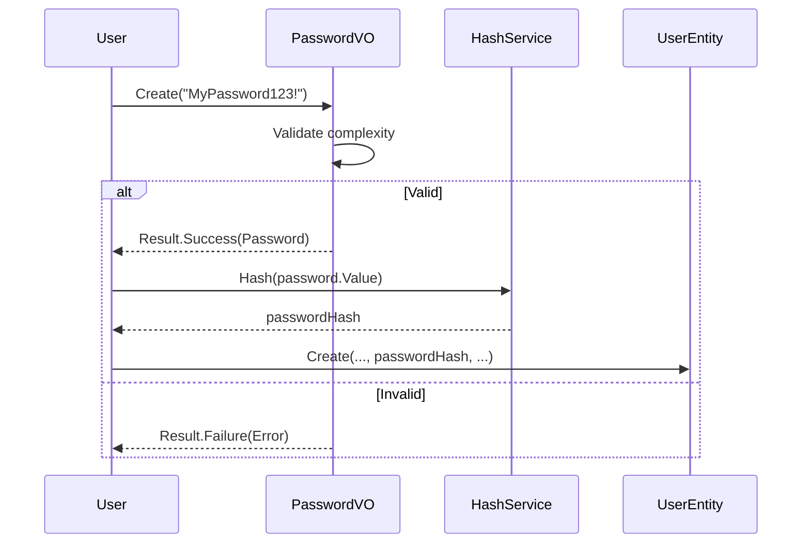
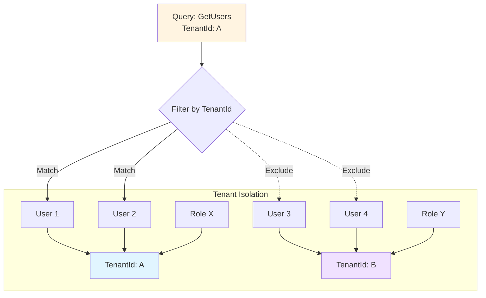
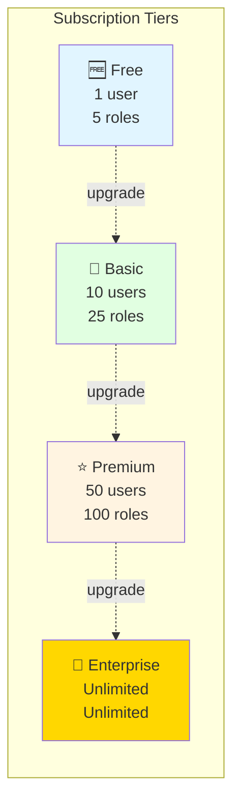
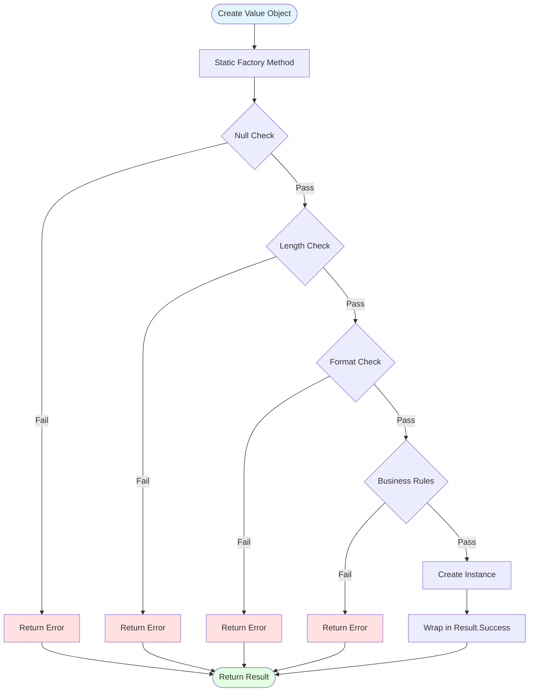
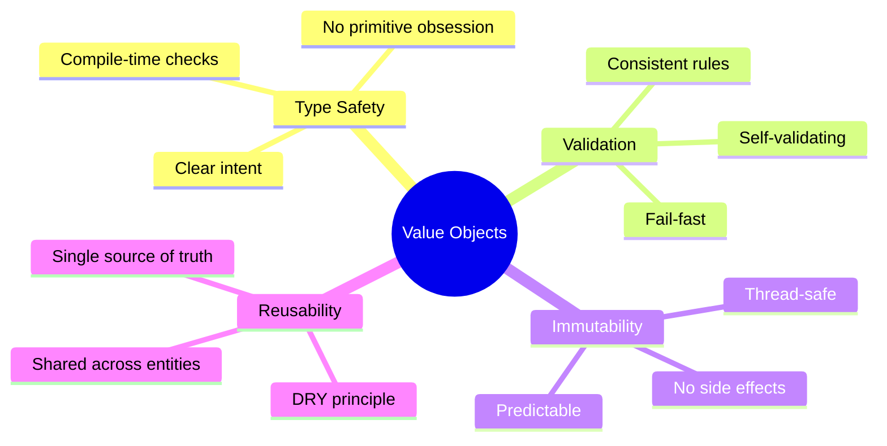

# Value Objects - Deep Dive

## 📖 Table of Contents
- [What are Value Objects?](#what-are-value-objects)
- [Value Objects vs Entities](#value-objects-vs-entities)
- [The Four Value Objects](#the-four-value-objects)
- [Implementation Patterns](#implementation-patterns)
- [Best Practices](#best-practices)

---

## What are Value Objects?

**Value Objects** are immutable objects defined by their **attributes**, not by identity. They:

- Have **no identity** (no ID property)
- Are **immutable** (cannot be changed after creation)
- Are **compared by value** (not by reference)
- **Validate themselves** on creation
- Provide **type safety** and domain meaning

### Why Use Value Objects?



**Benefits:**
- 🛡️ **Type Safety:** Can't pass email where tenantId is expected
- ✅ **Self-Validation:** Value object guarantees its own validity
- 📦 **Encapsulation:** Business rules in one place
- 🔄 **Reusability:** Use across multiple entities
- 📖 **Expressiveness:** `Email` is clearer than `string`

---

## Value Objects vs Entities

| Aspect | Value Object | Entity |
|--------|-------------|---------|
| **Identity** | No unique ID | Has unique ID |
| **Equality** | By value (all properties) | By ID |
| **Mutability** | Immutable | Mutable |
| **Lifecycle** | Created and discarded | Tracked over time |
| **Example** | Email, Money, Address | User, Order, Product |

### Equality Comparison



---

## The Four Value Objects

### 1. 📧 Email Value Object

**Purpose:** Ensure valid email format and provide normalization.

```csharp
public sealed class Email : ValueObject
{
    public const int MaxLength = 256;

    private Email(string value)
    {
        Value = value;
    }

    public string Value { get; }

    public static Result<Email> Create(string email)
    {
        if (string.IsNullOrWhiteSpace(email))
            return Result<Email>.Failure(Error.Validation("Email is required."));

        email = email.Trim().ToLowerInvariant();

        if (email.Length > MaxLength)
            return Result<Email>.Failure(
                Error.Validation($"Email must not exceed {MaxLength} characters."));

        if (!IsValidFormat(email))
            return Result<Email>.Failure(Error.Validation("Email format is invalid."));

        return Result<Email>.Success(new Email(email));
    }

    protected override IEnumerable<object?> GetEqualityComponents()
    {
        yield return Value;
    }
}
```

**Visual Flow:**

```mermaid
flowchart TD
    Start([User Input]) --> Input["  john@EXAMPLE.com  "]
    Input --> Validate{Validate}

    Validate -->|Empty| E1[Error: Required]
    Validate -->|Too Long| E2[Error: Max 256 chars]
    Validate -->|Invalid Format| E3[Error: Invalid format]
    Validate -->|Valid| Normalize[Normalize]

    Normalize --> Trim[Trim whitespace]
    Trim --> Lower[ToLowerInvariant]
    Lower --> Create[Create Email VO]
    Create --> Success([john@example.com ✅])

    style Start fill:#e1f5ff
    style Success fill:#e1ffe1
    style E1 fill:#ffe1e1
    style E2 fill:#ffe1e1
    style E3 fill:#ffe1e1
```

**Usage Example:**

```csharp
// ✅ Type-safe and validated
var emailResult = Email.Create("user@example.com");
if (emailResult.IsFailure)
{
    return emailResult.Error;
}

var user = User.Create(tenantId, emailResult.Value, hash, "John");

// ❌ Cannot do this (compile error):
var user = User.Create(tenantId, "not-validated-string", hash, "John");
```

---

### 2. 🔒 Password Value Object

**Purpose:** Enforce password strength requirements.

```csharp
public sealed class Password : ValueObject
{
    public const int MinLength = 8;
    public const int MaxLength = 128;

    private Password(string value)
    {
        Value = value;
    }

    public string Value { get; }

    public static Result<Password> Create(string password)
    {
        if (string.IsNullOrWhiteSpace(password))
            return Result<Password>.Failure(Error.Validation("Password is required."));

        if (password.Length < MinLength)
            return Result<Password>.Failure(
                Error.Validation($"Password must be at least {MinLength} characters."));

        if (password.Length > MaxLength)
            return Result<Password>.Failure(
                Error.Validation($"Password must not exceed {MaxLength} characters."));

        if (!HasRequiredComplexity(password))
            return Result<Password>.Failure(
                Error.Validation("Password must contain uppercase, lowercase, digit, and special character."));

        return Result<Password>.Success(new Password(password));
    }

    protected override IEnumerable<object?> GetEqualityComponents()
    {
        yield return Value;
    }
}
```

**Password Validation Flow:**



**Security Pattern:**



---

### 3. 🏢 TenantId Value Object

**Purpose:** Strong typing for tenant identifiers to prevent bugs.

```csharp
public sealed class TenantId : ValueObject
{
    private TenantId(Guid value)
    {
        Value = value;
    }

    public Guid Value { get; }

    public static Result<TenantId> Create(Guid value)
    {
        if (value == Guid.Empty)
            return Result<TenantId>.Failure(Error.Validation("TenantId cannot be empty."));

        return Result<TenantId>.Success(new TenantId(value));
    }

    public static TenantId CreateUnsafe(Guid value) => new(value);

    protected override IEnumerable<object?> GetEqualityComponents()
    {
        yield return Value;
    }
}
```

**Type Safety Example:**

```csharp
// ❌ Without TenantId (Primitive Obsession)
public class User
{
    public Guid TenantId { get; set; }
    public Guid RoleId { get; set; }
}

// Bug: Can accidentally swap IDs
var user = new User 
{ 
    TenantId = roleGuid,  // WRONG! But compiles
    RoleId = tenantGuid   // WRONG! But compiles
};

// ✅ With TenantId (Type Safety)
public class User
{
    public TenantId TenantId { get; private set; }
    public Guid RoleId { get; private set; }
}

// Compile error: Cannot assign Guid to TenantId
var user = User.Create(roleGuid, ...); // ❌ Compile Error!
var user = User.Create(tenantId, ...);  // ✅ Correct
```

**Multi-Tenancy Isolation:**



---

### 4. 💳 SubscriptionTier Value Object

**Purpose:** Enum-based value object for subscription plans.

```csharp
public sealed class SubscriptionTier : ValueObject
{
    public static readonly SubscriptionTier Free = new(0, "Free", 1, 5);
    public static readonly SubscriptionTier Basic = new(1, "Basic", 10, 25);
    public static readonly SubscriptionTier Premium = new(2, "Premium", 50, 100);
    public static readonly SubscriptionTier Enterprise = new(3, "Enterprise", int.MaxValue, int.MaxValue);

    private SubscriptionTier(int value, string name, int maxUsers, int maxRoles)
    {
        Value = value;
        Name = name;
        MaxUsers = maxUsers;
        MaxRoles = maxRoles;
    }

    public int Value { get; }
    public string Name { get; }
    public int MaxUsers { get; }
    public int MaxRoles { get; }

    public static SubscriptionTier FromValue(int value) => value switch
    {
        0 => Free,
        1 => Basic,
        2 => Premium,
        3 => Enterprise,
        _ => throw new ArgumentException($"Invalid subscription tier: {value}")
    };

    protected override IEnumerable<object?> GetEqualityComponents()
    {
        yield return Value;
    }
}
```

**Subscription Comparison:**



**Usage with Business Logic:**

```csharp
public Result AddUser(User newUser)
{
    var currentUserCount = _users.Count;

    if (currentUserCount >= Tier.MaxUsers)
    {
        return Result.Failure(
            Error.Conflict(
                $"Cannot add user. Tier '{Tier.Name}' allows max {Tier.MaxUsers} users."));
    }

    _users.Add(newUser);
    return Result.Success();
}
```

---

## Implementation Patterns

### 1. Base ValueObject Class

```csharp
public abstract class ValueObject : IEquatable<ValueObject>
{
    // Subclasses define their equality components
    protected abstract IEnumerable<object?> GetEqualityComponents();

    public bool Equals(ValueObject? other)
    {
        if (other is null || other.GetType() != GetType())
            return false;

        return GetEqualityComponents()
            .SequenceEqual(other.GetEqualityComponents());
    }

    public override bool Equals(object? obj) => Equals(obj as ValueObject);

    public override int GetHashCode()
    {
        return GetEqualityComponents()
            .Aggregate(1, (current, obj) =>
            {
                unchecked
                {
                    return current * 23 + (obj?.GetHashCode() ?? 0);
                }
            });
    }

    public static bool operator ==(ValueObject? left, ValueObject? right)
        => left is null && right is null || left is not null && left.Equals(right);

    public static bool operator !=(ValueObject? left, ValueObject? right)
        => !(left == right);
}
```

### 2. Validation Pattern



### 3. Immutability Pattern

```csharp
// ✅ IMMUTABLE - Value Object
public sealed class Email : ValueObject
{
    private Email(string value)  // Private constructor
    {
        Value = value;
    }

    public string Value { get; }  // Read-only property

    // No setters, no mutating methods
    // To change email, create new instance
}

// Usage
var email1 = Email.Create("old@example.com").Value;
var email2 = Email.Create("new@example.com").Value;  // New instance

// ❌ Cannot do this (immutable):
email1.Value = "changed";  // Compile error!
```

---

## Best Practices

### ✅ DO

1. **Always Validate in Factory Methods**
   ```csharp
   public static Result<Email> Create(string email)
   {
       if (string.IsNullOrWhiteSpace(email))
           return Result<Email>.Failure(Error.Validation("Email is required."));

       // More validation...
       return Result<Email>.Success(new Email(email));
   }
   ```

2. **Make Constructors Private**
   ```csharp
   private Email(string value)  // Forces use of factory method
   {
       Value = value;
   }
   ```

3. **Use Read-Only Properties**
   ```csharp
   public string Value { get; }  // No setter
   ```

4. **Implement Equality by Value**
   ```csharp
   protected override IEnumerable<object?> GetEqualityComponents()
   {
       yield return Value;
   }
   ```

5. **Normalize Input**
   ```csharp
   email = email.Trim().ToLowerInvariant();
   ```

### ❌ DON'T

1. **Don't Use Public Constructors**
   ```csharp
   // ❌ Allows invalid creation
   public Email(string value) { Value = value; }
   ```

2. **Don't Add Setters**
   ```csharp
   // ❌ Breaks immutability
   public string Value { get; set; }
   ```

3. **Don't Skip Validation**
   ```csharp
   // ❌ No validation
   public static Email Create(string email) => new Email(email);
   ```

4. **Don't Add Identity**
   ```csharp
   // ❌ Value objects don't have IDs
   public Guid Id { get; set; }
   ```

5. **Don't Add Mutating Methods**
   ```csharp
   // ❌ Violates immutability
   public void ChangeValue(string newValue) { Value = newValue; }
   ```

---

## Comparison Matrix

| Feature | Email | Password | TenantId | SubscriptionTier |
|---------|-------|----------|----------|------------------|
| **Validation** | Format, Length | Complexity, Length | Non-empty GUID | Valid enum value |
| **Normalization** | Trim, Lowercase | None | None | None |
| **Max Length** | 256 chars | 128 chars | N/A | N/A |
| **Min Length** | 1 char | 8 chars | N/A | N/A |
| **Type** | String-based | String-based | GUID-based | Enum-based |
| **Usage** | User identity | Authentication | Isolation | Features |

---

## Summary

Value Objects provide:

- 🛡️ **Type Safety** - Compile-time guarantees
- ✅ **Self-Validation** - Always valid
- 🔒 **Immutability** - Thread-safe by design
- 📦 **Encapsulation** - Rules in one place
- 🔄 **Reusability** - Used across entities
- 📖 **Expressiveness** - Domain language



---

**Next:** Learn about [Domain Events](./DomainEvents.md) for capturing state changes.

**Last Updated:** April 02, 2026
