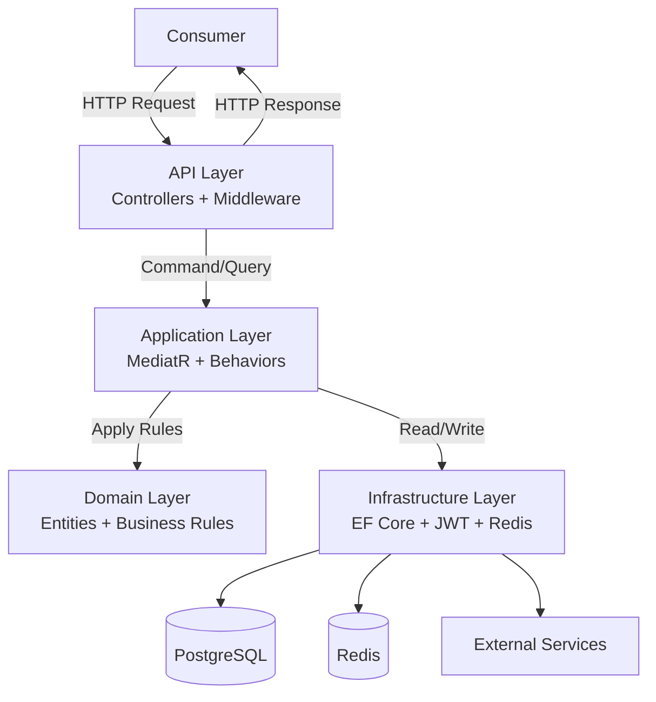
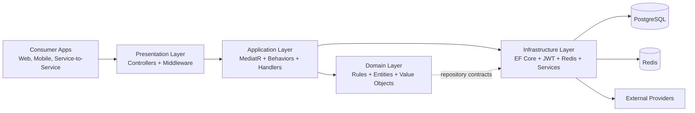
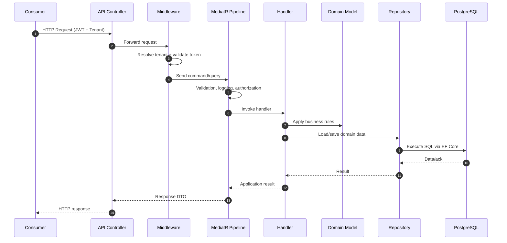
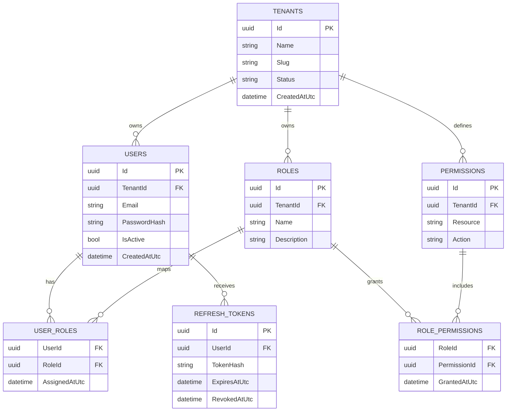

# Implementation Plan - .NET SaaS Multi-Tenant API

**Project**: dotnet-saas-multitenant-api  
**Architecture**: Clean Architecture + CQRS + DDD  
**Created**: February 18, 2026  
**Last Updated**: May 15, 2026  
**Status**: 🔵 In Progress

---

## Quick Reference

| Phase | Name                                            | Duration | Status         | Priority    | Day Tasks (Clickable + Status)                                                                                                                                                                                                                                                            |
| ----- | ----------------------------------------------- | -------- | -------------- | ----------- | ----------------------------------------------------------------------------------------------------------------------------------------------------------------------------------------------------------------------------------------------------------------------------------------- |
| 0     | [Architecture Overview](#architecture-overview) | 1 day    | 🟢 Completed   | 🔴 Critical | &nbsp;&nbsp;Visual diagrams + data flow + schema                                                                                                                                                                                                                                          |
| 1     | [Solution Setup & Domain Foundation](#phase-1)  | 3 days   | 🟢 Completed   | 🔴 Critical | &nbsp;&nbsp;[Day 1](#phase-1-day-1) - 🟢 Completed<br>&nbsp;&nbsp;[Day 2](#phase-1-day-2) - 🟢 Completed<br>&nbsp;&nbsp;[Day 3](#phase-1-day-3) - 🟢 Completed                                                                                                                            |
| 2     | [Domain Entities & Value Objects](#phase-2)     | 4 days   | 🟢 Completed   | 🔴 Critical | &nbsp;&nbsp;[Day 1](#phase-2-day-1) - 🟢 Completed<br>&nbsp;&nbsp;[Day 2](#phase-2-day-2) - 🟢 Completed<br>&nbsp;&nbsp;[Day 3](#phase-2-day-3) - 🟢 Completed<br>&nbsp;&nbsp;[Day 4](#phase-2-day-4) - 🟢 Completed                                                                      |
| 3     | [Application Layer Setup (MediatR)](#phase-3)   | 3 days   | 🟢 Completed   | 🔴 Critical | &nbsp;&nbsp;[Day 1](#phase-3-day-1) - 🟢 Completed<br>&nbsp;&nbsp;[Day 2](#phase-3-day-2) - 🟢 Completed<br>&nbsp;&nbsp;[Day 3](#phase-3-day-3) - 🟢 Completed                                                                                                                            |
| 4     | [Infrastructure - EF Core Setup](#phase-4)      | 4 days   | 🟢 Completed   | 🔴 Critical | &nbsp;&nbsp;[Day 1](#phase-4-day-1) - 🟢 Completed<br>&nbsp;&nbsp;[Day 2](#phase-4-day-2) - 🟢 Completed<br>&nbsp;&nbsp;[Day 3](#phase-4-day-3) - 🟢 Completed<br>&nbsp;&nbsp;[Day 4](#phase-4-day-4) - 🟢 Completed                                                                      |
| 5     | [Multi-Tenancy Infrastructure](#phase-5)        | 5 days   | 🟢 Completed   | 🔴 Critical | &nbsp;&nbsp;[Day 1](#phase-5-day-1) - 🟢 Completed<br>&nbsp;&nbsp;[Day 2](#phase-5-day-2) - 🟢 Completed<br>&nbsp;&nbsp;[Day 3](#phase-5-day-3) - 🟢 Completed<br>&nbsp;&nbsp;[Day 4](#phase-5-day-4) - 🟢 Completed<br>&nbsp;&nbsp;[Day 5](#phase-5-day-5) - 🟢 Completed                |
| 6     | [Authentication & JWT](#phase-6)                | 5 days   | 🟢 Completed   | 🔴 Critical | &nbsp;&nbsp;[Day 1](#phase-6-day-1) - 🟢 Completed<br>&nbsp;&nbsp;[Day 2](#phase-6-day-2) - 🟢 Completed<br>&nbsp;&nbsp;[Day 3](#phase-6-day-3) - 🟢 Completed<br>&nbsp;&nbsp;[Day 4](#phase-6-day-4) - 🟢 Completed<br>&nbsp;&nbsp;[Day 5](#phase-6-day-5) - 🟢 Completed                |
| 7     | [Auth Feature - CQRS Implementation](#phase-7)  | 4 days   | 🟢 Completed   | 🟠 High     | &nbsp;&nbsp;[Day 1](#phase-7-day-1) - 🟢 Completed<br>&nbsp;&nbsp;[Day 2](#phase-7-day-2) - 🟢 Completed<br>&nbsp;&nbsp;[Day 3](#phase-7-day-3) - 🟢 Completed<br>&nbsp;&nbsp;[Day 4](#phase-7-day-4) - 🟢 Completed                                                                      |
| 8     | [Users Feature - CQRS Implementation](#phase-8) | 5 days   | 📝 Docs Ready  | 🟠 High     | &nbsp;&nbsp;[Day 1](#phase-8-day-1) - ⚪ Not Started<br>&nbsp;&nbsp;[Day 2](#phase-8-day-2) - ⚪ Not Started<br>&nbsp;&nbsp;[Day 3](#phase-8-day-3) - ⚪ Not Started<br>&nbsp;&nbsp;[Day 4](#phase-8-day-4) - ⚪ Not Started<br>&nbsp;&nbsp;[Day 5](#phase-8-day-5) - ⚪ Not Started      |
| 9     | [API Layer & Controllers](#phase-9)             | 4 days   | 📝 Docs Ready  | 🟠 High     | &nbsp;&nbsp;[Day 1](#phase-9-day-1) - ⚪ Not Started<br>&nbsp;&nbsp;[Day 2](#phase-9-day-2) - ⚪ Not Started<br>&nbsp;&nbsp;[Day 3](#phase-9-day-3) - ⚪ Not Started<br>&nbsp;&nbsp;[Day 4](#phase-9-day-4) - ⚪ Not Started                                                              |
| 10    | [Tenants Feature](#phase-10)                    | 5 days   | ⚪ Not Started | 🟠 High     | &nbsp;&nbsp;[Day 1](#phase-10-day-1) - ⚪ Not Started<br>&nbsp;&nbsp;[Day 2](#phase-10-day-2) - ⚪ Not Started<br>&nbsp;&nbsp;[Day 3](#phase-10-day-3) - ⚪ Not Started<br>&nbsp;&nbsp;[Day 4](#phase-10-day-4) - ⚪ Not Started<br>&nbsp;&nbsp;[Day 5](#phase-10-day-5) - ⚪ Not Started |
| 11    | [Roles & Permissions](#phase-11)                | 5 days   | ⚪ Not Started | 🟡 Medium   | &nbsp;&nbsp;[Day 1](#phase-11-day-1) - ⚪ Not Started<br>&nbsp;&nbsp;[Day 2](#phase-11-day-2) - ⚪ Not Started<br>&nbsp;&nbsp;[Day 3](#phase-11-day-3) - ⚪ Not Started<br>&nbsp;&nbsp;[Day 4](#phase-11-day-4) - ⚪ Not Started<br>&nbsp;&nbsp;[Day 5](#phase-11-day-5) - ⚪ Not Started |
| 12    | [MediatR Behaviors](#phase-12)                  | 3 days   | ⚪ Not Started | 🟡 Medium   | &nbsp;&nbsp;[Day 1](#phase-12-day-1) - ⚪ Not Started<br>&nbsp;&nbsp;[Day 2](#phase-12-day-2) - ⚪ Not Started<br>&nbsp;&nbsp;[Day 3](#phase-12-day-3) - ⚪ Not Started                                                                                                                   |
| 13    | [Middleware & Error Handling](#phase-13)        | 3 days   | ⚪ Not Started | 🟡 Medium   | &nbsp;&nbsp;[Day 1](#phase-13-day-1) - ⚪ Not Started<br>&nbsp;&nbsp;[Day 2](#phase-13-day-2) - ⚪ Not Started<br>&nbsp;&nbsp;[Day 3](#phase-13-day-3) - ⚪ Not Started                                                                                                                   |
| 14    | [Swagger/OpenAPI](#phase-14)                    | 2 days   | ⚪ Not Started | 🟡 Medium   | &nbsp;&nbsp;[Day 1](#phase-14-day-1) - ⚪ Not Started<br>&nbsp;&nbsp;[Day 2](#phase-14-day-2) - ⚪ Not Started                                                                                                                                                                            |
| 15    | [Docker Setup](#phase-15)                       | 4 days   | ⚪ Not Started | 🟡 Medium   | &nbsp;&nbsp;[Day 1](#phase-15-day-1) - ⚪ Not Started<br>&nbsp;&nbsp;[Day 2](#phase-15-day-2) - ⚪ Not Started<br>&nbsp;&nbsp;[Day 3](#phase-15-day-3) - ⚪ Not Started<br>&nbsp;&nbsp;[Day 4](#phase-15-day-4) - ⚪ Not Started                                                          |
| 16    | [Redis Caching](#phase-16)                      | 3 days   | ⚪ Not Started | 🟢 Low      | &nbsp;&nbsp;[Day 1](#phase-16-day-1) - ⚪ Not Started<br>&nbsp;&nbsp;[Day 2](#phase-16-day-2) - ⚪ Not Started<br>&nbsp;&nbsp;[Day 3](#phase-16-day-3) - ⚪ Not Started                                                                                                                   |
| 17    | [Unit Tests - Domain & Application](#phase-17)  | 5 days   | ⚪ Not Started | 🟠 High     | &nbsp;&nbsp;[Day 1](#phase-17-day-1) - ⚪ Not Started<br>&nbsp;&nbsp;[Day 2](#phase-17-day-2) - ⚪ Not Started<br>&nbsp;&nbsp;[Day 3](#phase-17-day-3) - ⚪ Not Started<br>&nbsp;&nbsp;[Day 4](#phase-17-day-4) - ⚪ Not Started<br>&nbsp;&nbsp;[Day 5](#phase-17-day-5) - ⚪ Not Started |
| 18    | [Integration Tests](#phase-18)                  | 5 days   | ⚪ Not Started | 🟠 High     | &nbsp;&nbsp;[Day 1](#phase-18-day-1) - ⚪ Not Started<br>&nbsp;&nbsp;[Day 2](#phase-18-day-2) - ⚪ Not Started<br>&nbsp;&nbsp;[Day 3](#phase-18-day-3) - ⚪ Not Started<br>&nbsp;&nbsp;[Day 4](#phase-18-day-4) - ⚪ Not Started<br>&nbsp;&nbsp;[Day 5](#phase-18-day-5) - ⚪ Not Started |
| 19    | [Documentation](#phase-19)                      | 3 days   | ⚪ Not Started | 🟡 Medium   | &nbsp;&nbsp;[Day 1](#phase-19-day-1) - ⚪ Not Started<br>&nbsp;&nbsp;[Day 2](#phase-19-day-2) - ⚪ Not Started<br>&nbsp;&nbsp;[Day 3](#phase-19-day-3) - ⚪ Not Started                                                                                                                   |
| 20    | [Performance & Security](#phase-20)             | 4 days   | ⚪ Not Started | 🟠 High     | &nbsp;&nbsp;[Day 1](#phase-20-day-1) - ⚪ Not Started<br>&nbsp;&nbsp;[Day 2](#phase-20-day-2) - ⚪ Not Started<br>&nbsp;&nbsp;[Day 3](#phase-20-day-3) - ⚪ Not Started<br>&nbsp;&nbsp;[Day 4](#phase-20-day-4) - ⚪ Not Started                                                          |

**Total Estimated Duration**: ~76 days (~15 weeks)

---

## Status Legend

- ⚪ **Not Started** - Phase not begun
- 🔵 **In Progress** - Currently working on this phase
- 🟢 **Completed** - Phase finished and tested
- 📝 **Docs Ready** - Documentation complete, ready for implementation
- 🟡 **Blocked** - Waiting on dependencies or resources
- 🔴 **Issues** - Problems encountered, needs attention

## Priority Legend

- 🔴 **Critical** - Must be completed first, blocks other phases
- 🟠 **High** - Important for core functionality
- 🟡 **Medium** - Enhances functionality
- 🟢 **Low** - Nice to have, can be deferred

---

<a id="architecture-overview"></a>

## Architecture Overview

This project uses Clean Architecture + CQRS + DDD to keep business rules stable, implementation details replaceable, and feature growth manageable.

### Architecture At A Glance



### Architecture Goals

- Protect domain logic from infrastructure/framework coupling
- Enforce tenant isolation consistently across request, application, and data layers
- Separate write and read concerns for maintainability and scaling
- Keep API endpoints thin and move rules into handlers/domain model
- Centralize cross-cutting concerns (validation, logging, auth, transactions)

### Layer Model

- Presentation (API): HTTP endpoints, middleware, auth entrypoint, OpenAPI
- Application: Use-case orchestration with MediatR, validators, DTO mapping
- Domain: Entities, value objects, invariants, domain events, contracts
- Infrastructure: EF Core, JWT, Redis, tenant context/resolution, integrations

### High-Level Component Flow



### End-to-End Request Workflow



### Data Flow Summary (Consumer -> API -> Consumer)

1. Consumer sends request with auth token and tenant context.
2. Middleware authenticates, resolves tenant, and enriches request context.
3. Controller dispatches to MediatR as command (write) or query (read).
4. Pipeline behaviors execute shared concerns.
5. Handler executes domain logic and repository calls.
6. Infrastructure persists/reads through EF Core.
7. Controller returns normalized response payload to consumer.

### Multi-Tenancy Strategy

- Default model: shared database with TenantId discriminator on tenant-owned tables
- Isolation controls:
  - tenant resolution middleware
  - EF Core global query filters
  - authorization policies and ownership checks
- Evolution path: high-security tenants can be moved to schema-per-tenant or database-per-tenant if needed

### Database Schema Relationships



### CQRS Execution Paths

- Command path: API -> command -> validation -> handler -> domain rules -> save transaction -> response
- Query path: API -> query -> validation -> handler -> projection/read model -> optional cache -> response

### Security and Reliability Controls

- JWT-based authentication with tenant/role claims
- Policy-based authorization for sensitive operations
- Soft delete and audit timestamps for traceability
- Structured logging with correlation identifiers
- Redis support for cache/session/token scenarios

# Detailed Implementation Phases

<a id="phase-1"></a>

## Phase 1: Solution Setup & Domain Foundation

**Duration**: 3 days  
**Status**: 🟢 Completed  
**Priority**: 🔴 Critical  
**Dependencies**: None

### Objectives

- Create solution structure following Clean Architecture
- Set up all required projects with proper dependencies
- Configure project references and package management
- Establish folder structure for CQRS pattern

### Tasks

<a id="phase-1-day-1"></a>

#### Day 1: Solution & Core Projects

**Task Status**: 🟢 Completed

- [x] Create blank solution `dotnet-saas-multitenant-api`
  - Purpose: Establish a single root for all projects and build orchestration.
  - Example:
  ```bash
  dotnet new sln -n dotnet-saas-multitenant-api
  ```
- [x] Create `Core/Domain` class library (.NET 10)
- [x] Create `Core/Application` class library (.NET 10)
- [x] Create `Infrastructure` class library (.NET 10)
- [x] Create `Presentation/API` web API project (.NET 10)
  - Purpose: Separate concerns by architecture layer from day one.
  - Example:
  ```bash
  dotnet new classlib -n Domain -f net10.0
  dotnet new classlib -n Application -f net10.0
  dotnet new classlib -n Infrastructure -f net10.0
  dotnet new webapi -n API -f net10.0
  ```
- [x] Create `Tests` folder structure:
  - [x] `Domain.UnitTests`
  - [x] `Application.UnitTests`
  - [x] `Application.IntegrationTests`
  - [x] `API.IntegrationTests`
  - Purpose: Keep fast unit tests separate from integration suites.
- [x] Configure project references:
  - Domain: No dependencies (pure)
  - Application: References Domain
  - Infrastructure: References Application
  - API: References Infrastructure
  - Tests: Reference respective layers
  - Purpose: Enforce dependency direction required by Clean Architecture.

<a id="phase-1-day-2"></a>

#### Day 2: Package Installation

**Task Status**: 🟢 Completed

- [x] Install Domain packages:
  - None (keep pure)
  - Purpose: Preserve framework independence for business rules.
- [x] Install Application packages:
  - MediatR (v14.x)
  - FluentValidation (v12.x)
  - AutoMapper (v16.x)
- [x] Install Infrastructure packages:
  - Microsoft.EntityFrameworkCore (v10.x)
  - Microsoft.EntityFrameworkCore.Design
  - Npgsql.EntityFrameworkCore.PostgreSQL (v10.x)
  - Microsoft.AspNetCore.Authentication.JwtBearer
  - BCrypt.Net-Next
  - StackExchange.Redis
- [x] Install API packages:
  - Swashbuckle.AspNetCore (v10.x)
  - Serilog.AspNetCore
  - Serilog.Sinks.Console
- [x] Install Test packages:
  - xUnit (v2.x)
  - Moq (v4.x)
  - FluentAssertions (v8.x)
  - Microsoft.EntityFrameworkCore.InMemory
  - Purpose: Provide a complete testing toolchain for unit and integration scenarios.

<a id="phase-1-day-3"></a>

#### Day 3: Folder Structure & Base Files

**Task Status**: 🟢 Completed

- [x] Create Domain folder structure:

  ```
  Domain/
  ├── Entities/
  ├── ValueObjects/
  ├── Events/
  ├── Repositories/
  ├── Services/
  ├── Exceptions/
  └── Common/
  ```

  - Purpose: Reserve clear extension points for entities, domain events, and services.

- [x] Create Application folder structure:

  ```
  Application/
  ├── Common/
  │   ├── Behaviors/
  │   ├── Interfaces/
  │   ├── Mappings/
  │   └── Models/
  └── Features/
      ├── Auth/
      │   ├── Commands/
      │   └── Queries/
      ├── Users/
      ├── Tenants/
      └── Roles/
  ```

  - Purpose: Organize use-cases by feature and CQRS operation type.

- [x] Create Infrastructure folder structure:

  ```
  Infrastructure/
  ├── Persistence/
  │   ├── Configurations/
  │   ├── Interceptors/
  │   ├── Repositories/
  │   └── Migrations/
  ├── Identity/
  ├── Multitenancy/
  ├── Caching/
  └── Services/
  ```

  - Purpose: Isolate persistence, identity, and tenant concerns from core logic.

- [x] Create `.gitignore` for .NET projects
- [x] Create `README.md` in each project explaining purpose
  - Purpose: Keep repository clean and improve contributor onboarding.
- [x] Initial commit to source control
  - Purpose: Create a stable baseline before feature implementation starts.

### Success Criteria

- ✅ Solution builds successfully
- ✅ All projects reference correct dependencies
- ✅ No circular dependencies
- ✅ Folder structure matches Clean Architecture
- ✅ All packages installed and compatible

### Risks & Mitigation

- **Risk**: Package version conflicts
  - **Mitigation**: Use Central Package Management
- **Risk**: Wrong project dependencies
  - **Mitigation**: Review architecture diagram before linking

### Notes

- Keep Domain project completely pure (no external dependencies)
- Ensure proper naming conventions from the start
- Document any deviations from standard structure

---

<a id="phase-2"></a>

## Phase 2: Domain Entities & Value Objects

**Duration**: 4 days  
**Status**: 🟢 Completed  
**Priority**: 🔴 Critical  
**Dependencies**: Phase 1

### Objectives

- Create rich domain entities with business logic
- Implement value objects for type safety
- Define domain events for significant occurrences
- Establish repository interfaces
- Create domain exceptions

### Tasks

<a id="phase-2-day-1"></a>

#### Day 1: Base Classes & Common Types

**Task Status**: 🟢 Completed

- [x] Create `Domain/Common/BaseEntity.cs`
  - Purpose: Common identity, audit fields, and soft-delete behavior for all entities.
  - Example:

  ```csharp
  namespace Domain.Common;

  public abstract class BaseEntity
  {
    public Guid Id { get; protected set; }
    public DateTime CreatedAtUtc { get; protected set; }
    public DateTime? UpdatedAtUtc { get; protected set; }
    public bool IsDeleted { get; protected set; }

    protected BaseEntity(Guid? id = null)
    {
      Id = id ?? Guid.NewGuid();
      CreatedAtUtc = DateTime.UtcNow;
    }

    public void MarkUpdated() => UpdatedAtUtc = DateTime.UtcNow;
    public void SoftDelete()
    {
      IsDeleted = true;
      UpdatedAtUtc = DateTime.UtcNow;
    }
  }
  ```

- [x] Create `Domain/Common/AggregateRoot.cs`
  - Purpose: Adds domain event support and keeps event handling inside aggregate boundaries.
  - Example:

  ```csharp
  using Domain.Events;

  namespace Domain.Common;

  public abstract class AggregateRoot : BaseEntity
  {
    private readonly List<IDomainEvent> _domainEvents = new();
    public IReadOnlyCollection<IDomainEvent> DomainEvents => _domainEvents.AsReadOnly();

    protected AggregateRoot(Guid? id = null) : base(id)
    {
    }

    protected void AddDomainEvent(IDomainEvent @event)
    {
      if (@event is null)
      {
        throw new ArgumentNullException(nameof(@event));
      }

      _domainEvents.Add(@event);
    }

    public void ClearDomainEvents() => _domainEvents.Clear();
  }
  ```

- [x] Create `Domain/Common/ValueObject.cs` (abstract base)
  - Purpose: Centralized equality for immutable value objects.
  - Example:

  ```csharp
  namespace Domain.Common;

  public abstract class ValueObject : IEquatable<ValueObject>
  {
    protected abstract IEnumerable<object?> GetEqualityComponents();

    public bool Equals(ValueObject? other)
    {
      if (other is null || other.GetType() != GetType())
      {
        return false;
      }

      return GetEqualityComponents().SequenceEqual(other.GetEqualityComponents());
    }

    public override bool Equals(object? obj) => Equals(obj as ValueObject);

    public override int GetHashCode()
    {
      return GetEqualityComponents()
        .Select(x => x?.GetHashCode() ?? 0)
        .Aggregate(0, HashCode.Combine);
    }

    public static bool operator ==(ValueObject? left, ValueObject? right) =>
      left is null ? right is null : left.Equals(right);

    public static bool operator !=(ValueObject? left, ValueObject? right) => !(left == right);
  }
  ```

- [x] Create `Domain/Common/Error.cs`
  - Purpose: Structured error payload for domain results.
  - Example:

  ```csharp
  namespace Domain.Common;

  public sealed record Error(string Code, string Message)
  {
    public static readonly Error None = new(string.Empty, string.Empty);
    public static Error Validation(string message) => new("Validation", message);
    public static Error NotFound(string message) => new("NotFound", message);
    public static Error Conflict(string message) => new("Conflict", message);
  }
  ```

- [x] Create `Domain/Common/Result.cs`
  - Purpose: Represents success/failure without throwing for expected business validation issues.
  - Example:

  ```csharp
  namespace Domain.Common;

  public class Result
  {
    protected Result(bool isSuccess, Error error)
    {
      if (isSuccess && error != Error.None)
      {
        throw new ArgumentException("Successful result cannot contain error.", nameof(error));
      }

      if (!isSuccess && error == Error.None)
      {
        throw new ArgumentException("Failed result must contain error.", nameof(error));
      }

      IsSuccess = isSuccess;
      Error = error;
    }

    public bool IsSuccess { get; }
    public bool IsFailure => !IsSuccess;
    public Error Error { get; }

    public static Result Success() => new(true, Error.None);
    public static Result Failure(Error error) => new(false, error);
  }

  public sealed class Result<T> : Result
  {
    private readonly T? _value;

    private Result(T value) : base(true, Error.None)
    {
      _value = value;
    }

    private Result(Error error) : base(false, error)
    {
      _value = default;
    }

    public T Value => IsSuccess
      ? _value!
      : throw new InvalidOperationException("Cannot access value of a failed result.");

    public static Result<T> Success(T value) => new(value);
    public static new Result<T> Failure(Error error) => new(error);
  }
  ```

<a id="phase-2-day-2"></a>

#### Day 2: Value Objects

**Task Status**: 🟢 Completed

- [x] Create `Domain/ValueObjects/Email.cs`
  - Purpose: Avoid invalid strings being treated as valid emails.
  - Example:

  ```csharp
  using System.Text.RegularExpressions;
  using Domain.Common;

  namespace Domain.ValueObjects;

  public sealed class Email : ValueObject
  {
    private static readonly Regex EmailRegex =
      new(@"^[^\s@]+@[^\s@]+\.[^\s@]+$", RegexOptions.Compiled | RegexOptions.IgnoreCase);

    public string Value { get; }

    private Email(string value)
    {
      Value = value;
    }

    public static Result<Email> Create(string input)
    {
      if (string.IsNullOrWhiteSpace(input))
      {
        return Result<Email>.Failure(Error.Validation("Email is required."));
      }

      var normalized = input.Trim().ToLowerInvariant();
      if (!EmailRegex.IsMatch(normalized))
      {
        return Result<Email>.Failure(Error.Validation("Email format is invalid."));
      }

      return Result<Email>.Success(new Email(normalized));
    }

    protected override IEnumerable<object?> GetEqualityComponents()
    {
      yield return Value;
    }

    public override string ToString() => Value;
  }
  ```

- [x] Create `Domain/ValueObjects/TenantId.cs`
  - Purpose: Prevent accidental mixing of tenant GUIDs with unrelated GUIDs.
  - Example:

  ```csharp
  using Domain.Common;

  namespace Domain.ValueObjects;

  public sealed class TenantId : ValueObject
  {
    public Guid Value { get; }

    private TenantId(Guid value)
    {
      Value = value;
    }

    public static Result<TenantId> Create(Guid value)
    {
      if (value == Guid.Empty)
      {
        return Result<TenantId>.Failure(Error.Validation("TenantId cannot be empty."));
      }

      return Result<TenantId>.Success(new TenantId(value));
    }

    protected override IEnumerable<object?> GetEqualityComponents()
    {
      yield return Value;
    }

    public override string ToString() => Value.ToString();
  }
  ```

- [x] Create `Domain/ValueObjects/Password.cs`
  - Purpose: Keep password policy in one place and avoid weak credentials.
  - Example:

  ```csharp
  using Domain.Common;

  namespace Domain.ValueObjects;

  public sealed class Password : ValueObject
  {
    public string Value { get; }

    private Password(string value)
    {
      Value = value;
    }

    public static Result<Password> Create(string input)
    {
      if (string.IsNullOrWhiteSpace(input))
      {
        return Result<Password>.Failure(Error.Validation("Password is required."));
      }

      if (input.Length < 8)
      {
        return Result<Password>.Failure(Error.Validation("Password must be at least 8 characters."));
      }

      if (!input.Any(char.IsUpper) || !input.Any(char.IsLower) || !input.Any(char.IsDigit))
      {
        return Result<Password>.Failure(Error.Validation("Password must contain upper, lower, and digit."));
      }

      return Result<Password>.Success(new Password(input));
    }

    protected override IEnumerable<object?> GetEqualityComponents()
    {
      yield return Value;
    }
  }
  ```

- [x] Create `Domain/ValueObjects/SubscriptionTier.cs`
  - Purpose: Encapsulate allowed plan values and tier-specific rules.
  - Example:

  ```csharp
  using Domain.Common;

  namespace Domain.ValueObjects;

  public sealed class SubscriptionTier : ValueObject
  {
    public static readonly SubscriptionTier Free = new("Free", 5, false);
    public static readonly SubscriptionTier Pro = new("Pro", 50, true);
    public static readonly SubscriptionTier Enterprise = new("Enterprise", int.MaxValue, true);

    private SubscriptionTier(string name, int maxUsers, bool supportsCustomRoles)
    {
      Name = name;
      MaxUsers = maxUsers;
      SupportsCustomRoles = supportsCustomRoles;
    }

    public string Name { get; }
    public int MaxUsers { get; }
    public bool SupportsCustomRoles { get; }

    public static Result<SubscriptionTier> Create(string input)
    {
      return input?.Trim().ToLowerInvariant() switch
      {
        "free" => Result<SubscriptionTier>.Success(Free),
        "pro" => Result<SubscriptionTier>.Success(Pro),
        "enterprise" => Result<SubscriptionTier>.Success(Enterprise),
        _ => Result<SubscriptionTier>.Failure(Error.Validation("Unsupported subscription tier."))
      };
    }

    protected override IEnumerable<object?> GetEqualityComponents()
    {
      yield return Name;
    }

    public override string ToString() => Name;
  }
  ```

<a id="phase-2-day-3"></a>

#### Day 3: Core Entities

**Task Status**: 🟢 Completed

- [x] Create `Domain/Entities/User.cs`
  - Purpose: Aggregate root enforcing user lifecycle rules and role assignment.
  - Example:

  ```csharp
  using Domain.Common;
  using Domain.Events;
  using Domain.ValueObjects;

  namespace Domain.Entities;

  public sealed class User : AggregateRoot
  {
    private readonly HashSet<Guid> _roleIds = new();

    private User(TenantId tenantId, Email email, string passwordHash, string fullName) : base()
    {
      TenantId = tenantId;
      Email = email;
      PasswordHash = passwordHash;
      FullName = fullName;
      IsActive = true;
    }

    public TenantId TenantId { get; private set; }
    public Email Email { get; private set; }
    public string PasswordHash { get; private set; }
    public string FullName { get; private set; }
    public bool IsActive { get; private set; }
    public IReadOnlyCollection<Guid> RoleIds => _roleIds;

    public static Result<User> Create(TenantId tenantId, Email email, string passwordHash, string fullName)
    {
      if (string.IsNullOrWhiteSpace(passwordHash))
      {
        return Result<User>.Failure(Error.Validation("Password hash is required."));
      }

      if (string.IsNullOrWhiteSpace(fullName))
      {
        return Result<User>.Failure(Error.Validation("Full name is required."));
      }

      var user = new User(tenantId, email, passwordHash, fullName.Trim());
      user.AddDomainEvent(new UserCreatedEvent(user.Id, user.TenantId.Value, user.Email.Value));
      return Result<User>.Success(user);
    }

    public Result AssignRole(Guid roleId)
    {
      if (!IsActive)
      {
        return Result.Failure(Error.Conflict("Cannot assign role to inactive user."));
      }

      if (roleId == Guid.Empty)
      {
        return Result.Failure(Error.Validation("RoleId cannot be empty."));
      }

      if (_roleIds.Add(roleId))
      {
        MarkUpdated();
        AddDomainEvent(new RoleAssignedEvent(Id, roleId, TenantId.Value));
      }

      return Result.Success();
    }

    public Result Deactivate()
    {
      if (!IsActive)
      {
        return Result.Success();
      }

      IsActive = false;
      MarkUpdated();
      AddDomainEvent(new UserDeactivatedEvent(Id, TenantId.Value));
      return Result.Success();
    }

    public Result UpdatePassword(string newPasswordHash)
    {
      if (string.IsNullOrWhiteSpace(newPasswordHash))
      {
        return Result.Failure(Error.Validation("New password hash is required."));
      }

      PasswordHash = newPasswordHash;
      MarkUpdated();
      AddDomainEvent(new PasswordChangedEvent(Id, TenantId.Value));
      return Result.Success();
    }
  }
  ```

- [x] Create `Domain/Entities/Tenant.cs`
  - Purpose: Aggregate root for tenant provisioning and activation rules.
  - Example:

  ```csharp
  using Domain.Common;
  using Domain.Events;
  using Domain.ValueObjects;

  namespace Domain.Entities;

  public sealed class Tenant : AggregateRoot
  {
    private Tenant(string name, string subdomain, SubscriptionTier tier) : base()
    {
      Name = name;
      Subdomain = subdomain;
      Tier = tier;
      IsActive = true;
    }

    public string Name { get; private set; }
    public string Subdomain { get; private set; }
    public SubscriptionTier Tier { get; private set; }
    public bool IsActive { get; private set; }

    public static Result<Tenant> Create(string name, string subdomain, SubscriptionTier tier)
    {
      if (string.IsNullOrWhiteSpace(name))
      {
        return Result<Tenant>.Failure(Error.Validation("Tenant name is required."));
      }

      if (string.IsNullOrWhiteSpace(subdomain) || subdomain.Contains(' '))
      {
        return Result<Tenant>.Failure(Error.Validation("Subdomain is invalid."));
      }

      var tenant = new Tenant(name.Trim(), subdomain.Trim().ToLowerInvariant(), tier);
      tenant.AddDomainEvent(new TenantProvisionedEvent(tenant.Id, tenant.Name, tenant.Subdomain));
      return Result<Tenant>.Success(tenant);
    }

    public void Activate()
    {
      IsActive = true;
      MarkUpdated();
    }

    public void Deactivate()
    {
      IsActive = false;
      MarkUpdated();
    }

    public Result UpdateSettings(string name, SubscriptionTier tier)
    {
      if (string.IsNullOrWhiteSpace(name))
      {
        return Result.Failure(Error.Validation("Tenant name cannot be empty."));
      }

      Name = name.Trim();
      Tier = tier;
      MarkUpdated();
      return Result.Success();
    }
  }
  ```

- [x] Create `Domain/Entities/Role.cs`
  - Purpose: Tenant-scoped role aggregate with permission management.
  - Example:

  ```csharp
  using Domain.Common;
  using Domain.ValueObjects;

  namespace Domain.Entities;

  public sealed class Role : AggregateRoot
  {
    private readonly HashSet<string> _permissions = new(StringComparer.OrdinalIgnoreCase);

    private Role(TenantId tenantId, string name, bool isSystemRole) : base()
    {
      TenantId = tenantId;
      Name = name;
      IsSystemRole = isSystemRole;
    }

    public TenantId TenantId { get; private set; }
    public string Name { get; private set; }
    public bool IsSystemRole { get; private set; }
    public IReadOnlyCollection<string> Permissions => _permissions;

    public static Result<Role> Create(TenantId tenantId, string name, bool isSystemRole = false)
    {
      if (string.IsNullOrWhiteSpace(name))
      {
        return Result<Role>.Failure(Error.Validation("Role name is required."));
      }

      return Result<Role>.Success(new Role(tenantId, name.Trim(), isSystemRole));
    }

    public Result AssignPermission(string permission)
    {
      if (string.IsNullOrWhiteSpace(permission))
      {
        return Result.Failure(Error.Validation("Permission is required."));
      }

      if (_permissions.Add(permission.Trim()))
      {
        MarkUpdated();
      }

      return Result.Success();
    }

    public Result RevokePermission(string permission)
    {
      if (IsSystemRole)
      {
        return Result.Failure(Error.Conflict("Cannot revoke permissions from a system role."));
      }

      if (_permissions.Remove(permission.Trim()))
      {
        MarkUpdated();
      }

      return Result.Success();
    }
  }
  ```

- [x] Create `Domain/Entities/Permission.cs`
  - Purpose: Canonical permission model with reusable static definitions.
  - Example:

  ```csharp
  using Domain.Common;

  namespace Domain.Entities;

  public sealed class Permission : BaseEntity
  {
    private Permission(string name, string resource, string action) : base()
    {
      Name = name;
      Resource = resource;
      Action = action;
    }

    public string Name { get; private set; }
    public string Resource { get; private set; }
    public string Action { get; private set; }

    public static Permission Of(string resource, string action)
    {
      var normalizedResource = resource.Trim().ToLowerInvariant();
      var normalizedAction = action.Trim().ToLowerInvariant();
      return new Permission($"{normalizedResource}:{normalizedAction}", normalizedResource, normalizedAction);
    }

    public static Permission UsersRead() => Of("users", "read");
    public static Permission UsersWrite() => Of("users", "write");
    public static Permission TenantsManage() => Of("tenants", "manage");
  }
  ```

<a id="phase-2-day-4"></a>

#### Day 4: Domain Events, Exceptions & Interfaces

**Task Status**: 🟢 Completed

- [x] Create `Domain/Events/IDomainEvent.cs` interface
  - Purpose: Marker + timestamp contract for domain events consumed by application/infrastructure.
  - Example:

  ```csharp
  namespace Domain.Events;

  public interface IDomainEvent
  {
    DateTime OccurredOnUtc { get; }
  }
  ```

- [x] Create domain events (`UserCreatedEvent.cs`, `UserDeactivatedEvent.cs`, `RoleAssignedEvent.cs`, `TenantProvisionedEvent.cs`, `PasswordChangedEvent.cs`)
  - Purpose: Explicitly capture important state changes.
  - Example:

  ```csharp
  namespace Domain.Events;

  public sealed record UserCreatedEvent(Guid UserId, Guid TenantId, string Email) : IDomainEvent
  {
    public DateTime OccurredOnUtc { get; } = DateTime.UtcNow;
  }

  public sealed record UserDeactivatedEvent(Guid UserId, Guid TenantId) : IDomainEvent
  {
    public DateTime OccurredOnUtc { get; } = DateTime.UtcNow;
  }

  public sealed record RoleAssignedEvent(Guid UserId, Guid RoleId, Guid TenantId) : IDomainEvent
  {
    public DateTime OccurredOnUtc { get; } = DateTime.UtcNow;
  }

  public sealed record TenantProvisionedEvent(Guid TenantId, string Name, string Subdomain) : IDomainEvent
  {
    public DateTime OccurredOnUtc { get; } = DateTime.UtcNow;
  }

  public sealed record PasswordChangedEvent(Guid UserId, Guid TenantId) : IDomainEvent
  {
    public DateTime OccurredOnUtc { get; } = DateTime.UtcNow;
  }
  ```

- [x] Create domain exceptions (`DomainException.cs`, `TenantNotFoundException.cs`, `UserNotFoundException.cs`, `UserAlreadyExistsException.cs`, `InvalidOperationException.cs`)
  - Purpose: Meaningful, domain-specific error types for exceptional business situations.
  - Example:

  ```csharp
  namespace Domain.Exceptions;

  public abstract class DomainException : Exception
  {
    protected DomainException(string message) : base(message)
    {
    }
  }

  public sealed class TenantNotFoundException(Guid tenantId)
    : DomainException($"Tenant '{tenantId}' was not found.")
  {
  }

  public sealed class UserNotFoundException(Guid userId)
    : DomainException($"User '{userId}' was not found.")
  {
  }

  public sealed class UserAlreadyExistsException(string email)
    : DomainException($"User with email '{email}' already exists.")
  {
  }

  public sealed class DomainInvalidOperationException(string message)
    : DomainException(message)
  {
  }
  ```

- [x] Create repository interfaces (`IUserRepository.cs`, `ITenantRepository.cs`, `IRoleRepository.cs`, `IUnitOfWork.cs`)
  - Purpose: Keep domain persistence abstract and infrastructure-independent.
  - Example:

  ```csharp
  using Domain.Entities;
  using Domain.ValueObjects;

  namespace Domain.Repositories;

  public interface IUserRepository
  {
    Task<User?> GetByIdAsync(Guid userId, CancellationToken ct = default);
    Task<User?> GetByEmailAsync(TenantId tenantId, string email, CancellationToken ct = default);
    Task AddAsync(User user, CancellationToken ct = default);
  }

  public interface ITenantRepository
  {
    Task<Tenant?> GetByIdAsync(Guid tenantId, CancellationToken ct = default);
    Task<Tenant?> GetBySubdomainAsync(string subdomain, CancellationToken ct = default);
    Task AddAsync(Tenant tenant, CancellationToken ct = default);
  }

  public interface IRoleRepository
  {
    Task<Role?> GetByIdAsync(Guid roleId, CancellationToken ct = default);
    Task<IReadOnlyList<Role>> GetByTenantAsync(TenantId tenantId, CancellationToken ct = default);
    Task AddAsync(Role role, CancellationToken ct = default);
  }

  public interface IUnitOfWork
  {
    Task<int> SaveChangesAsync(CancellationToken ct = default);
  }
  ```

- [x] Create domain service interfaces (`ITenantIsolationService.cs`, `IPasswordHashingService.cs`)
  - Purpose: Model cross-aggregate or technical policies as domain abstractions.
  - Example:

  ```csharp
  using Domain.Entities;
  using Domain.ValueObjects;

  namespace Domain.Services;

  public interface ITenantIsolationService
  {
    bool CanAccess(User actor, TenantId tenantId);
  }

  public interface IPasswordHashingService
  {
    string Hash(string plainTextPassword);
    bool Verify(string plainTextPassword, string passwordHash);
  }
  ```

### Success Criteria

- ✅ All entities have proper encapsulation (private setters)
- ✅ Value objects are immutable
- ✅ Factory methods enforce business rules
- ✅ Domain events properly defined
- ✅ No infrastructure concerns in Domain layer
- ✅ Domain compiles without external dependencies

### Risks & Mitigation

- **Risk**: Anemic domain model (entities as data containers)
  - **Mitigation**: Review each entity for missing business logic
- **Risk**: Breaking encapsulation
  - **Mitigation**: Use private setters, expose methods not properties

### Notes

- Focus on business logic, not data access
- Entities should protect their invariants
- Value objects enforce type safety

---

<a id="phase-3"></a>

## Phase 3: Application Layer Setup (MediatR)

**Duration**: 3 days  
**Status**: 🟢 Completed  
**Priority**: 🔴 Critical  
**Dependencies**: Phase 2

### Objectives

- Configure MediatR for CQRS implementation
- Set up FluentValidation infrastructure
- Configure AutoMapper profiles
- Create common interfaces and models
- Establish marker interfaces for Commands/Queries

### Tasks

<a id="phase-3-day-1"></a>

#### Day 1: MediatR & Common Interfaces

**Task Status**: 🟢 Completed

- [x] Create `Application/DependencyInjection.cs`
  - Purpose: Central registration point for Application services.
  - Example:

  ```csharp
  using Application.Common.Behaviors;
  using FluentValidation;
  using MediatR;
  using Microsoft.Extensions.DependencyInjection;

  namespace Application;

  public static class DependencyInjection
  {
    public static IServiceCollection AddApplicationServices(this IServiceCollection services)
    {
      var assembly = typeof(DependencyInjection).Assembly;

      services.AddMediatR(cfg =>
      {
        cfg.RegisterServicesFromAssembly(assembly);
      });

      services.AddValidatorsFromAssembly(assembly);
      services.AddAutoMapper(assembly);

      services.AddTransient(typeof(IPipelineBehavior<,>), typeof(ValidationBehavior<,>));
      return services;
    }
  }
  ```

- [x] Create marker interfaces: `ICommand.cs` and `IQuery.cs`
  - Purpose: Type-safe CQRS contracts for write/read operations.
  - Example:

  ```csharp
  using MediatR;

  namespace Application.Common.Interfaces;

  public interface ICommand<out TResponse> : IRequest<TResponse>
  {
  }

  public interface IQuery<out TResponse> : IRequest<TResponse>
  {
  }
  ```

- [x] Create common interfaces (`IApplicationDbContext.cs`, `ICurrentUserService.cs`, `ITenantContext.cs`, `IDateTime.cs`)
  - Purpose: Keep application logic infrastructure-agnostic.
  - Example:

  ```csharp
  using Domain.Entities;
  using Microsoft.EntityFrameworkCore;

  namespace Application.Common.Interfaces;

  public interface IApplicationDbContext
  {
    DbSet<User> Users { get; }
    DbSet<Tenant> Tenants { get; }
    DbSet<Role> Roles { get; }
    DbSet<Permission> Permissions { get; }
    Task<int> SaveChangesAsync(CancellationToken ct);
  }

  public interface ICurrentUserService
  {
    Guid? UserId { get; }
    string? Email { get; }
    Guid? TenantId { get; }
    bool IsAuthenticated { get; }
  }

  public interface ITenantContext
  {
    Guid TenantId { get; }
    string? TenantName { get; }
    bool IsResolved { get; }
  }

  public interface IDateTime
  {
    DateTime UtcNow { get; }
  }
  ```

<a id="phase-3-day-2"></a>

#### Day 2: Common Models & DTOs

**Task Status**: 🟢 Completed

- [x] Create `Application/Common/Models/PaginatedList.cs`
  - Purpose: Consistent pagination response shape.
  - Example:

  ```csharp
  namespace Application.Common.Models;

  public sealed class PaginatedList<T>
  {
    public PaginatedList(IReadOnlyList<T> items, int totalCount, int pageNumber, int pageSize)
    {
      Items = items;
      TotalCount = totalCount;
      PageNumber = pageNumber;
      PageSize = pageSize;
      TotalPages = (int)Math.Ceiling(totalCount / (double)pageSize);
    }

    public IReadOnlyList<T> Items { get; }
    public int TotalCount { get; }
    public int PageNumber { get; }
    public int PageSize { get; }
    public int TotalPages { get; }
    public bool HasPreviousPage => PageNumber > 1;
    public bool HasNextPage => PageNumber < TotalPages;
  }
  ```

- [x] Create `Application/Common/Models/ApiResponse.cs`
  - Purpose: Unified API response contract for success and failure.
  - Example:

  ```csharp
  namespace Application.Common.Models;

  public sealed class ApiResponse<T>
  {
    public bool Success { get; init; }
    public T? Data { get; init; }
    public string? Message { get; init; }
    public List<string> Errors { get; init; } = new();

    public static ApiResponse<T> Ok(T data, string? message = null) => new()
    {
      Success = true,
      Data = data,
      Message = message
    };

    public static ApiResponse<T> Fail(string message, params string[] errors) => new()
    {
      Success = false,
      Message = message,
      Errors = errors.ToList()
    };
  }
  ```

- [x] Create common DTOs: `ValidationError.cs`, `ErrorDetails.cs`
  - Purpose: Standard payloads for validation and runtime failures.
  - Example:

  ```csharp
  namespace Application.Common.Models;

  public sealed record ValidationError(string PropertyName, string ErrorMessage);
  public sealed record ErrorDetails(string Code, string Message, string? TraceId = null);
  ```

- [x] Create `ValidationException.cs`, `NotFoundException.cs`, and `ForbiddenAccessException.cs`
  - Purpose: Application-specific exceptions with rich metadata.
  - Example:

  ```csharp
  using FluentValidation.Results;

  namespace Application.Common.Exceptions;

  public sealed class ValidationException : Exception
  {
    public ValidationException(IEnumerable<ValidationFailure> failures)
      : base("One or more validation failures occurred.")
    {
      Errors = failures
        .GroupBy(x => x.PropertyName)
        .ToDictionary(g => g.Key, g => g.Select(x => x.ErrorMessage).ToArray());
    }

    public IReadOnlyDictionary<string, string[]> Errors { get; }
  }

  public sealed class NotFoundException(string name, object key)
    : Exception($"{name} ({key}) was not found.")
  {
  }

  public sealed class ForbiddenAccessException : Exception
  {
    public ForbiddenAccessException(string message = "You are not authorized to access this resource.")
      : base(message)
    {
    }
  }
  ```

<a id="phase-3-day-3"></a>

#### Day 3: AutoMapper & Feature Folders

**Task Status**: 🟢 Completed

- [x] Create `Application/Common/Mappings/MappingProfile.cs`
  - Purpose: Auto-discover and register mapping definitions.
  - Example:

  ```csharp
  using System.Reflection;
  using AutoMapper;

  namespace Application.Common.Mappings;

  public sealed class MappingProfile : Profile
  {
    public MappingProfile()
    {
      ApplyMappingsFromAssembly(Assembly.GetExecutingAssembly());
    }

    private void ApplyMappingsFromAssembly(Assembly assembly)
    {
      var mapTypes = assembly.GetExportedTypes()
        .Where(t => t.GetInterfaces().Any(i => i.IsGenericType && i.GetGenericTypeDefinition() == typeof(IMapFrom<>)))
        .ToList();

      foreach (var type in mapTypes)
      {
        var instance = Activator.CreateInstance(type);
        var method = type.GetMethod(nameof(IMapFrom<object>.Mapping));
        method?.Invoke(instance, new object[] { this });
      }
    }
  }
  ```

- [x] Create `Application/Common/Mappings/IMapFrom.cs` interface
  - Purpose: Feature DTOs define their own mappings close to the model.
  - Example:

  ```csharp
  using AutoMapper;

  namespace Application.Common.Mappings;

  public interface IMapFrom<T>
  {
    void Mapping(Profile profile)
    {
      profile.CreateMap(typeof(T), GetType());
    }
  }
  ```

- [x] Set up feature folder structure:
  ```
  Features/
  ├── Auth/
  │   ├── Commands/
  │   │   ├── Login/
  │   │   ├── Register/
  │   │   └── RefreshToken/
  │   └── Queries/
  ├── Users/
  │   ├── Commands/
  │   │   ├── CreateUser/
  │   │   ├── UpdateUser/
  │   │   └── DeleteUser/
  │   └── Queries/
  │       ├── GetUsers/
  │       └── GetUserById/
  ├── Tenants/
  │   ├── Commands/
  │   └── Queries/
  └── Roles/
      ├── Commands/
      └── Queries/
  ```
- [x] Document CQRS folder conventions in README
  - Purpose: Keep team implementation consistent across features.
  - Example:

  ```md
  # CQRS Folder Conventions

  - One folder per use-case, not per entity operation type only.
  - Each command/query folder contains request, validator, handler, and response DTO.
  - Keep handlers thin: orchestration only, business rules live in Domain.
  ```

### Success Criteria

- ✅ MediatR properly registered and configured
- ✅ Common interfaces defined and documented
- ✅ AutoMapper configured with profiles
- ✅ Feature folder structure established
- ✅ Application layer compiles successfully

### Risks & Mitigation

- **Risk**: Over-complicated abstractions
  - **Mitigation**: Keep interfaces simple and focused
- **Risk**: Inconsistent folder structure
  - **Mitigation**: Document and enforce conventions

### Notes

- Keep Application layer focused on orchestration
- No infrastructure concerns (database, HTTP, etc.)
- All external dependencies as interfaces

---

<a id="phase-4"></a>

## Phase 4: Infrastructure - EF Core Setup

**Duration**: 4 days  
**Status**: 🟢 Completed  
**Priority**: 🔴 Critical  
**Dependencies**: Phase 3

### Objectives

- Configure Entity Framework Core with PostgreSQL
- Create DbContext implementations
- Configure entity mappings
- Implement repository pattern
- Set up EF Core interceptors

### Tasks

<a id="phase-4-day-1"></a>

#### Day 1: DbContext Setup

- [x] Create `Infrastructure/Persistence/ApplicationDbContext.cs`
  - Purpose: EF Core root context with tenant and soft-delete isolation.
  - Example:

  ```csharp
  using System.Reflection;
  using Application.Common.Interfaces;
  using Domain.Common;
  using Domain.Entities;
  using Microsoft.EntityFrameworkCore;

  namespace Infrastructure.Persistence;

  public sealed class ApplicationDbContext : DbContext, IApplicationDbContext
  {
    private readonly ITenantContext _tenantContext;

    public ApplicationDbContext(DbContextOptions<ApplicationDbContext> options, ITenantContext tenantContext)
      : base(options)
    {
      _tenantContext = tenantContext;
    }

    public DbSet<User> Users => Set<User>();
    public DbSet<Tenant> Tenants => Set<Tenant>();
    public DbSet<Role> Roles => Set<Role>();
    public DbSet<Permission> Permissions => Set<Permission>();
    public DbSet<RefreshToken> RefreshTokens => Set<RefreshToken>();

    protected override void OnModelCreating(ModelBuilder builder)
    {
      base.OnModelCreating(builder);
      builder.ApplyConfigurationsFromAssembly(Assembly.GetExecutingAssembly());

      builder.Entity<User>().HasQueryFilter(x => !x.IsDeleted && (!_tenantContext.IsResolved || x.TenantId.Value == _tenantContext.TenantId));
      builder.Entity<Role>().HasQueryFilter(x => !x.IsDeleted && (!_tenantContext.IsResolved || x.TenantId.Value == _tenantContext.TenantId || x.IsSystemRole));
      builder.Entity<Tenant>().HasQueryFilter(x => !x.IsDeleted);
    }

    public IQueryable<T> QueryIgnoringFilters<T>() where T : BaseEntity => Set<T>().IgnoreQueryFilters();
  }
  ```

- [x] Create connection string configuration in appsettings
  - Purpose: Keep environment-safe DB settings in configuration.
  - Example:
  ```json
  {
    "ConnectionStrings": {
      "DefaultConnection": "Host=localhost;Port=5432;Database=saas_db;Username=postgres;Password=postgres"
    }
  }
  ```
- [x] Configure DbContext service registration
  - Purpose: Register Npgsql provider and EF interceptors.
  - Example:

  ```csharp
  services.AddScoped<AuditableEntityInterceptor>();
  services.AddScoped<SoftDeleteInterceptor>();

  services.AddDbContext<ApplicationDbContext>((sp, options) =>
  {
    var cs = configuration.GetConnectionString("DefaultConnection")
      ?? throw new InvalidOperationException("Missing DefaultConnection");

    options.UseNpgsql(cs);
    options.AddInterceptors(
      sp.GetRequiredService<AuditableEntityInterceptor>(),
      sp.GetRequiredService<SoftDeleteInterceptor>());
  });
  ```

- [x] Test database connection
  - Purpose: Fail fast for bad configuration.
  - Example:
  ```csharp
  await using var scope = app.Services.CreateAsyncScope();
  var db = scope.ServiceProvider.GetRequiredService<ApplicationDbContext>();
  _ = await db.Database.CanConnectAsync();
  ```

<a id="phase-4-day-2"></a>

#### Day 2: Entity Configurations

- [x] Create `Infrastructure/Persistence/Configurations/UserConfiguration.cs`
  - Purpose: Explicit mapping for value objects, keys, and relationships.
  - Example:

  ```csharp
  using Domain.Entities;
  using Domain.ValueObjects;
  using Microsoft.EntityFrameworkCore;
  using Microsoft.EntityFrameworkCore.Metadata.Builders;

  namespace Infrastructure.Persistence.Configurations;

  public sealed class UserConfiguration : IEntityTypeConfiguration<User>
  {
    public void Configure(EntityTypeBuilder<User> builder)
    {
      builder.ToTable("users");
      builder.HasKey(x => x.Id);

      builder.Property(x => x.Email)
        .HasConversion(v => v.Value, v => Email.Create(v).Value)
        .HasMaxLength(320)
        .IsRequired();

      builder.Property(x => x.PasswordHash)
        .HasMaxLength(200)
        .IsRequired();

      builder.HasIndex(x => x.CreatedAtUtc);
      builder.HasIndex(x => new { x.IsDeleted });
      builder.Ignore(x => x.DomainEvents);
    }
  }
  ```

- [x] Create configurations (`TenantConfiguration.cs`, `RoleConfiguration.cs`, `PermissionConfiguration.cs`, `UserRoleConfiguration.cs`, `RolePermissionConfiguration.cs`)
  - Purpose: Keep entity mapping isolated and maintainable.
  - Example:
  ```csharp
  builder.HasIndex(x => x.Subdomain).IsUnique();
  builder.Property(x => x.Name).HasMaxLength(128).IsRequired();
  ```
- [x] Configure value object conversions
  - Purpose: Persist VO values while preserving domain types in code.
  - Example:
  ```csharp
  builder.Property(x => x.TenantId)
    .HasConversion(v => v.Value, v => TenantId.Create(v).Value);
  ```
- [x] Set up indexes and constraints
  - Purpose: Protect uniqueness and improve read performance.
  - Example:
  ```csharp
  builder.HasIndex(x => new { x.TenantId, x.Email }).IsUnique();
  ```
- [x] Configure cascade delete behavior
  - Purpose: Prevent unintended hard delete of related data.
  - Example:
  ```csharp
  builder.HasMany("RoleAssignments").WithOne().OnDelete(DeleteBehavior.Restrict);
  ```

<a id="phase-4-day-3"></a>

#### Day 3: Interceptors & Repository Implementation

- [x] Create `AuditableEntityInterceptor.cs`
  - Purpose: Auto-manage created/updated timestamps.
  - Example:

  ```csharp
  using Domain.Common;
  using Microsoft.EntityFrameworkCore;
  using Microsoft.EntityFrameworkCore.Diagnostics;

  namespace Infrastructure.Persistence.Interceptors;

  public sealed class AuditableEntityInterceptor : SaveChangesInterceptor
  {
    public override InterceptionResult<int> SavingChanges(DbContextEventData eventData, InterceptionResult<int> result)
    {
      var ctx = eventData.Context;
      if (ctx is null) return result;

      foreach (var entry in ctx.ChangeTracker.Entries<BaseEntity>())
      {
        if (entry.State == EntityState.Added)
        {
          entry.Entity.MarkUpdated();
        }

        if (entry.State == EntityState.Modified)
        {
          entry.Entity.MarkUpdated();
        }
      }

      return result;
    }
  }
  ```

- [x] Create `SoftDeleteInterceptor.cs`
  - Purpose: Convert hard deletes into soft deletes.
  - Example:

  ```csharp
  using Domain.Common;
  using Microsoft.EntityFrameworkCore;
  using Microsoft.EntityFrameworkCore.Diagnostics;

  namespace Infrastructure.Persistence.Interceptors;

  public sealed class SoftDeleteInterceptor : SaveChangesInterceptor
  {
    public override InterceptionResult<int> SavingChanges(DbContextEventData eventData, InterceptionResult<int> result)
    {
      var ctx = eventData.Context;
      if (ctx is null) return result;

      foreach (var entry in ctx.ChangeTracker.Entries<BaseEntity>().Where(x => x.State == EntityState.Deleted))
      {
        entry.State = EntityState.Modified;
        entry.Entity.SoftDelete();
      }

      return result;
    }
  }
  ```

- [x] Create `UserRepository.cs`, `TenantRepository.cs`, and `RoleRepository.cs`
  - Purpose: Infrastructure implementations of domain repository contracts.
  - Example (`UserRepository.cs`):

  ```csharp
  using Domain.Entities;
  using Domain.Repositories;
  using Domain.ValueObjects;
  using Microsoft.EntityFrameworkCore;

  namespace Infrastructure.Persistence.Repositories;

  public sealed class UserRepository(ApplicationDbContext context) : IUserRepository
  {
    public Task<User?> GetByIdAsync(Guid userId, CancellationToken ct = default)
      => context.Users.FirstOrDefaultAsync(x => x.Id == userId, ct);

    public Task<User?> GetByEmailAsync(TenantId tenantId, string email, CancellationToken ct = default)
      => context.Users.FirstOrDefaultAsync(x => x.TenantId == tenantId && x.Email.Value == email, ct);

    public Task AddAsync(User user, CancellationToken ct = default)
      => context.Users.AddAsync(user, ct).AsTask();
  }
  ```

<a id="phase-4-day-4"></a>

#### Day 4: Unit of Work & Initial Migration

- [x] Create `Infrastructure/Persistence/UnitOfWork.cs`
  - Purpose: Transaction boundary for repository operations.
  - Example:

  ```csharp
  using Domain.Repositories;

  namespace Infrastructure.Persistence;

  public sealed class UnitOfWork(ApplicationDbContext context) : IUnitOfWork
  {
    public Task<int> SaveChangesAsync(CancellationToken ct = default)
      => context.SaveChangesAsync(ct);
  }
  ```

- [x] Create `Infrastructure/DependencyInjection.cs`
  - Purpose: Single setup method for all Infrastructure registrations.
  - Example:

  ```csharp
  using Domain.Repositories;
  using Infrastructure.Persistence;
  using Infrastructure.Persistence.Repositories;
  using Microsoft.Extensions.Configuration;
  using Microsoft.Extensions.DependencyInjection;

  namespace Infrastructure;

  public static class DependencyInjection
  {
    public static IServiceCollection AddInfrastructureServices(this IServiceCollection services, IConfiguration configuration)
    {
      // DbContext and interceptors registration shown in Day 1 section.
      services.AddScoped<IUserRepository, UserRepository>();
      services.AddScoped<ITenantRepository, TenantRepository>();
      services.AddScoped<IRoleRepository, RoleRepository>();
      services.AddScoped<IUnitOfWork, UnitOfWork>();
      return services;
    }
  }
  ```

- [x] Create initial EF Core migration
  - Purpose: Baseline schema for local/prod deployments.
  - Example:
  ```bash
  dotnet ef migrations add InitialCreate --project Infrastructure --startup-project API
  ```
- [x] Review generated migration
  - Purpose: Catch unintended schema changes before apply.
- [x] Test migration on local PostgreSQL
  - Purpose: Validate end-to-end database bootstrapping.

### Success Criteria

- ✅ DbContext properly configured with all entities
- ✅ Entity configurations use Fluent API
- ✅ Repositories implement interfaces from Domain
- ✅ Interceptors work for audit and soft delete
- ✅ Initial migration creates correct schema
- ✅ Can connect to PostgreSQL database

### Risks & Mitigation

- **Risk**: Migration conflicts
  - **Mitigation**: Review migrations before applying
- **Risk**: Incorrect entity relationships
  - **Mitigation**: Test with sample data
- **Risk**: Performance issues with query filters
  - **Mitigation**: Profile queries, use indexes

### Notes

- Use explicit configuration over conventions
- Always include navigation properties in queries when needed
- Test soft delete and audit interceptors thoroughly

---

<a id="phase-5"></a>

## Phase 5: Multi-Tenancy Infrastructure

**Duration**: 5 days  
**Status**: 🟢 Completed  
**Priority**: 🔴 Critical  
**Dependencies**: Phase 4

### Objectives

- Implement tenant resolution strategy
- Create tenant context service
- Set up global query filters for tenant isolation
- Build tenant middleware
- Ensure complete data isolation

### Tasks

<a id="phase-5-day-1"></a>

#### Day 1: Tenant Context & Resolution Strategy

- [ ] Create `Infrastructure/Multitenancy/TenantContext.cs`
  - Purpose: Scoped tenant state container per request.
  - Example:

  ```csharp
  using Application.Common.Interfaces;

  namespace Infrastructure.Multitenancy;

  public sealed class TenantContext : ITenantContext
  {
    public Guid TenantId { get; private set; }
    public string? TenantName { get; private set; }
    public bool IsResolved { get; private set; }

    public void SetTenant(Guid tenantId, string? tenantName)
    {
      TenantId = tenantId;
      TenantName = tenantName;
      IsResolved = tenantId != Guid.Empty;
    }

    public void Clear()
    {
      TenantId = Guid.Empty;
      TenantName = null;
      IsResolved = false;
    }
  }
  ```

- [ ] Register TenantContext as scoped service
  - Purpose: Ensure tenant info is isolated per HTTP request.
- [ ] Create `Infrastructure/Multitenancy/TenantResolver.cs`
  - Purpose: Resolve tenant consistently from request context.
  - Example:

  ```csharp
  using Domain.Repositories;

  namespace Infrastructure.Multitenancy;

  public interface ITenantResolver
  {
    Task<(Guid TenantId, string TenantName)?> ResolveTenantAsync(HttpContext context, CancellationToken ct = default);
  }

  public sealed class TenantResolver(ITenantRepository tenantRepository) : ITenantResolver
  {
    public async Task<(Guid TenantId, string TenantName)?> ResolveTenantAsync(HttpContext context, CancellationToken ct = default)
    {
      if (context.Request.Headers.TryGetValue("X-Tenant-Id", out var header) && Guid.TryParse(header, out var tenantId))
      {
        var tenant = await tenantRepository.GetByIdAsync(tenantId, ct);
        return tenant is null ? null : (tenant.Id, tenant.Name);
      }

      var host = context.Request.Host.Host;
      var subdomain = host.Split('.').FirstOrDefault();
      if (!string.IsNullOrWhiteSpace(subdomain) && !string.Equals(subdomain, "api", StringComparison.OrdinalIgnoreCase))
      {
        var tenant = await tenantRepository.GetBySubdomainAsync(subdomain, ct);
        return tenant is null ? null : (tenant.Id, tenant.Name);
      }

      if (context.Request.RouteValues.TryGetValue("tenantId", out var routeValue) && Guid.TryParse(routeValue?.ToString(), out tenantId))
      {
        var tenant = await tenantRepository.GetByIdAsync(tenantId, ct);
        return tenant is null ? null : (tenant.Id, tenant.Name);
      }

      return null;
    }
  }
  ```

- [ ] Implement multiple resolution strategies (header, subdomain, route)
  - Purpose: Support different deployment/API gateway styles.
- [ ] Add configuration for resolution strategy
  - Purpose: Control strategy precedence without code changes.

<a id="phase-5-day-2"></a>

#### Day 2: Tenant Middleware

- [ ] Create `Infrastructure/Multitenancy/TenantMiddleware.cs`
  - Purpose: Resolve and attach tenant context before request handlers execute.
  - Example:

  ```csharp
  using Application.Common.Interfaces;

  namespace Infrastructure.Multitenancy;

  public sealed class TenantMiddleware
  {
    private static readonly string[] BypassPrefixes = ["/health", "/swagger", "/api/v1/auth"];
    private readonly RequestDelegate _next;

    public TenantMiddleware(RequestDelegate next)
    {
      _next = next;
    }

    public async Task InvokeAsync(HttpContext context, ITenantResolver resolver, TenantContext tenantContext)
    {
      if (BypassPrefixes.Any(p => context.Request.Path.StartsWithSegments(p, StringComparison.OrdinalIgnoreCase)))
      {
        await _next(context);
        return;
      }

      var resolved = await resolver.ResolveTenantAsync(context, context.RequestAborted);
      if (resolved is null)
      {
        context.Response.StatusCode = StatusCodes.Status400BadRequest;
        await context.Response.WriteAsJsonAsync(new { error = "Tenant not specified or invalid." }, context.RequestAborted);
        return;
      }

      tenantContext.SetTenant(resolved.Value.TenantId, resolved.Value.TenantName);
      await _next(context);
    }
  }
  ```

- [ ] Add middleware extension method
  - Purpose: Clean and reusable pipeline registration.
  - Example:
  ```csharp
  public static class TenantMiddlewareExtensions
  {
    public static IApplicationBuilder UseTenantResolution(this IApplicationBuilder app)
      => app.UseMiddleware<TenantMiddleware>();
  }
  ```
- [ ] Configure middleware in API pipeline
  - Purpose: Ensure tenant context exists before endpoints.
- [ ] Add bypass logic for health/auth/swagger/super-admin endpoints
  - Purpose: Avoid tenant requirement for global/system endpoints.

<a id="phase-5-day-3"></a>

#### Day 3: Global Query Filters

- [ ] Update `ApplicationDbContext` with query filters
  - Purpose: Enforce tenant isolation and soft-delete at DB query level.
  - Example:
  ```csharp
  builder.Entity<User>().HasQueryFilter(x => !x.IsDeleted && (!_tenantContext.IsResolved || x.TenantId.Value == _tenantContext.TenantId));
  builder.Entity<Role>().HasQueryFilter(x => !x.IsDeleted && (!_tenantContext.IsResolved || x.TenantId.Value == _tenantContext.TenantId || x.IsSystemRole));
  builder.Entity<Tenant>().HasQueryFilter(x => !x.IsDeleted);
  ```
- [ ] Add query filter bypass method
  - Purpose: Support admin/reporting workflows.
  - Example:
  ```csharp
  public IQueryable<T> QueryIgnoringFilters<T>() where T : BaseEntity
    => Set<T>().IgnoreQueryFilters();
  ```
- [ ] Test query filters with multiple tenants
  - Purpose: Verify no cross-tenant data leakage.
- [ ] Verify tenant isolation in queries
  - Purpose: Confirm security boundaries.

<a id="phase-5-day-4"></a>

#### Day 4: Tenant Service & Provisioning

- [ ] Create `Infrastructure/Multitenancy/TenantService.cs`
  - Purpose: Handle tenant creation/provisioning workflow.
  - Example:

  ```csharp
  using Domain.Entities;
  using Domain.Repositories;
  using Domain.ValueObjects;

  namespace Infrastructure.Multitenancy;

  public interface ITenantService
  {
    Task<Result<Tenant>> CreateTenantAsync(string name, string subdomain, string tier, CancellationToken ct = default);
    Task<bool> ValidateTenantAsync(Guid tenantId, CancellationToken ct = default);
  }

  public sealed class TenantService(ITenantRepository tenants, IRoleRepository roles, IUnitOfWork unitOfWork) : ITenantService
  {
    public async Task<Result<Tenant>> CreateTenantAsync(string name, string subdomain, string tier, CancellationToken ct = default)
    {
      var tierResult = SubscriptionTier.Create(tier);
      if (tierResult.IsFailure)
      {
        return Result<Tenant>.Failure(tierResult.Error);
      }

      var tenantResult = Tenant.Create(name, subdomain, tierResult.Value);
      if (tenantResult.IsFailure)
      {
        return tenantResult;
      }

      await tenants.AddAsync(tenantResult.Value, ct);
      await unitOfWork.SaveChangesAsync(ct);
      return tenantResult;
    }

    public async Task<bool> ValidateTenantAsync(Guid tenantId, CancellationToken ct = default)
    {
      var tenant = await tenants.GetByIdAsync(tenantId, ct);
      return tenant is not null && tenant.IsActive;
    }
  }
  ```

- [ ] Create default data seeder per tenant:
  - System roles (Admin, User)
  - Default permissions
  - Sample configuration
- [ ] Implement tenant database strategy:
  - Shared database with discriminator (initial approach)
  - Document how to switch to database-per-tenant
- [ ] Test tenant provisioning flow
  - Purpose: Validate tenant creation + default seed + access.

<a id="phase-5-day-5"></a>

#### Day 5: Testing & Documentation

- [ ] Write unit tests for tenant resolution:
  - Test header-based resolution
  - Test subdomain resolution
  - Test missing tenant handling
- [ ] Write integration tests for tenant isolation:
  - Create data for Tenant A
  - Query as Tenant B
  - Verify no data returned
- [ ] Test cross-tenant data access prevention
  - Purpose: Assert hard security boundary between tenants.
- [ ] Document multi-tenancy architecture in `docs/MULTITENANCY.md`:
  - Resolution strategies
  - Query filters explanation
  - How to bypass filters (for super admin)
  - Tenant provisioning process
  - Migration to database-per-tenant
- [ ] Create troubleshooting guide for tenant issues
  - Purpose: Speed up operational support.

### Success Criteria

- ✅ Tenant resolution works for all strategies
- ✅ Middleware correctly resolves tenant
- ✅ Query filters prevent cross-tenant access
- ✅ Can create and provision new tenants
- ✅ Integration tests prove isolation
- ✅ Documentation complete

### Risks & Mitigation

- **Risk**: Accidental cross-tenant data access
  - **Mitigation**: Comprehensive integration tests
- **Risk**: Performance impact of query filters
  - **Mitigation**: Index tenant columns, monitor queries
- **Risk**: Complex tenant resolution logic
  - **Mitigation**: Start simple (header-based), add complexity later

### Notes

- Always test tenant isolation thoroughly
- Consider performance implications of query filters
- Document how to bypass filters for admin operations

---

<a id="phase-6"></a>

## Phase 6: Authentication & JWT

**Duration**: 5 days  
**Status**: 🟢 Completed  
**Priority**: 🔴 Critical  
**Dependencies**: Phase 5

### Objectives

- Implement JWT token generation and validation
- Create password hashing service
- Build refresh token mechanism
- Configure ASP.NET Core authentication
- Implement current user service

### Tasks

<a id="phase-6-day-1"></a>

#### Day 1: JWT Configuration & Token Generator

- [ ] Add JWT settings to `appsettings.json`
  - Purpose: Externalize token behavior and security values.
  - Example:
  ```json
  {
    "Jwt": {
      "SecretKey": "your-secret-key-min-32-characters-long",
      "Issuer": "dotnet-saas-api",
      "Audience": "dotnet-saas-client",
      "AccessTokenExpirationMinutes": 30,
      "RefreshTokenExpirationDays": 7
    }
  }
  ```
- [ ] Create `Infrastructure/Identity/JwtSettings.cs`
  - Purpose: Typed settings model for options binding.
  - Example:

  ```csharp
  namespace Infrastructure.Identity;

  public sealed class JwtSettings
  {
    public string SecretKey { get; init; } = string.Empty;
    public string Issuer { get; init; } = string.Empty;
    public string Audience { get; init; } = string.Empty;
    public int AccessTokenExpirationMinutes { get; init; }
    public int RefreshTokenExpirationDays { get; init; }
  }
  ```

- [ ] Create `Infrastructure/Identity/JwtTokenGenerator.cs`
  - Purpose: Generate access/refresh tokens with tenant + role claims.
  - Example:

  ```csharp
  using System.IdentityModel.Tokens.Jwt;
  using System.Security.Claims;
  using System.Security.Cryptography;
  using System.Text;
  using Domain.Entities;
  using Microsoft.Extensions.Options;
  using Microsoft.IdentityModel.Tokens;

  namespace Infrastructure.Identity;

  public interface IJwtTokenGenerator
  {
    string GenerateAccessToken(User user, IReadOnlyCollection<string> roles);
    string GenerateRefreshToken();
  }

  public sealed class JwtTokenGenerator(IOptions<JwtSettings> options) : IJwtTokenGenerator
  {
    private readonly JwtSettings _settings = options.Value;

    public string GenerateAccessToken(User user, IReadOnlyCollection<string> roles)
    {
      var claims = new List<Claim>
      {
        new(JwtRegisteredClaimNames.Sub, user.Id.ToString()),
        new(JwtRegisteredClaimNames.Email, user.Email.Value),
        new("tenantId", user.TenantId.Value.ToString()),
        new(JwtRegisteredClaimNames.Jti, Guid.NewGuid().ToString())
      };

      claims.AddRange(roles.Select(r => new Claim(ClaimTypes.Role, r)));

      var key = new SymmetricSecurityKey(Encoding.UTF8.GetBytes(_settings.SecretKey));
      var credentials = new SigningCredentials(key, SecurityAlgorithms.HmacSha256);

      var token = new JwtSecurityToken(
        issuer: _settings.Issuer,
        audience: _settings.Audience,
        claims: claims,
        expires: DateTime.UtcNow.AddMinutes(_settings.AccessTokenExpirationMinutes),
        signingCredentials: credentials);

      return new JwtSecurityTokenHandler().WriteToken(token);
    }

    public string GenerateRefreshToken() => Convert.ToBase64String(RandomNumberGenerator.GetBytes(64));
  }
  ```

- [ ] Test token generation with sample user
  - Purpose: Verify token claims and expiration shape.

<a id="phase-6-day-2"></a>

#### Day 2: Password Hashing & Validation

- [ ] Create `Infrastructure/Identity/PasswordHasher.cs`
  - Purpose: Secure one-way password hashing and verification.
  - Example:

  ```csharp
  using Domain.Services;

  namespace Infrastructure.Identity;

  public sealed class PasswordHasher : IPasswordHashingService
  {
    public string Hash(string plainTextPassword)
      => BCrypt.Net.BCrypt.HashPassword(plainTextPassword, workFactor: 12);

    public bool Verify(string plainTextPassword, string passwordHash)
      => BCrypt.Net.BCrypt.Verify(plainTextPassword, passwordHash);
  }
  ```

- [ ] Create password validation rules:
  - Minimum 8 characters
  - At least 1 uppercase letter
  - At least 1 lowercase letter
  - At least 1 number
  - At least 1 special character
- [ ] Add password strength validator
- [ ] Test password hashing and verification
  - Purpose: Ensure hash uniqueness and verify correctness.

<a id="phase-6-day-3"></a>

#### Day 3: Refresh Token Entity & Repository

- [ ] Create `Domain/Entities/RefreshToken.cs`
  - Purpose: Persist token lifecycle state (active/revoked/expired).
  - Example:

  ```csharp
  using Domain.Common;

  namespace Domain.Entities;

  public sealed class RefreshToken : BaseEntity
  {
    private RefreshToken(Guid userId, string token, DateTime expiresAtUtc) : base()
    {
      UserId = userId;
      Token = token;
      ExpiresAtUtc = expiresAtUtc;
    }

    public Guid UserId { get; private set; }
    public string Token { get; private set; }
    public DateTime ExpiresAtUtc { get; private set; }
    public DateTime? RevokedAtUtc { get; private set; }
    public bool IsExpired => DateTime.UtcNow >= ExpiresAtUtc;
    public bool IsRevoked => RevokedAtUtc.HasValue;
    public bool IsActive => !IsExpired && !IsRevoked;

    public static RefreshToken Create(Guid userId, string token, DateTime expiresAtUtc)
      => new(userId, token, expiresAtUtc);

    public void Revoke()
    {
      if (!IsRevoked)
      {
        RevokedAtUtc = DateTime.UtcNow;
        MarkUpdated();
      }
    }
  }
  ```

- [ ] Add RefreshToken DbSet to ApplicationDbContext
- [ ] Create EF Core configuration for RefreshToken
- [ ] Create migration for RefreshToken table
- [ ] Create `IRefreshTokenRepository` interface
- [ ] Implement RefreshTokenRepository
  - Purpose: Token persistence abstraction and implementation.

<a id="phase-6-day-4"></a>

#### Day 4: ASP.NET Core Authentication Configuration

- [ ] Configure authentication in API `Program.cs`
  - Purpose: Enable JWT bearer validation for protected endpoints.
  - Example:

  ```csharp
  builder.Services.AddAuthentication(options =>
  {
      options.DefaultAuthenticateScheme = JwtBearerDefaults.AuthenticationScheme;
      options.DefaultChallengeScheme = JwtBearerDefaults.AuthenticationScheme;
  })
  .AddJwtBearer(options =>
  {
      var jwtSettings = builder.Configuration.GetSection("Jwt").Get<JwtSettings>();

      options.TokenValidationParameters = new TokenValidationParameters
      {
          ValidateIssuer = true,
          ValidateAudience = true,
          ValidateLifetime = true,
          ValidateIssuerSigningKey = true,
          ValidIssuer = jwtSettings.Issuer,
          ValidAudience = jwtSettings.Audience,
          IssuerSigningKey = new SymmetricSecurityKey(
              Encoding.UTF8.GetBytes(jwtSettings.SecretKey)),
          ClockSkew = TimeSpan.Zero
      };

      options.Events = new JwtBearerEvents
      {
          OnAuthenticationFailed = context =>
          {
              // Log authentication failures
              return Task.CompletedTask;
          },
          OnTokenValidated = context =>
          {
              // Additional validation logic
              return Task.CompletedTask;
          }
      };
  });

  builder.Services.AddAuthorization();
  ```

- [ ] Add authentication middleware to pipeline
  - Purpose: Activate auth handlers in request pipeline.
- [ ] Test JWT validation with valid and invalid tokens
  - Purpose: Verify 401/403 behavior and valid access.

<a id="phase-6-day-5"></a>

#### Day 5: Current User Service & Testing

- [ ] Create `Infrastructure/Identity/CurrentUserService.cs`
  - Purpose: Expose authenticated user claims to application handlers.
  - Example:

  ```csharp
  using System.Security.Claims;
  using Application.Common.Interfaces;

  namespace Infrastructure.Identity;

  public sealed class CurrentUserService(IHttpContextAccessor httpContextAccessor) : ICurrentUserService
  {
  public Guid? UserId
    => TryParseGuid(httpContextAccessor.HttpContext?.User?.FindFirstValue(ClaimTypes.NameIdentifier)
    ?? httpContextAccessor.HttpContext?.User?.FindFirstValue(ClaimTypes.Name)
    ?? httpContextAccessor.HttpContext?.User?.FindFirstValue(ClaimTypes.NameIdentifier));

  public string? Email => httpContextAccessor.HttpContext?.User?.FindFirstValue(ClaimTypes.Email);
  public Guid? TenantId => TryParseGuid(httpContextAccessor.HttpContext?.User?.FindFirstValue("tenantId"));
  public bool IsAuthenticated => httpContextAccessor.HttpContext?.User?.Identity?.IsAuthenticated ?? false;

  private static Guid? TryParseGuid(string? value)
    => Guid.TryParse(value, out var id) ? id : null;
  }
  ```

- [ ] Register CurrentUserService as scoped
- [ ] Register HttpContextAccessor
- [ ] Update Infrastructure DependencyInjection with all auth services
- [ ] Write unit tests for JwtTokenGenerator
- [ ] Write unit tests for PasswordHasher
- [ ] Document authentication flow in `docs/AUTHENTICATION.md`:
  - JWT structure and claims
  - Token generation process
  - Token validation process
  - Refresh token flow
  - Password hashing details

### Success Criteria

- ✅ JWT tokens generated with correct claims
- ✅ Token validation works correctly
- ✅ Password hashing is secure (BCrypt with work factor 12)
- ✅ Refresh token mechanism implemented
- ✅ Current user service retrieves claims from token
- ✅ Authentication middleware configured
- ✅ Unit tests pass

### Risks & Mitigation

- **Risk**: Weak JWT secret key
  - **Mitigation**: Validate key length, use environment variables
- **Risk**: Token expiration issues
  - **Mitigation**: Handle clock skew, test timezone scenarios
- **Risk**: Password hash vulnerabilities
  - **Mitigation**: Use BCrypt with high work factor

### Notes

- Never store JWT secret in source control
- Use asymmetric encryption (RS256) for production
- Implement token blacklist for revocation
- Consider token versioning for security updates

---

<a id="phase-7"></a>

## Phase 7: Auth Feature - CQRS Implementation

**Duration**: 4 days  
**Status**: 🟢 Completed  
**Priority**: 🟠 High  
**Dependencies**: Phase 6

### Objectives

- Implement Login command and handler
- Implement Register command and handler
- Implement RefreshToken command and handler
- Create validators for all commands
- Build DTOs and responses

### Tasks

<a id="phase-7-day-1"></a>

#### Day 1: Login Command

- [ ] Create `LoginCommand.cs`, `LoginResponse.cs`, `LoginCommandValidator.cs`, and `LoginCommandHandler.cs`
  - Purpose: Authenticate users and return JWT + refresh token pair.
  - Example:

  ```csharp
  using Application.Common.Interfaces;
  using AutoMapper;
  using Domain.Common;
  using Domain.Entities;
  using Domain.Repositories;
  using Domain.Services;
  using Domain.ValueObjects;
  using FluentValidation;
  using MediatR;

  namespace Application.Features.Auth.Commands.Login;

  public sealed record LoginCommand(string Email, string Password) : ICommand<Result<LoginResponse>>;

  public sealed record LoginResponse(string AccessToken, string RefreshToken, DateTime ExpiresAtUtc, Guid UserId, string Email);

  public sealed class LoginCommandValidator : AbstractValidator<LoginCommand>
  {
    public LoginCommandValidator()
    {
      RuleFor(x => x.Email).NotEmpty().EmailAddress();
      RuleFor(x => x.Password).NotEmpty();
    }
  }

  public sealed class LoginCommandHandler(
    IUserRepository users,
    IPasswordHashingService passwordHasher,
    IJwtTokenGenerator tokenGenerator,
    IRefreshTokenRepository refreshTokens,
    IUnitOfWork unitOfWork) : IRequestHandler<LoginCommand, Result<LoginResponse>>
  {
    public async Task<Result<LoginResponse>> Handle(LoginCommand request, CancellationToken ct)
    {
      var emailResult = Email.Create(request.Email);
      if (emailResult.IsFailure)
      {
        return Result<LoginResponse>.Failure(emailResult.Error);
      }

      var tenantId = TenantId.Create(Guid.Empty);
      if (tenantId.IsFailure)
      {
        return Result<LoginResponse>.Failure(tenantId.Error);
      }

      // Replace tenant source with ITenantContext in actual implementation.
      var user = await users.GetByEmailAsync(tenantId.Value, emailResult.Value.Value, ct);
      if (user is null || !passwordHasher.Verify(request.Password, user.PasswordHash) || !user.IsActive)
      {
        return Result<LoginResponse>.Failure(Error.Conflict("Invalid credentials."));
      }

      var accessToken = tokenGenerator.GenerateAccessToken(user, Array.Empty<string>());
      var refreshTokenValue = tokenGenerator.GenerateRefreshToken();
      var refreshToken = RefreshToken.Create(user.Id, refreshTokenValue, DateTime.UtcNow.AddDays(7));

      await refreshTokens.AddAsync(refreshToken, ct);
      await unitOfWork.SaveChangesAsync(ct);

      return Result<LoginResponse>.Success(
        new LoginResponse(accessToken, refreshTokenValue, DateTime.UtcNow.AddMinutes(30), user.Id, user.Email.Value));
    }
  }
  ```

- [ ] Test login with valid and invalid credentials
  - Purpose: Ensure auth works and fails securely.

<a id="phase-7-day-2"></a>

#### Day 2: Register Command

- [ ] Create `RegisterCommand.cs`, `RegisterResponse.cs`, `RegisterCommandValidator.cs`, and `RegisterCommandHandler.cs`
  - Purpose: Tenant-aware user registration with password hashing.
  - Example:

  ```csharp
  public sealed record RegisterCommand(Guid TenantId, string Email, string Password, string ConfirmPassword, string FullName)
    : ICommand<Result<RegisterResponse>>;

  public sealed record RegisterResponse(Guid UserId, string Email, string Message);

  public sealed class RegisterCommandValidator : AbstractValidator<RegisterCommand>
  {
    public RegisterCommandValidator()
    {
      RuleFor(x => x.TenantId).NotEmpty();
      RuleFor(x => x.Email).NotEmpty().EmailAddress();
      RuleFor(x => x.Password).NotEmpty().MinimumLength(8);
      RuleFor(x => x.ConfirmPassword).Equal(x => x.Password);
      RuleFor(x => x.FullName).NotEmpty().MaximumLength(120);
    }
  }
  ```

- [ ] Test registration flow
  - Purpose: Ensure duplicate email and invalid tenant cases are blocked.

<a id="phase-7-day-3"></a>

#### Day 3: RefreshToken Command

- [ ] Create `RefreshTokenCommand.cs`, `RefreshTokenResponse.cs`, `RefreshTokenCommandValidator.cs`, and `RefreshTokenCommandHandler.cs`
  - Purpose: Rotate refresh tokens and issue a new access token securely.
  - Example:

  ```csharp
  public sealed record RefreshTokenCommand(string RefreshToken) : ICommand<Result<RefreshTokenResponse>>;
  public sealed record RefreshTokenResponse(string AccessToken, string RefreshToken, DateTime ExpiresAtUtc);

  public sealed class RefreshTokenCommandValidator : AbstractValidator<RefreshTokenCommand>
  {
    public RefreshTokenCommandValidator()
    {
      RuleFor(x => x.RefreshToken).NotEmpty();
    }
  }
  ```

- [ ] Test refresh token flow
  - Purpose: Verify revocation and rotation behavior.

<a id="phase-7-day-4"></a>

#### Day 4: Additional Auth Commands & Testing

- [ ] Create `ForgotPassword` command structure
  - Purpose: Start password recovery by issuing one-time reset token.
- [ ] Create `ResetPassword` command structure
  - Purpose: Verify reset token and update password hash securely.
- [ ] Create `ChangePassword` command:
  - Command, Validator, Handler
- [ ] Create `Logout` command:
  - Revoke refresh token
- [ ] Write unit tests:
  - Test successful login
  - Test failed login with wrong password
  - Test login with inactive user
  - Test successful registration
  - Test registration with existing email
  - Test refresh token flow
  - Test expired refresh token
- [ ] Document auth commands in code comments
  - Purpose: Keep authentication feature maintainable and auditable.

### Success Criteria

- ✅ Login command works with valid credentials
- ✅ Login fails gracefully with invalid credentials
- ✅ Register command creates new users
- ✅ Refresh token command generates new tokens
- ✅ All validators enforce business rules
- ✅ Unit tests pass
- ✅ Tokens contain correct claims

### Risks & Mitigation

- **Risk**: Insecure password storage
  - **Mitigation**: Use BCrypt with high work factor
- **Risk**: Token replay attacks
  - **Mitigation**: Implement token revocation, short expiration
- **Risk**: Brute force attacks
  - **Mitigation**: Implement rate limiting (later phase)

### Notes

- Never log passwords or tokens
- Always validate user status before issuing tokens
- Consider implementing account lockout after failed attempts

---

<a id="phase-8"></a>

## Phase 8: Users Feature - CQRS Implementation

**Duration**: 5 days  
**Status**: ⚪ Not Started  
**Priority**: 🟠 High  
**Dependencies**: Phase 7

### Objectives

- Implement user CRUD commands
- Implement user queries with pagination
- Create comprehensive validators
- Build user DTOs for different scenarios
- Implement role assignment commands

### Tasks

<a id="phase-8-day-1"></a>

#### Day 1: Create & Update User Commands

- [ ] Create `CreateUserCommand.cs`, validator, and handler
  - Purpose: Add tenant-scoped users with initial role assignment.
  - Example:

  ```csharp
  public sealed record CreateUserCommand(string Email, string Password, string FullName, List<Guid> RoleIds)
    : ICommand<Result<Guid>>;

  public sealed class CreateUserCommandValidator : AbstractValidator<CreateUserCommand>
  {
    public CreateUserCommandValidator()
    {
      RuleFor(x => x.Email).NotEmpty().EmailAddress();
      RuleFor(x => x.Password).NotEmpty().MinimumLength(8);
      RuleFor(x => x.FullName).NotEmpty().MaximumLength(120);
    }
  }
  ```

- [ ] Create `UpdateUserCommand.cs`, validator, and handler
  - Purpose: Update user profile state while preserving invariants.
  - Example:
  ```csharp
  public sealed record UpdateUserCommand(Guid UserId, string? FullName, bool? IsActive) : ICommand<Result<Unit>>;
  ```
- [ ] Test create and update commands
  - Purpose: Validate user lifecycle behavior.

<a id="phase-8-day-2"></a>

#### Day 2: Delete User & Role Assignment Commands

- [ ] Create `DeleteUserCommand.cs` and handler (soft delete)
  - Purpose: Keep auditability by deactivating/soft deleting instead of hard delete.
  - Example:
  ```csharp
  public sealed record DeleteUserCommand(Guid UserId) : ICommand<Result<Unit>>;
  ```
- [ ] Create `AssignRoleCommand.cs`, validator, and handler
  - Purpose: Manage user authorization membership.
  - Example:
  ```csharp
  public sealed record AssignRoleCommand(Guid UserId, Guid RoleId) : ICommand<Result<Unit>>;
  ```
- [ ] Create `RemoveRoleCommand` and handler
- [ ] Test role assignment
  - Purpose: Ensure idempotent assignment/removal logic.

<a id="phase-8-day-3"></a>

#### Day 3: User Query DTOs & Mappings

- [ ] Create `UserDto.cs` and `UserDetailDto.cs`
  - Purpose: Define read models tailored for list/detail endpoints.
  - Example:
  ```csharp
  public sealed record UserDto(Guid Id, string Email, string FullName, bool IsActive, DateTime CreatedAtUtc);
  public sealed record UserDetailDto(Guid Id, Guid TenantId, string Email, string FullName, bool IsActive, DateTime CreatedAtUtc, DateTime? UpdatedAtUtc);
  ```
- [ ] Configure AutoMapper mappings
- [ ] Test mapping from entities to DTOs
  - Purpose: Ensure API contracts are stable.

<a id="phase-8-day-4"></a>

#### Day 4: User Queries

- [ ] Create `GetUsersQuery.cs`, validator, and handler
  - Purpose: Return tenant-scoped paginated list with filtering/sorting.
  - Example:
  ```csharp
  public sealed record GetUsersQuery(int PageNumber = 1, int PageSize = 10, string? Search = null, bool? IsActive = null)
  : IQuery<Result<PaginatedList<UserDto>>>;
  ```
- [ ] Create `GetUserById/GetUserByIdQuery.cs`
- [ ] Create `GetUserByIdQueryHandler.cs`
- [ ] Create `GetUserRoles/GetUserRolesQuery.cs`
- [ ] Create `GetUserRolesQueryHandler.cs`

<a id="phase-8-day-5"></a>

#### Day 5: Testing & Documentation

- [ ] Write unit tests for CreateUserCommandHandler
- [ ] Write unit tests for UpdateUserCommandHandler
- [ ] Write unit tests for DeleteUserCommandHandler
- [ ] Write unit tests for AssignRoleCommandHandler
- [ ] Write unit tests for GetUsersQueryHandler:
  - Test pagination
  - Test search filtering
  - Test sorting
  - Test tenant isolation
- [ ] Write unit tests for GetUserByIdQueryHandler
- [ ] Document users feature in code comments
- [ ] Add example requests/responses in documentation
  - Purpose: Reduce onboarding time and support API consumers.

### Success Criteria

- ✅ All user CRUD commands work correctly
- ✅ User queries return paginated, filtered results
- ✅ Role assignment/removal works
- ✅ Tenant isolation enforced in queries
- ✅ AutoMapper mappings work correctly
- ✅ All unit tests pass
- ✅ Validators enforce business rules

### Risks & Mitigation

- **Risk**: N+1 query problems
  - **Mitigation**: Use .Include() for eager loading
- **Risk**: Large result sets
  - **Mitigation**: Enforce max page size (100)
- **Risk**: Complex filtering logic
  - **Mitigation**: Keep filters simple, add indexes

### Notes

- Always include roles when querying users for complete data
- Test pagination edge cases (empty results, single page)
- Consider caching for frequently accessed users

---

<a id="phase-9"></a>

## Phase 9: API Layer & Controllers

**Duration**: 4 days  
**Status**: 📝 Documentation Complete  
**Priority**: 🟠 High  
**Dependencies**: Phase 8  
**Documentation**: [Phase9-api-layer](./Phase9-api-layer/)

### Objectives

- Create base API controller
- Implement AuthController with login/register endpoints
- Implement UsersController with CRUD endpoints
- Configure routing and versioning
- Add proper HTTP status codes

### Tasks

<a id="phase-9-day-1"></a>

#### Day 1: Base Controller & API Structure

- [ ] Create `Presentation/API/Controllers/ApiController.cs`
  - Purpose: Standardize API responses and mediator access.
  - Example:

  ```csharp
  using Application.Common.Models;
  using Domain.Common;
  using MediatR;
  using Microsoft.AspNetCore.Mvc;

  namespace Presentation.API.Controllers;

  [ApiController]
  [Produces("application/json")]
  [Route("api/v1/[controller]")]
  public abstract class ApiController : ControllerBase
  {
    private ISender? _sender;
    protected ISender Sender => _sender ??= HttpContext.RequestServices.GetRequiredService<ISender>();

    protected IActionResult FromResult<T>(Result<T> result)
    {
      if (result.IsSuccess)
      {
        return Ok(ApiResponse<T>.Ok(result.Value));
      }

      return result.Error.Code switch
      {
        "NotFound" => NotFound(ApiResponse<T>.Fail(result.Error.Message)),
        "Forbidden" => Forbid(),
        _ => BadRequest(ApiResponse<T>.Fail(result.Error.Message))
      };
    }
  }
  ```

- [ ] Configure API versioning in Program.cs
- [ ] Configure JSON serialization options:
  - Camel case naming
  - Ignore null values
  - Handle reference loops
- [ ] Add CORS configuration
  - Purpose: Provide a production-ready API baseline.

<a id="phase-9-day-2"></a>

#### Day 2: AuthController

- [ ] Create `Presentation/API/Controllers/AuthController.cs`
  - Purpose: Expose authentication endpoints through MediatR requests.
  - Example:

  ```csharp
  using Application.Features.Auth.Commands.Login;
  using Application.Features.Auth.Commands.RefreshToken;
  using Application.Features.Auth.Commands.Register;
  using Microsoft.AspNetCore.Authorization;
  using Microsoft.AspNetCore.Mvc;

  namespace Presentation.API.Controllers;

  public sealed class AuthController : ApiController
  {
    [AllowAnonymous]
    [HttpPost("login")]
    public async Task<IActionResult> Login([FromBody] LoginCommand command)
      => FromResult(await Sender.Send(command));

    [AllowAnonymous]
    [HttpPost("register")]
    public async Task<IActionResult> Register([FromBody] RegisterCommand command)
      => FromResult(await Sender.Send(command));

    [AllowAnonymous]
    [HttpPost("refresh")]
    public async Task<IActionResult> Refresh([FromBody] RefreshTokenCommand command)
      => FromResult(await Sender.Send(command));
  }
  ```

- [ ] Test all auth endpoints with Postman/curl
- [ ] Verify JWT tokens are returned correctly
  - Purpose: Validate endpoint behavior and response contracts.

<a id="phase-9-day-3"></a>

#### Day 3: UsersController

- [ ] Create `Presentation/API/Controllers/UsersController.cs`
  - Purpose: Expose user CRUD and role endpoints with authorization rules.
  - Example:

  ```csharp
  using Application.Features.Users.Commands.AssignRole;
  using Application.Features.Users.Commands.CreateUser;
  using Application.Features.Users.Commands.DeleteUser;
  using Application.Features.Users.Commands.UpdateUser;
  using Application.Features.Users.Queries.GetUserById;
  using Application.Features.Users.Queries.GetUsers;
  using Microsoft.AspNetCore.Authorization;
  using Microsoft.AspNetCore.Mvc;

  namespace Presentation.API.Controllers;

  [Authorize]
  public sealed class UsersController : ApiController
  {
  [HttpGet]
  public async Task<IActionResult> GetUsers([FromQuery] GetUsersQuery query)
    => FromResult(await Sender.Send(query));

  [HttpGet("{id:guid}")]
  public async Task<IActionResult> GetUserById(Guid id)
    => FromResult(await Sender.Send(new GetUserByIdQuery(id)));

  [Authorize(Roles = "TenantAdmin,SuperAdmin")]
  [HttpPost]
  public async Task<IActionResult> Create([FromBody] CreateUserCommand command)
    => FromResult(await Sender.Send(command));

  [Authorize(Roles = "TenantAdmin,SuperAdmin")]
  [HttpPut("{id:guid}")]
  public async Task<IActionResult> Update(Guid id, [FromBody] UpdateUserCommand command)
    => id != command.UserId ? BadRequest() : FromResult(await Sender.Send(command));

  [Authorize(Roles = "TenantAdmin,SuperAdmin")]
  [HttpDelete("{id:guid}")]
  public async Task<IActionResult> Delete(Guid id)
    => FromResult(await Sender.Send(new DeleteUserCommand(id)));

  [Authorize(Roles = "TenantAdmin,SuperAdmin")]
  [HttpPost("{id:guid}/roles")]
  public async Task<IActionResult> AssignRole(Guid id, [FromBody] AssignRoleCommand command)
    => id != command.UserId ? BadRequest() : FromResult(await Sender.Send(command));
  }
  ```

- [ ] Test all user endpoints
  - Purpose: Verify route, auth, and response consistency.

<a id="phase-9-day-4"></a>

#### Day 4: Program.cs Configuration & Testing

- [ ] Configure `Program.cs`:

  ```csharp
  var builder = WebApplication.CreateBuilder(args);

  // Add services
  builder.Services.AddControllers();
  builder.Services.AddEndpointsApiExplorer();

  // Add application layers
  builder.Services.AddApplicationServices();
  builder.Services.AddInfrastructureServices(builder.Configuration);

  // Configure authentication
  builder.Services.AddAuthentication(/* JWT config */);
  builder.Services.AddAuthorization();

  // Configure CORS
  builder.Services.AddCors(options =>
  {
      options.AddPolicy("AllowAll", policy =>
      {
          policy.AllowAnyOrigin()
                .AllowAnyMethod()
                .AllowAnyHeader();
      });
  });

  var app = builder.Build();

  // Configure middleware pipeline
  app.UseHttpsRedirection();
  app.UseCors("AllowAll");
  app.UseAuthentication();
  app.UseAuthorization();

  // Add tenant middleware
  app.UseMiddleware<TenantMiddleware>();

  app.MapControllers();

  app.Run();
  ```

- [ ] Test complete API flow:
  - Register new user
  - Login
  - Get access token
  - Call protected endpoint with token
  - Refresh token
  - Logout
- [ ] Test tenant isolation:
  - Create users in different tenants
  - Verify cross-tenant access is blocked
- [ ] Document all endpoints with examples
  - Purpose: Provide a complete API onboarding reference.

### Success Criteria

- ✅ All API endpoints respond correctly
- ✅ Authentication required for protected endpoints
- ✅ Authorization enforced (roles)
- ✅ Tenant isolation working
- ✅ Proper HTTP status codes returned
- ✅ Error responses are consistent
- ✅ API is RESTful and follows conventions

### Risks & Mitigation

- **Risk**: Inconsistent error responses
  - **Mitigation**: Use base controller HandleResult method
- **Risk**: Missing authorization checks
  - **Mitigation**: Review each endpoint for [Authorize] attribute
- **Risk**: CORS issues
  - **Mitigation**: Configure CORS properly for frontend

### Notes

- Always use [ProducesResponseType] for documentation
- Keep controllers thin, delegate to MediatR
- Use XML comments for Swagger documentation

### 📚 Documentation

Complete Phase 9 documentation is available in the [`Phase9-api-layer`](./Phase9-api-layer/) folder:

- **[README.md](./Phase9-api-layer/README.md)** - Main documentation with architecture decisions and implementation details
- **[API-RESPONSE-MODELS.md](./Phase9-api-layer/API-RESPONSE-MODELS.md)** - Response standardization and models
- **[AUTHENTICATION-ENDPOINTS.md](./Phase9-api-layer/AUTHENTICATION-ENDPOINTS.md)** - Authentication API reference
- **[USER-MANAGEMENT-ENDPOINTS.md](./Phase9-api-layer/USER-MANAGEMENT-ENDPOINTS.md)** - User management API reference
- **[API-TESTING-GUIDE.md](./Phase9-api-layer/API-TESTING-GUIDE.md)** - Comprehensive testing guide
- **[INDEX.md](./Phase9-api-layer/INDEX.md)** - Quick navigation guide

**Status**: ✅ Documentation Complete (2026-05-15)

---

## Phase 10-20 Detailed Plan

<a id="phase-10"></a>
<a id="phase-10-day-1"></a>
<a id="phase-10-day-2"></a>
<a id="phase-10-day-3"></a>
<a id="phase-10-day-4"></a>
<a id="phase-10-day-5"></a>

### Phase 10: Tenants Feature (5 days)

- [ ] Create tenant commands/queries (`CreateTenant`, `UpdateTenant`, `DeactivateTenant`, `GetTenants`, `GetTenantById`)
  - Purpose: Manage tenant lifecycle via CQRS.
- [ ] Implement `TenantsController` with `SuperAdmin` policies
  - Purpose: Restrict tenant administration to platform operators.
- [ ] Add provisioning workflow endpoint (`POST /api/v1/tenants/{id}/provision`)
  - Purpose: Trigger onboarding automation.

<a id="phase-11"></a>
<a id="phase-11-day-1"></a>
<a id="phase-11-day-2"></a>
<a id="phase-11-day-3"></a>
<a id="phase-11-day-4"></a>
<a id="phase-11-day-5"></a>

### Phase 11: Roles & Permissions (5 days)

- [ ] Implement role CRUD commands and queries
  - Purpose: Tenant-level authorization administration.
- [ ] Implement permission assignment/revocation commands
  - Purpose: Fine-grained access control.
- [ ] Add default role seed data strategy
  - Purpose: Provide consistent bootstrap permissions.

<a id="phase-12"></a>
<a id="phase-12-day-1"></a>
<a id="phase-12-day-2"></a>
<a id="phase-12-day-3"></a>

### Phase 12: MediatR Behaviors (3 days)

- [ ] Implement `ValidationBehavior<TRequest, TResponse>`
  - Purpose: Fail fast for invalid requests.
- [ ] Implement `LoggingBehavior<TRequest, TResponse>`
  - Purpose: Trace request execution.
- [ ] Implement `TransactionBehavior<TRequest, TResponse>` for commands
  - Purpose: Ensure atomic writes.
- [ ] Implement `PerformanceBehavior<TRequest, TResponse>`
  - Purpose: Identify slow handlers.

<a id="phase-13"></a>
<a id="phase-13-day-1"></a>
<a id="phase-13-day-2"></a>
<a id="phase-13-day-3"></a>

### Phase 13: Middleware & Error Handling (3 days)

- [ ] Implement `ExceptionHandlingMiddleware`
  - Purpose: Centralize error translation to API responses.
- [ ] Implement request/response correlation ID middleware
  - Purpose: Improve observability in logs.
- [ ] Configure structured Serilog sinks
  - Purpose: Production-grade diagnostics.

<a id="phase-14"></a>
<a id="phase-14-day-1"></a>
<a id="phase-14-day-2"></a>

### Phase 14: Swagger/OpenAPI (2 days)

- [ ] Configure Swagger docs with XML comments and examples
  - Purpose: Self-service API documentation.
- [ ] Add JWT bearer scheme to Swagger
  - Purpose: Test protected endpoints from UI.
- [ ] Add example request/response payloads for auth/users/tenants
  - Purpose: Improve integration speed.

<a id="phase-15"></a>
<a id="phase-15-day-1"></a>
<a id="phase-15-day-2"></a>
<a id="phase-15-day-3"></a>
<a id="phase-15-day-4"></a>

### Phase 15: Docker Setup (4 days)

- [ ] Create multi-stage `Dockerfile` for API
  - Purpose: Smaller, secure production images.
- [ ] Create `docker-compose.yml` with API + PostgreSQL + Redis
  - Purpose: Local reproducible environment.
- [ ] Add optional Nginx reverse proxy service
  - Purpose: Simulate production ingress.

<a id="phase-16"></a>
<a id="phase-16-day-1"></a>
<a id="phase-16-day-2"></a>
<a id="phase-16-day-3"></a>

### Phase 16: Redis Caching (3 days)

- [ ] Add cache abstraction (`ICacheService`) and Redis implementation
  - Purpose: Decouple caching policy from infrastructure.
- [ ] Cache selected read queries (`GetUsers`, `GetTenantById`)
  - Purpose: Reduce DB load for hot reads.
- [ ] Implement cache invalidation on write commands
  - Purpose: Prevent stale API responses.

<a id="phase-17"></a>
<a id="phase-17-day-1"></a>
<a id="phase-17-day-2"></a>
<a id="phase-17-day-3"></a>
<a id="phase-17-day-4"></a>
<a id="phase-17-day-5"></a>

### Phase 17: Unit Tests - Domain & Application (5 days)

- [ ] Write tests for value objects and entity invariants
  - Purpose: Protect core business rules.
- [ ] Write tests for command/query handlers
  - Purpose: Validate orchestration and edge cases.
- [ ] Write validator tests for all request validators
  - Purpose: Ensure consistent input validation.

<a id="phase-18"></a>
<a id="phase-18-day-1"></a>
<a id="phase-18-day-2"></a>
<a id="phase-18-day-3"></a>
<a id="phase-18-day-4"></a>
<a id="phase-18-day-5"></a>

### Phase 18: Integration Tests (5 days)

- [ ] Add API integration tests using `WebApplicationFactory`
  - Purpose: Verify end-to-end request behavior.
- [ ] Add PostgreSQL integration using Testcontainers
  - Purpose: Test against real DB behavior.
- [ ] Add tenant-isolation and auth-flow integration tests
  - Purpose: Validate critical security boundaries.

<a id="phase-19"></a>
<a id="phase-19-day-1"></a>
<a id="phase-19-day-2"></a>
<a id="phase-19-day-3"></a>

### Phase 19: Documentation (3 days)

- [ ] Finalize `docs/API.md`, `docs/AUTHENTICATION.md`, `docs/MULTITENANCY.md`, `docs/DEPLOYMENT.md`
  - Purpose: Complete developer and ops handoff.
- [ ] Add troubleshooting FAQ sections
  - Purpose: Reduce support burden.
- [ ] Update root README with quick-start and architecture map
  - Purpose: Improve onboarding.

<a id="phase-20"></a>
<a id="phase-20-day-1"></a>
<a id="phase-20-day-2"></a>
<a id="phase-20-day-3"></a>
<a id="phase-20-day-4"></a>

### Phase 20: Performance & Security (4 days)

- [ ] Profile hot queries and add missing indexes
  - Purpose: Meet latency and throughput goals.
- [ ] Add security headers + rate limiting + brute-force protection
  - Purpose: Harden public endpoints.
- [ ] Run dependency vulnerability scan and penetration smoke tests
  - Purpose: Catch exploitable weaknesses before release.

---

## Progress Tracking

### How to Update Status

When starting a phase:

```
Status: 🔵 In Progress
Started: [Date]
Assigned: [Name]
```

When completing a phase:

```
Status: 🟢 Completed
Completed: [Date]
Notes: [Any important notes]
```

When blocked:

```
Status: 🟡 Blocked
Blocker: [Description of blocker]
Action Needed: [What's needed to unblock]
```

### Weekly Review Checklist

- [ ] Review completed phases
- [ ] Update phase statuses
- [ ] Identify blockers
- [ ] Adjust timeline if needed
- [ ] Document lessons learned

---

## Dependencies Graph

```
Phase 1 (Solution Setup)
  ↓
Phase 2 (Domain)
  ↓
Phase 3 (Application Setup)
  ↓
Phase 4 (EF Core)
  ↓
Phase 5 (Multi-Tenancy)
  ↓
Phase 6 (Authentication)
  ↓
Phase 7 (Auth Feature) ────┐
  ↓                         │
Phase 8 (Users Feature) ───┤
  ↓                         │
Phase 9 (API Layer) ────────┤
  ↓                         │
Phase 10 (Tenants) ─────────┤
  ↓                         │
Phase 11 (Roles) ───────────┤
  │                         ↓
  └──────────────→ Phase 12 (Behaviors)
                            ↓
                   Phase 13 (Middleware)
                            ↓
                   Phase 14 (Swagger)
                            ↓
                   Phase 15 (Docker)
                            ↓
                   Phase 16 (Caching)
                            ↓
  ┌────────────────────────┤
  │                        │
  ↓                        ↓
Phase 17 (Unit Tests)  Phase 18 (Integration Tests)
  │                        │
  └──────────┬─────────────┘
             ↓
    Phase 19 (Documentation)
             ↓
    Phase 20 (Performance)
```

---

## Notes & Best Practices

### During Implementation

1. **Commit frequently** - Small, atomic commits
2. **Write tests first** - TDD when possible
3. **Document as you go** - Don't leave it for later
4. **Code review** - All code should be reviewed
5. **Run tests** - Before every commit
6. **Update this plan** - Keep status current

### Code Quality Checks

- [ ] No compiler warnings
- [ ] All tests passing
- [ ] Code coverage > 80%
- [ ] No TODO comments in production code
- [ ] XML documentation on public APIs
- [ ] Follows SOLID principles
- [ ] Follows Clean Code practices

### Before Moving to Next Phase

- [ ] All tasks completed
- [ ] Tests written and passing
- [ ] Documentation updated
- [ ] Code reviewed
- [ ] No blocking issues
- [ ] Success criteria met

---

## Contact & Support

**Project Lead**: [Name]  
**Team**: [Team members]  
**Repository**: [GitHub URL]  
**Documentation**: [Wiki/Docs URL]

---

**Last Updated**: May 13, 2026  
**Version**: 1.0  
**Total Progress**: 4/20 phases completed (20%)
