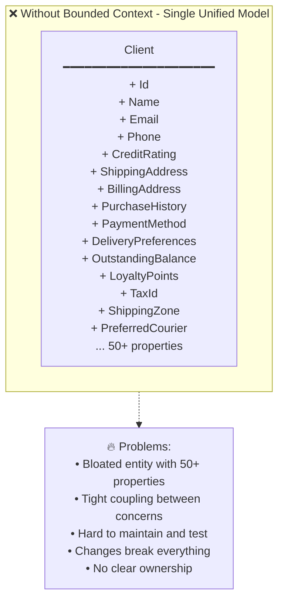
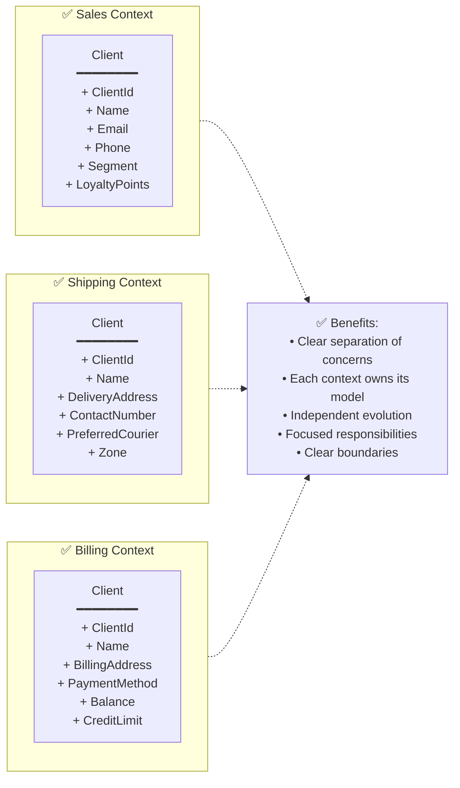
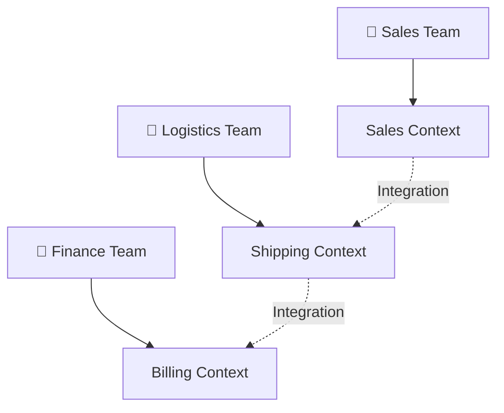
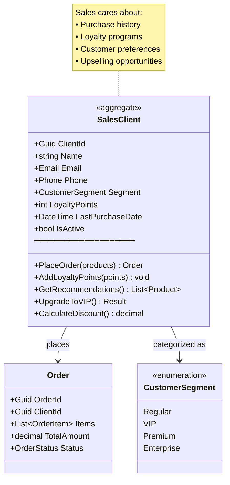
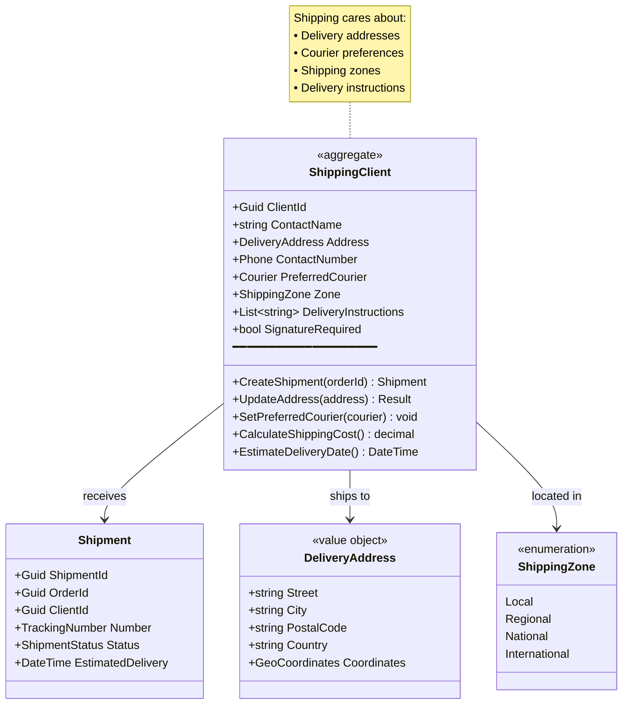
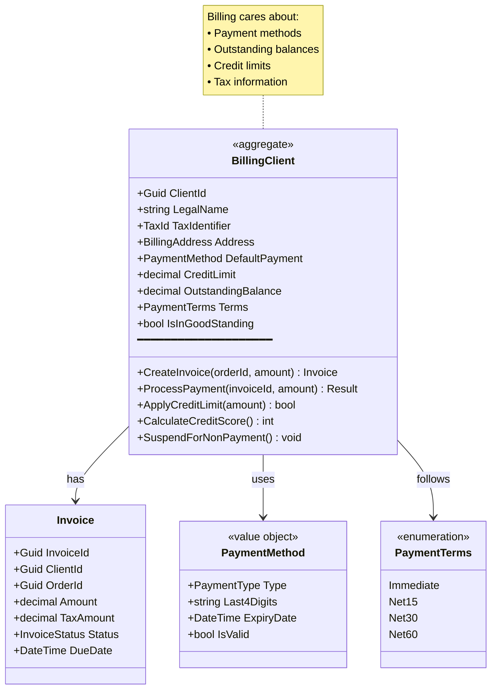
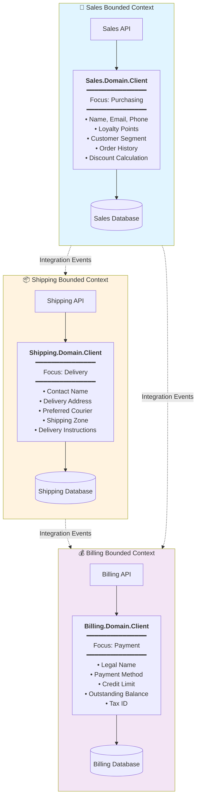
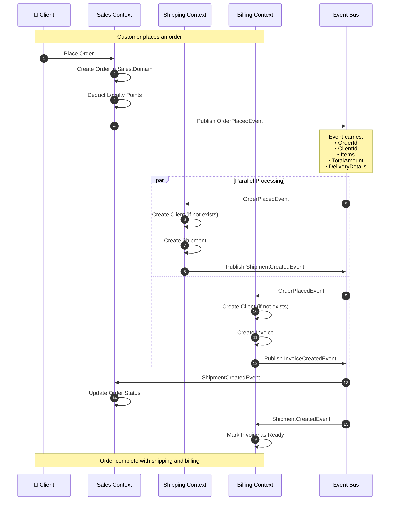
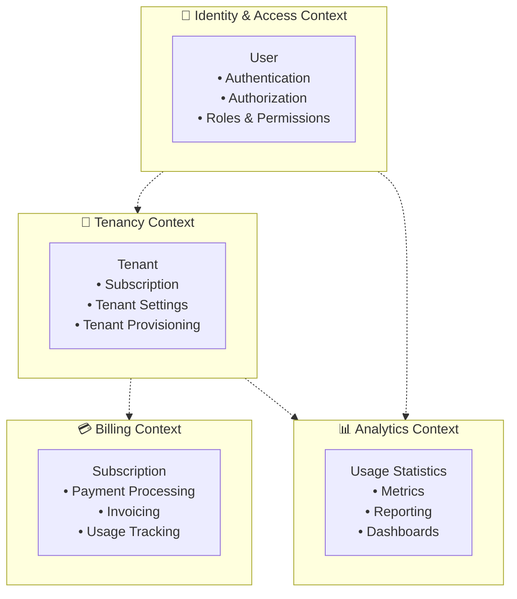
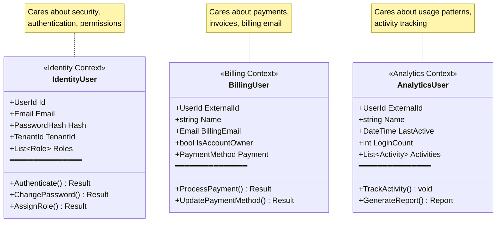

# DDD Bounded Context - Deep Dive

> **Understanding how the same business concept behaves differently across different contexts**

This document explains one of the most important strategic patterns in Domain-Driven Design: **Bounded Context**. We'll explore how a "Client" entity behaves differently in Sales, Shipping, and Billing contexts.

---

## 📚 Table of Contents

- [What is a Bounded Context?](#what-is-a-bounded-context)
- [Why Bounded Contexts Matter](#why-bounded-contexts-matter)
- [Example: Client Across Three Contexts](#example-client-across-three-contexts)
- [Context Boundaries](#context-boundaries)
- [Context Integration](#context-integration)
- [Applying to Multi-Tenant SaaS](#applying-to-multi-tenant-saas)
- [Best Practices](#best-practices)

---

## What is a Bounded Context?

A **Bounded Context** is an explicit boundary within which a domain model is defined and applicable. Within this boundary, all terms, definitions, and rules are consistent and have a specific meaning.

### Key Principles:

1. **Explicit Boundaries** - Clear separation between contexts
2. **Ubiquitous Language** - Each context has its own language
3. **Model Isolation** - Models don't leak across boundaries
4. **Context Autonomy** - Each context can evolve independently

### The Problem Without Bounded Contexts:



### The Solution With Bounded Contexts:



---

## Why Bounded Contexts Matter

### 1. **Different Perspectives, Different Models**

The same real-world concept (Client) means different things in different contexts:

- **Sales Team:** "Client is someone with purchasing power and preferences"
- **Shipping Team:** "Client is a delivery destination with logistics requirements"
- **Billing Team:** "Client is a payment entity with financial obligations"

### 2. **Reduced Complexity**

Instead of one bloated model trying to satisfy everyone, each context has a focused model:

```
❌ Single Model: 1 Client class with 50 properties
✅ Bounded Contexts: 3 focused Client classes with 5-8 properties each
```

### 3. **Team Autonomy**

Different teams can work on different contexts without stepping on each other's toes:



---

## Example: Client Across Three Contexts

Let's explore how the **same business entity (Client)** is modeled differently in three bounded contexts.

### 🎯 Scenario: E-Commerce Company

An e-commerce company has customers who:
1. Browse and purchase products (Sales)
2. Receive deliveries (Shipping)
3. Pay for orders (Billing)

---

### Context 1: Sales Context

**Purpose:** Managing customer relationships, product sales, and order placement

**What "Client" Means Here:**
A client is a **buyer** with purchasing preferences, loyalty status, and order history.



**Code Example:**

```csharp
// Sales Context - Sales.Domain/Entities/Client.cs
namespace Sales.Domain.Entities;

public class Client : AggregateRoot
{
    private readonly List<Guid> _orderIds = new();

    public string Name { get; private set; }
    public Email Email { get; private set; }
    public Phone Phone { get; private set; }
    public CustomerSegment Segment { get; private set; }
    public int LoyaltyPoints { get; private set; }
    public DateTime? LastPurchaseDate { get; private set; }
    public bool IsActive { get; private set; }
    public IReadOnlyCollection<Guid> OrderIds => _orderIds.AsReadOnly();

    public Result<Order> PlaceOrder(List<Product> products)
    {
        if (!IsActive)
            return Result<Order>.Failure(Error.Conflict("Client is not active"));

        var order = Order.Create(Id, products, CalculateDiscount());
        _orderIds.Add(order.Id);
        LastPurchaseDate = DateTime.UtcNow;

        AddDomainEvent(new OrderPlacedEvent(order.Id, Id, order.TotalAmount));

        return Result<Order>.Success(order);
    }

    public void AddLoyaltyPoints(int points)
    {
        LoyaltyPoints += points;

        // Auto-upgrade to VIP at 1000 points
        if (LoyaltyPoints >= 1000 && Segment == CustomerSegment.Regular)
        {
            Segment = CustomerSegment.VIP;
            AddDomainEvent(new ClientUpgradedToVIPEvent(Id));
        }
    }

    public decimal CalculateDiscount()
    {
        return Segment switch
        {
            CustomerSegment.VIP => 0.10m,      // 10% discount
            CustomerSegment.Premium => 0.15m,   // 15% discount
            CustomerSegment.Enterprise => 0.25m, // 25% discount
            _ => 0m
        };
    }
}
```

**Sales Context Concerns:**
- ✅ Customer segments (Regular, VIP, Premium)
- ✅ Loyalty points and rewards
- ✅ Purchase history
- ✅ Product recommendations
- ✅ Discount calculations
- ❌ NOT concerned with shipping addresses
- ❌ NOT concerned with payment methods
- ❌ NOT concerned with delivery logistics

---

### Context 2: Shipping Context

**Purpose:** Managing deliveries, logistics, and courier operations

**What "Client" Means Here:**
A client is a **delivery destination** with address, preferred courier, and delivery preferences.



**Code Example:**

```csharp
// Shipping Context - Shipping.Domain/Entities/Client.cs
namespace Shipping.Domain.Entities;

public class Client : AggregateRoot
{
    private readonly List<string> _deliveryInstructions = new();

    public string ContactName { get; private set; }
    public DeliveryAddress Address { get; private set; }
    public Phone ContactNumber { get; private set; }
    public Courier PreferredCourier { get; private set; }
    public ShippingZone Zone { get; private set; }
    public bool SignatureRequired { get; private set; }
    public IReadOnlyCollection<string> DeliveryInstructions => _deliveryInstructions.AsReadOnly();

    public Result<Shipment> CreateShipment(Guid orderId, decimal weight)
    {
        if (Address is null)
            return Result<Shipment>.Failure(Error.Validation("Delivery address is required"));

        var shippingCost = CalculateShippingCost(weight);
        var estimatedDelivery = EstimateDeliveryDate();

        var shipment = Shipment.Create(orderId, Id, Address, PreferredCourier, shippingCost, estimatedDelivery);

        AddDomainEvent(new ShipmentCreatedEvent(shipment.Id, orderId, Id));

        return Result<Shipment>.Success(shipment);
    }

    public Result UpdateAddress(DeliveryAddress newAddress)
    {
        var addressResult = DeliveryAddress.Create(newAddress);
        if (addressResult.IsFailure)
            return Result.Failure(addressResult.Error);

        Address = addressResult.Value;
        Zone = DetermineShippingZone(Address);

        AddDomainEvent(new DeliveryAddressUpdatedEvent(Id, Address));

        return Result.Success();
    }

    public decimal CalculateShippingCost(decimal weight)
    {
        var baseCost = Zone switch
        {
            ShippingZone.Local => 5.00m,
            ShippingZone.Regional => 10.00m,
            ShippingZone.National => 20.00m,
            ShippingZone.International => 50.00m,
            _ => 10.00m
        };

        return baseCost + (weight * 0.5m); // $0.50 per kg
    }

    public DateTime EstimateDeliveryDate()
    {
        var daysToDeliver = Zone switch
        {
            ShippingZone.Local => 1,
            ShippingZone.Regional => 2,
            ShippingZone.National => 3,
            ShippingZone.International => 7,
            _ => 3
        };

        return DateTime.UtcNow.AddDays(daysToDeliver);
    }
}
```

**Shipping Context Concerns:**
- ✅ Delivery addresses and zones
- ✅ Preferred couriers
- ✅ Shipping costs and estimates
- ✅ Delivery tracking
- ✅ Special delivery instructions
- ❌ NOT concerned with loyalty points
- ❌ NOT concerned with payment status
- ❌ NOT concerned with product preferences

---

### Context 3: Billing Context

**Purpose:** Managing invoices, payments, and financial obligations

**What "Client" Means Here:**
A client is a **financial entity** with payment methods, credit limits, and outstanding balances.



**Code Example:**

```csharp
// Billing Context - Billing.Domain/Entities/Client.cs
namespace Billing.Domain.Entities;

public class Client : AggregateRoot
{
    private readonly List<Guid> _invoiceIds = new();
    private readonly List<Guid> _paymentIds = new();

    public string LegalName { get; private set; }
    public TaxId TaxIdentifier { get; private set; }
    public BillingAddress Address { get; private set; }
    public PaymentMethod DefaultPayment { get; private set; }
    public decimal CreditLimit { get; private set; }
    public decimal OutstandingBalance { get; private set; }
    public PaymentTerms Terms { get; private set; }
    public bool IsInGoodStanding { get; private set; }
    public IReadOnlyCollection<Guid> InvoiceIds => _invoiceIds.AsReadOnly();

    public Result<Invoice> CreateInvoice(Guid orderId, decimal amount, decimal taxRate)
    {
        if (!IsInGoodStanding)
            return Result<Invoice>.Failure(Error.Conflict("Client account is suspended"));

        if (OutstandingBalance + amount > CreditLimit)
            return Result<Invoice>.Failure(Error.Conflict("Credit limit exceeded"));

        var taxAmount = amount * taxRate;
        var totalAmount = amount + taxAmount;

        var dueDate = CalculateDueDate();
        var invoice = Invoice.Create(Id, orderId, amount, taxAmount, dueDate);

        _invoiceIds.Add(invoice.Id);
        OutstandingBalance += totalAmount;

        AddDomainEvent(new InvoiceCreatedEvent(invoice.Id, Id, totalAmount));

        return Result<Invoice>.Success(invoice);
    }

    public Result ProcessPayment(Guid invoiceId, decimal amount)
    {
        if (amount <= 0)
            return Result.Failure(Error.Validation("Payment amount must be positive"));

        if (OutstandingBalance < amount)
            return Result.Failure(Error.Validation("Payment exceeds outstanding balance"));

        OutstandingBalance -= amount;

        if (OutstandingBalance == 0)
        {
            IsInGoodStanding = true;
        }

        AddDomainEvent(new PaymentProcessedEvent(invoiceId, Id, amount));

        return Result.Success();
    }

    public bool ApplyCreditLimit(decimal requestedAmount)
    {
        return (OutstandingBalance + requestedAmount) <= CreditLimit;
    }

    public int CalculateCreditScore()
    {
        if (OutstandingBalance == 0) return 100;
        if (OutstandingBalance < CreditLimit * 0.3m) return 80;
        if (OutstandingBalance < CreditLimit * 0.7m) return 60;
        return 40;
    }

    public void SuspendForNonPayment()
    {
        IsInGoodStanding = false;
        AddDomainEvent(new ClientSuspendedEvent(Id, "Non-payment"));
    }

    private DateTime CalculateDueDate()
    {
        var days = Terms switch
        {
            PaymentTerms.Immediate => 0,
            PaymentTerms.Net15 => 15,
            PaymentTerms.Net30 => 30,
            PaymentTerms.Net60 => 60,
            _ => 30
        };

        return DateTime.UtcNow.AddDays(days);
    }
}
```

**Billing Context Concerns:**
- ✅ Payment methods and processing
- ✅ Invoices and receipts
- ✅ Credit limits and balances
- ✅ Tax information
- ✅ Payment terms and due dates
- ❌ NOT concerned with loyalty points
- ❌ NOT concerned with delivery addresses
- ❌ NOT concerned with product catalog

---

## Context Boundaries

### Visual Representation of Boundaries



### Key Boundary Characteristics:

| Aspect | Sales Context | Shipping Context | Billing Context |
|--------|--------------|------------------|-----------------|
| **Purpose** | Sell products | Deliver orders | Process payments |
| **Client Meaning** | Buyer with preferences | Delivery destination | Payment entity |
| **Primary ID** | ClientId (Sales) | ClientId (Shipping) | ClientId (Billing) |
| **Database** | Separate | Separate | Separate |
| **Team Ownership** | Sales team | Logistics team | Finance team |
| **Language** | Orders, Products, Discounts | Shipments, Couriers, Zones | Invoices, Payments, Balance |

---

## Context Integration

### How Contexts Communicate



### Integration Patterns

#### 1. **Event-Driven Integration** (Recommended)

```csharp
// Sales Context publishes an event
namespace Sales.Domain.Events;

public record OrderPlacedEvent(
    Guid OrderId,
    Guid ClientId,
    string ClientName,
    string ClientEmail,
    decimal TotalAmount,
    ShippingDetails Shipping  // Anti-corruption layer DTO
) : IntegrationEvent;

// Shipping Context subscribes
namespace Shipping.Application.EventHandlers;

public class OrderPlacedEventHandler : INotificationHandler<OrderPlacedEvent>
{
    private readonly IClientRepository _clientRepository;
    private readonly IShipmentService _shipmentService;

    public async Task Handle(OrderPlacedEvent @event, CancellationToken ct)
    {
        // 1. Get or create client in Shipping context
        var client = await _clientRepository.GetByExternalIdAsync(@event.ClientId, ct)
            ?? await CreateClientFromEvent(@event);

        // 2. Create shipment in Shipping context
        var shipment = await _shipmentService.CreateShipmentAsync(
            @event.OrderId,
            client.Id,
            @event.Shipping.Address,
            ct);

        // 3. Publish ShipmentCreatedEvent for other contexts
        await _mediator.Publish(new ShipmentCreatedEvent(shipment.Id, @event.OrderId));
    }

    private async Task<Client> CreateClientFromEvent(OrderPlacedEvent @event)
    {
        // Map from Sales context to Shipping context
        var address = DeliveryAddress.Create(
            @event.Shipping.Street,
            @event.Shipping.City,
            @event.Shipping.PostalCode,
            @event.Shipping.Country);

        return Client.Create(
            @event.ClientId,        // Keep same ID for correlation
            @event.ClientName,
            address.Value,
            Phone.Create(@event.Shipping.Phone).Value);
    }
}
```

#### 2. **Anti-Corruption Layer (ACL)**

Protects your context from external models:

```csharp
// Anti-Corruption Layer in Shipping Context
namespace Shipping.Application.Integration;

public interface IClientAdapter
{
    Task<ClientDto> GetClientFromSalesAsync(Guid clientId);
}

public class SalesClientAdapter : IClientAdapter
{
    private readonly HttpClient _httpClient;

    public async Task<ClientDto> GetClientFromSalesAsync(Guid clientId)
    {
        // Call Sales API
        var salesClient = await _httpClient.GetFromJsonAsync<SalesClientDto>(
            $"api/sales/clients/{clientId}");

        // Translate to Shipping context model
        return new ClientDto
        {
            ExternalId = salesClient.Id,
            ContactName = salesClient.Name,
            DeliveryAddress = MapAddress(salesClient.PrimaryAddress),
            Phone = salesClient.Phone
            // Only take what Shipping needs, ignore loyalty points, etc.
        };
    }
}
```

#### 3. **Shared Kernel** (Use Sparingly)

Minimal shared concepts across contexts:

```csharp
// Shared.Common/ValueObjects/ClientId.cs
// This ID is shared across all contexts for correlation

namespace Shared.Common.ValueObjects;

public record ClientId
{
    public Guid Value { get; }

    private ClientId(Guid value) => Value = value;

    public static ClientId Create(Guid value)
    {
        if (value == Guid.Empty)
            throw new ArgumentException("ClientId cannot be empty");
        return new ClientId(value);
    }
}

// Each context uses ClientId but has its own Client model
```

---

## Applying to Multi-Tenant SaaS

### Your Project's Potential Bounded Contexts



### Example: User Entity Across Contexts



### Implementation Strategy for Your Project

```csharp
// Project Structure with Bounded Contexts

Solution/
│
├── src/
│   ├── Identity.Context/
│   │   ├── Identity.Domain/
│   │   │   └── Entities/
│   │   │       └── User.cs           // Identity's User
│   │   ├── Identity.Application/
│   │   └── Identity.Infrastructure/
│   │
│   ├── Tenancy.Context/
│   │   ├── Tenancy.Domain/
│   │   │   └── Entities/
│   │   │       ├── Tenant.cs         // Tenancy's Tenant
│   │   │       └── TenantUser.cs     // Tenancy's view of User
│   │   ├── Tenancy.Application/
│   │   └── Tenancy.Infrastructure/
│   │
│   ├── Billing.Context/
│   │   ├── Billing.Domain/
│   │   │   └── Entities/
│   │   │       ├── Subscription.cs   // Billing's Subscription
│   │   │       └── BillingClient.cs  // Billing's view of User
│   │   ├── Billing.Application/
│   │   └── Billing.Infrastructure/
│   │
│   └── Shared/
│       └── IntegrationEvents/        // Events for cross-context communication
│
└── tests/
```

---

## Best Practices

### ✅ DO:

1. **Keep Contexts Independent**
   ```csharp
   // ✅ Good: Each context has its own model
   namespace Sales.Domain { public class Client { ... } }
   namespace Shipping.Domain { public class Client { ... } }
   namespace Billing.Domain { public class Client { ... } }
   ```

2. **Use Events for Integration**
   ```csharp
   // ✅ Good: Async event-driven communication
   await _mediator.Publish(new OrderPlacedEvent(order.Id, client.Id));
   ```

3. **Create Anti-Corruption Layers**
   ```csharp
   // ✅ Good: Translate external models
   public class SalesClientAdapter : IClientAdapter
   {
       public ShippingClient MapToShippingClient(SalesClient salesClient)
       {
           // Translation logic
       }
   }
   ```

4. **Use Ubiquitous Language per Context**
   ```
   Sales: "Customer places an Order"
   Shipping: "Client receives a Shipment"
   Billing: "Account processes an Invoice"
   ```

5. **Separate Databases per Context**
   ```
   ✅ SalesDB, ShippingDB, BillingDB (separate schemas or databases)
   ```

### ❌ DON'T:

1. **Share Domain Models Across Contexts**
   ```csharp
   // ❌ Bad: Shared.Models.Client used everywhere
   namespace Shared.Models { public class Client { ... } }
   ```

2. **Direct Database Queries Across Contexts**
   ```csharp
   // ❌ Bad: Billing queries Sales database directly
   var salesClient = await _salesDbContext.Clients.FindAsync(id);
   ```

3. **Synchronous API Calls for Integration**
   ```csharp
   // ❌ Bad: Tight coupling, latency, failure cascade
   var shippingInfo = await _shippingApi.GetClientAddressAsync(clientId);
   ```

4. **Create God Objects**
   ```csharp
   // ❌ Bad: One Client class trying to do everything
   public class Client {
       // Sales properties
       public int LoyaltyPoints { get; set; }
       // Shipping properties
       public Address DeliveryAddress { get; set; }
       // Billing properties
       public decimal Balance { get; set; }
       // ... 50 more properties
   }
   ```

---

## Summary

### Key Takeaways:

1. **Bounded Context = Explicit Boundary**
   - Each context has its own model
   - Same concept, different perspectives

2. **Context Autonomy**
   - Independent evolution
   - Team ownership
   - Separate databases

3. **Integration via Events**
   - Loose coupling
   - Eventual consistency
   - Scalability

4. **Anti-Corruption Layers**
   - Protect your model
   - Translate external concepts
   - Maintain integrity

5. **Ubiquitous Language**
   - Context-specific terms
   - Clear communication
   - Reduced ambiguity

### The Client Example Recap:

| Context | What Client Means | Key Properties | Key Behaviors |
|---------|------------------|----------------|---------------|
| **Sales** | A buyer | Name, Email, Loyalty Points | PlaceOrder, CalculateDiscount |
| **Shipping** | A delivery destination | Address, Zone, Courier | CreateShipment, CalculateShippingCost |
| **Billing** | A payment entity | Balance, Payment Method, Credit Limit | CreateInvoice, ProcessPayment |

---

## Related Documentation

- [DDD-ClassDiagrams](./DDD-ClassDiagrams.md) - Visual architecture
- [DDD-DataFlow](./DDD-DataFlow.md) - Request lifecycle
- [ConcreteExample-CreateUser](./ConcreteExample-CreateUser.md) - Code examples
- [DomainEvents](./DomainEvents.md) - Event-driven patterns

---

**Last Updated:** April 02, 2026  
**Diagrams:** 8 comprehensive bounded context diagrams  
**Coverage:** Strategic DDD patterns with practical examples
