# DDD Data Flow Diagrams

> **Complete visual representation of data flow through the Domain-Driven Design architecture**

This document provides comprehensive data flow diagrams showing how requests flow through the application layers following DDD and Clean Architecture principles.

> **📝 Note:** All diagrams are optimized for both light and dark themes. Colors are handled by your Mermaid renderer for better compatibility.

---

## 📊 Table of Contents

- [Overall Architecture Data Flow](#overall-architecture-data-flow)
- [Command Flow (Write Operations)](#command-flow-write-operations)
- [Query Flow (Read Operations)](#query-flow-read-operations)
- [Domain Event Flow](#domain-event-flow)
  - [Event Handler Registration & Execution](#event-handler-registration--execution)
- [Authentication Flow](#authentication-flow)
- [Multi-Tenant Data Isolation Flow](#multi-tenant-data-isolation-flow)
- [Error Handling Flow](#error-handling-flow)
- [Complete Request Lifecycle](#complete-request-lifecycle)

---

## Overall Architecture Data Flow

### Clean Architecture Layers

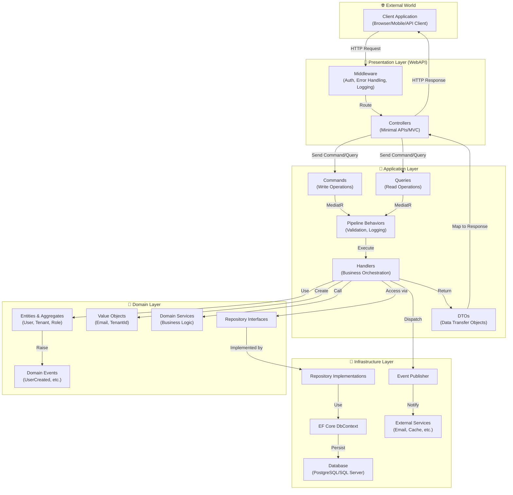
```mermaid
flowchart TB
    subgraph External["🌐 External World"]
        Client["Client Application<br/>(Browser/Mobile/API Client)"]
    end

    subgraph Presentation["📱 Presentation Layer (WebAPI)"]
        Controller["Controllers<br/>(Minimal APIs/MVC)"]
        Middleware["Middleware<br/>(Auth, Error Handling, Logging)"]
    end

    subgraph Application["🎯 Application Layer"]
        Command["Commands<br/>(Write Operations)"]
        Query["Queries<br/>(Read Operations)"]
        Handlers["Handlers<br/>(Business Orchestration)"]
        Behaviors["Pipeline Behaviors<br/>(Validation, Logging)"]
        DTOs["DTOs<br/>(Data Transfer Objects)"]
    end

    subgraph Domain["💎 Domain Layer"]
        Entities["Entities & Aggregates<br/>(User, Tenant, Role)"]
        ValueObjects["Value Objects<br/>(Email, TenantId)"]
        DomainEvents["Domain Events<br/>(UserCreated, etc.)"]
        DomainServices["Domain Services<br/>(Business Logic)"]
        Repositories["Repository Interfaces"]
    end

    subgraph Infrastructure["🔧 Infrastructure Layer"]
        RepositoryImpl["Repository Implementations"]
        DbContext["EF Core DbContext"]
        Database["Database<br/>(PostgreSQL/SQL Server)"]
        EventPublisher["Event Publisher"]
        ExternalServices["External Services<br/>(Email, Cache, etc.)"]
    end

    Client -->|HTTP Request| Middleware
    Middleware -->|Route| Controller
    Controller -->|Send Command/Query| Command
    Controller -->|Send Command/Query| Query

    Command -->|MediatR| Behaviors
    Query -->|MediatR| Behaviors
    Behaviors -->|Execute| Handlers

    Handlers -->|Use| Entities
    Handlers -->|Create| ValueObjects
    Handlers -->|Call| DomainServices
    Handlers -->|Access via| Repositories

    Entities -->|Raise| DomainEvents

    Repositories -->|Implemented by| RepositoryImpl
    RepositoryImpl -->|Use| DbContext
    DbContext -->|Persist| Database

    Handlers -->|Dispatch| EventPublisher
    EventPublisher -->|Notify| ExternalServices

    Handlers -->|Return| DTOs
    DTOs -->|Map to Response| Controller
    Controller -->|HTTP Response| Client
```

---

## Command Flow (Write Operations)

### Creating a New User (Write Operation)

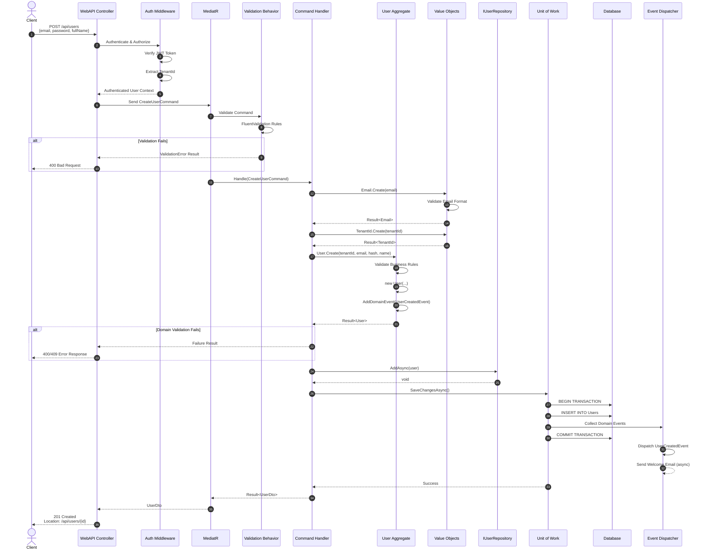
```mermaid
sequenceDiagram
    autonumber
    actor Client
    participant API as WebAPI Controller
    participant Auth as Auth Middleware
    participant MR as MediatR
    participant Val as Validation Behavior
    participant Handler as Command Handler
    participant Domain as User Aggregate
    participant VO as Value Objects
    participant Repo as IUserRepository
    participant UoW as Unit of Work
    participant DB as Database
    participant Events as Event Dispatcher

    Client->>API: POST /api/users<br/>{email, password, fullName}

    API->>Auth: Authenticate & Authorize
    Auth->>Auth: Verify JWT Token
    Auth->>Auth: Extract TenantId
    Auth-->>API: Authenticated User Context

    API->>MR: Send CreateUserCommand

    MR->>Val: Validate Command
    Val->>Val: FluentValidation Rules
    alt Validation Fails
        Val-->>API: ValidationError Result
        API-->>Client: 400 Bad Request
    end

    MR->>Handler: Handle(CreateUserCommand)

    Handler->>VO: Email.Create(email)
    VO->>VO: Validate Email Format
    VO-->>Handler: Result<Email>

    Handler->>VO: TenantId.Create(tenantId)
    VO-->>Handler: Result<TenantId>

    Handler->>Domain: User.Create(tenantId, email, hash, name)
    Domain->>Domain: Validate Business Rules
    Domain->>Domain: new User(...)
    Domain->>Domain: AddDomainEvent(UserCreatedEvent)
    Domain-->>Handler: Result<User>

    alt Domain Validation Fails
        Handler-->>API: Failure Result
        API-->>Client: 400/409 Error Response
    end

    Handler->>Repo: AddAsync(user)
    Repo-->>Handler: void

    Handler->>UoW: SaveChangesAsync()
    UoW->>DB: BEGIN TRANSACTION
    UoW->>DB: INSERT INTO Users
    UoW->>Events: Collect Domain Events
    UoW->>DB: COMMIT TRANSACTION

    Events->>Events: Dispatch UserCreatedEvent
    Events-->>Events: Send Welcome Email (async)

    UoW-->>Handler: Success
    Handler-->>MR: Result<UserDto>
    MR-->>API: UserDto

    API-->>Client: 201 Created<br/>Location: /api/users/{id}
```

### Data Flow Details (Write)

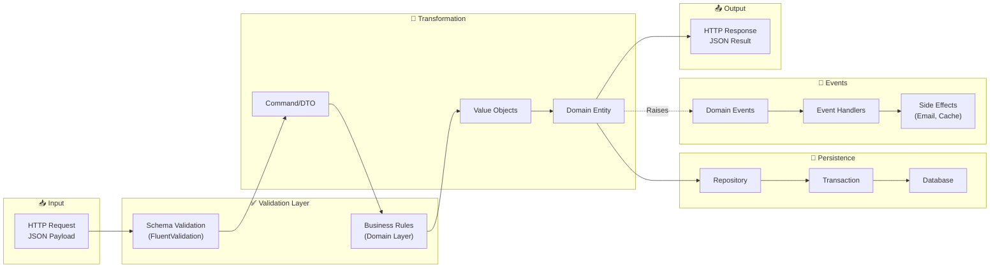
```mermaid
flowchart LR
    subgraph Input["📥 Input"]
        HTTP["HTTP Request<br/>JSON Payload"]
    end

    subgraph Validation["✅ Validation Layer"]
        Schema["Schema Validation<br/>(FluentValidation)"]
        Business["Business Rules<br/>(Domain Layer)"]
    end

    subgraph Transform["🔄 Transformation"]
        DTO["Command/DTO"]
        VO["Value Objects"]
        Entity["Domain Entity"]
    end

    subgraph Persist["💾 Persistence"]
        Repo["Repository"]
        Transaction["Transaction"]
        DB["Database"]
    end

    subgraph Events["📢 Events"]
        DomainEvent["Domain Events"]
        EventHandler["Event Handlers"]
        SideEffects["Side Effects<br/>(Email, Cache)"]
    end

    subgraph Output["📤 Output"]
        Response["HTTP Response<br/>JSON Result"]
    end

    HTTP --> Schema
    Schema --> DTO
    DTO --> Business
    Business --> VO
    VO --> Entity
    Entity --> Repo
    Repo --> Transaction
    Transaction --> DB
    Entity -.Raises.-> DomainEvent
    DomainEvent --> EventHandler
    EventHandler --> SideEffects
    Entity --> Response
```

---

## Query Flow (Read Operations)

### Fetching User Details (Read Operation)

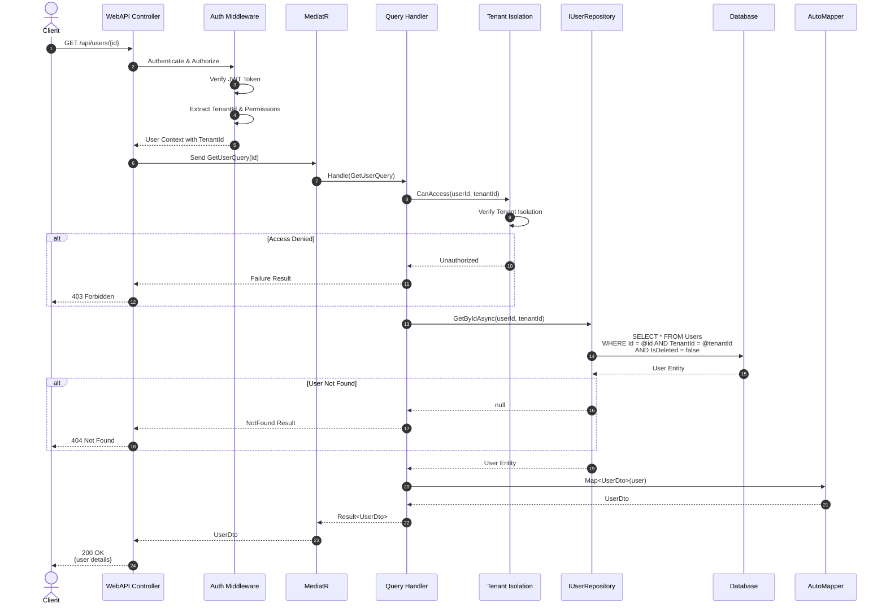
```mermaid
sequenceDiagram
    autonumber
    actor Client
    participant API as WebAPI Controller
    participant Auth as Auth Middleware
    participant MR as MediatR
    participant Handler as Query Handler
    participant Tenant as Tenant Isolation
    participant Repo as IUserRepository
    participant DB as Database
    participant Mapper as AutoMapper

    Client->>API: GET /api/users/{id}

    API->>Auth: Authenticate & Authorize
    Auth->>Auth: Verify JWT Token
    Auth->>Auth: Extract TenantId & Permissions
    Auth-->>API: User Context with TenantId

    API->>MR: Send GetUserQuery(id)

    MR->>Handler: Handle(GetUserQuery)

    Handler->>Tenant: CanAccess(userId, tenantId)
    Tenant->>Tenant: Verify Tenant Isolation

    alt Access Denied
        Tenant-->>Handler: Unauthorized
        Handler-->>API: Failure Result
        API-->>Client: 403 Forbidden
    end

    Handler->>Repo: GetByIdAsync(userId, tenantId)
    Repo->>DB: SELECT * FROM Users<br/>WHERE Id = @id AND TenantId = @tenantId<br/>AND IsDeleted = false
    DB-->>Repo: User Entity

    alt User Not Found
        Repo-->>Handler: null
        Handler-->>API: NotFound Result
        API-->>Client: 404 Not Found
    end

    Repo-->>Handler: User Entity

    Handler->>Mapper: Map<UserDto>(user)
    Mapper-->>Handler: UserDto

    Handler-->>MR: Result<UserDto>
    MR-->>API: UserDto

    API-->>Client: 200 OK<br/>{user details}
```

### Data Flow Details (Read)


```mermaid
flowchart LR
    subgraph Input["📥 Input"]
        Request["HTTP GET Request<br/>Route Parameters"]
    end

    subgraph Security["🔒 Security"]
        Auth["Authentication"]
        Authz["Authorization"]
        TenantCheck["Tenant Isolation"]
    end

    subgraph Query["🔍 Query Processing"]
        QueryObj["Query Object"]
        Filters["Filters & Pagination"]
    end

    subgraph Data["📊 Data Access"]
        Repo["Repository"]
        DB["Database Query<br/>(Read-Only)"]
        Cache["Cache Layer<br/>(Optional)"]
    end

    subgraph Transform["🔄 Transformation"]
        Entity["Domain Entity"]
        Projection["Projection/Mapping"]
        DTO["Response DTO"]
    end

    subgraph Output["📤 Output"]
        Response["HTTP Response<br/>JSON Result"]
    end

    Request --> Auth
    Auth --> Authz
    Authz --> TenantCheck
    TenantCheck --> QueryObj
    QueryObj --> Filters
    Filters --> Cache
    Cache -.Cache Miss.-> Repo
    Repo --> DB
    DB --> Entity
    Entity --> Projection
    Projection --> DTO
    DTO --> Response
    DTO -.Cache Hit.-> Cache
```

---

## Domain Event Flow

### Event Sourcing and Side Effects

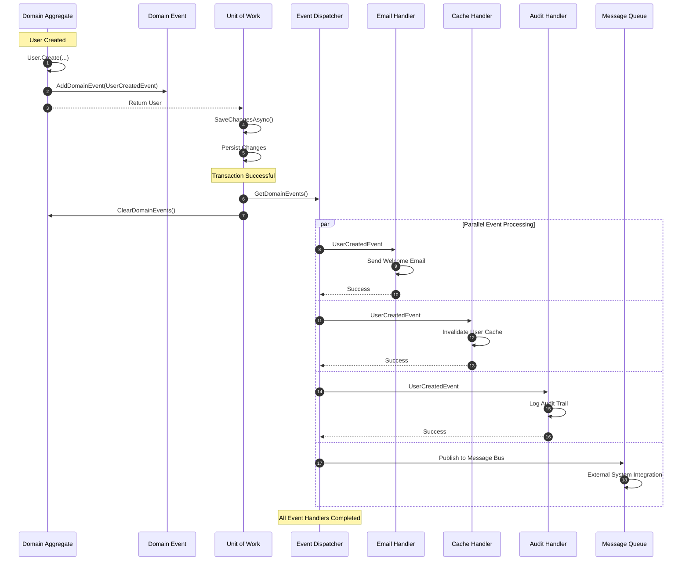
```mermaid
sequenceDiagram
    autonumber
    participant Aggregate as Domain Aggregate
    participant Event as Domain Event
    participant UoW as Unit of Work
    participant Dispatcher as Event Dispatcher
    participant Handler1 as Email Handler
    participant Handler2 as Cache Handler
    participant Handler3 as Audit Handler
    participant Queue as Message Queue

    Note over Aggregate: User Created
    Aggregate->>Aggregate: User.Create(...)
    Aggregate->>Event: AddDomainEvent(UserCreatedEvent)
    Aggregate-->>UoW: Return User

    UoW->>UoW: SaveChangesAsync()
    UoW->>UoW: Persist Changes

    Note over UoW: Transaction Successful
    UoW->>Dispatcher: GetDomainEvents()
    UoW->>Aggregate: ClearDomainEvents()

    par Parallel Event Processing
        Dispatcher->>Handler1: UserCreatedEvent
        Handler1->>Handler1: Send Welcome Email
        Handler1-->>Dispatcher: Success
    and
        Dispatcher->>Handler2: UserCreatedEvent
        Handler2->>Handler2: Invalidate User Cache
        Handler2-->>Dispatcher: Success
    and
        Dispatcher->>Handler3: UserCreatedEvent
        Handler3->>Handler3: Log Audit Trail
        Handler3-->>Dispatcher: Success
    and
        Dispatcher->>Queue: Publish to Message Bus
        Queue->>Queue: External System Integration
    end

    Note over Dispatcher: All Event Handlers Completed
```

### Event Flow Diagram

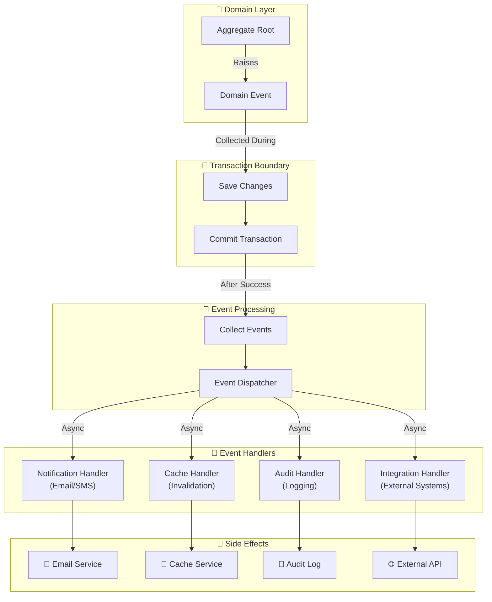
```mermaid
flowchart TB
    subgraph Domain["💎 Domain Layer"]
        Aggregate["Aggregate Root"]
        Event["Domain Event"]
    end

    subgraph Transaction["💾 Transaction Boundary"]
        SaveChanges["Save Changes"]
        Commit["Commit Transaction"]
    end

    subgraph EventProcessing["📢 Event Processing"]
        Collect["Collect Events"]
        Dispatch["Event Dispatcher"]
    end

    subgraph Handlers["🎯 Event Handlers"]
        Handler1["Notification Handler<br/>(Email/SMS)"]
        Handler2["Cache Handler<br/>(Invalidation)"]
        Handler3["Audit Handler<br/>(Logging)"]
        Handler4["Integration Handler<br/>(External Systems)"]
    end

    subgraph SideEffects["🔄 Side Effects"]
        Email["📧 Email Service"]
        Cache["💾 Cache Service"]
        Audit["📝 Audit Log"]
        External["🌐 External API"]
    end

    Aggregate -->|Raises| Event
    Event -->|Collected During| SaveChanges
    SaveChanges --> Commit
    Commit -->|After Success| Collect
    Collect --> Dispatch

    Dispatch -->|Async| Handler1
    Dispatch -->|Async| Handler2
    Dispatch -->|Async| Handler3
    Dispatch -->|Async| Handler4

    Handler1 --> Email
    Handler2 --> Cache
    Handler3 --> Audit
    Handler4 --> External
```

### Event Handler Registration & Execution

This diagram shows **WHERE** event handlers are registered and **WHEN** they are executed:

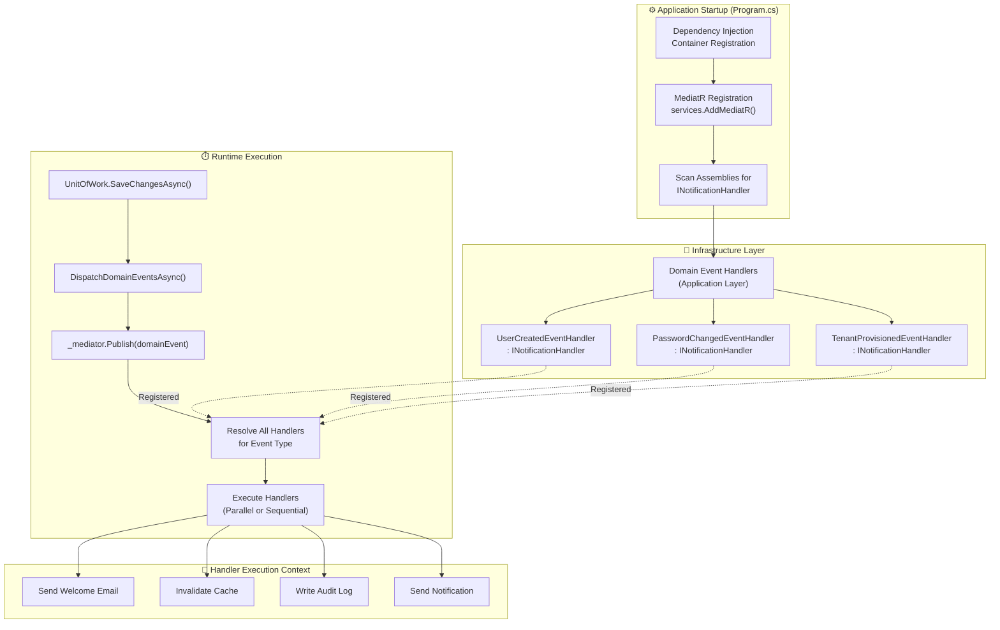
```mermaid
flowchart TB
    subgraph Startup["⚙️ Application Startup (Program.cs)"]
        direction TB
        DI["Dependency Injection<br/>Container Registration"]
        MediatRReg["MediatR Registration<br/>services.AddMediatR()"]
        ScanHandlers["Scan Assemblies for<br/>INotificationHandler<T>"]
    end

    subgraph Infrastructure["🔧 Infrastructure Layer"]
        direction TB
        EventHandlers["Domain Event Handlers<br/>(Application Layer)"]
        Handler1["UserCreatedEventHandler<br/>: INotificationHandler<UserCreatedEvent>"]
        Handler2["PasswordChangedEventHandler<br/>: INotificationHandler<PasswordChangedEvent>"]
        Handler3["TenantProvisionedEventHandler<br/>: INotificationHandler<TenantProvisionedEvent>"]
    end

    subgraph Runtime["⏱️ Runtime Execution"]
        direction TB
        SaveChanges["UnitOfWork.SaveChangesAsync()"]
        DispatchEvents["DispatchDomainEventsAsync()"]
        MediatRPublish["_mediator.Publish(domainEvent)"]
        ResolveHandlers["Resolve All Handlers<br/>for Event Type"]
        ExecuteHandlers["Execute Handlers<br/>(Parallel or Sequential)"]
    end

    subgraph Handlers["🎯 Handler Execution Context"]
        direction TB
        EmailService["Send Welcome Email"]
        CacheInvalidate["Invalidate Cache"]
        AuditLog["Write Audit Log"]
        Notification["Send Notification"]
    end

    DI --> MediatRReg
    MediatRReg --> ScanHandlers
    ScanHandlers --> EventHandlers
    EventHandlers --> Handler1
    EventHandlers --> Handler2
    EventHandlers --> Handler3

    SaveChanges --> DispatchEvents
    DispatchEvents --> MediatRPublish
    MediatRPublish --> ResolveHandlers
    ResolveHandlers --> ExecuteHandlers

    ExecuteHandlers --> EmailService
    ExecuteHandlers --> CacheInvalidate
    ExecuteHandlers --> AuditLog
    ExecuteHandlers --> Notification

    Handler1 -.Registered.-> ResolveHandlers
    Handler2 -.Registered.-> ResolveHandlers
    Handler3 -.Registered.-> ResolveHandlers
```

### Complete Event Subscription Flow (Step-by-Step)

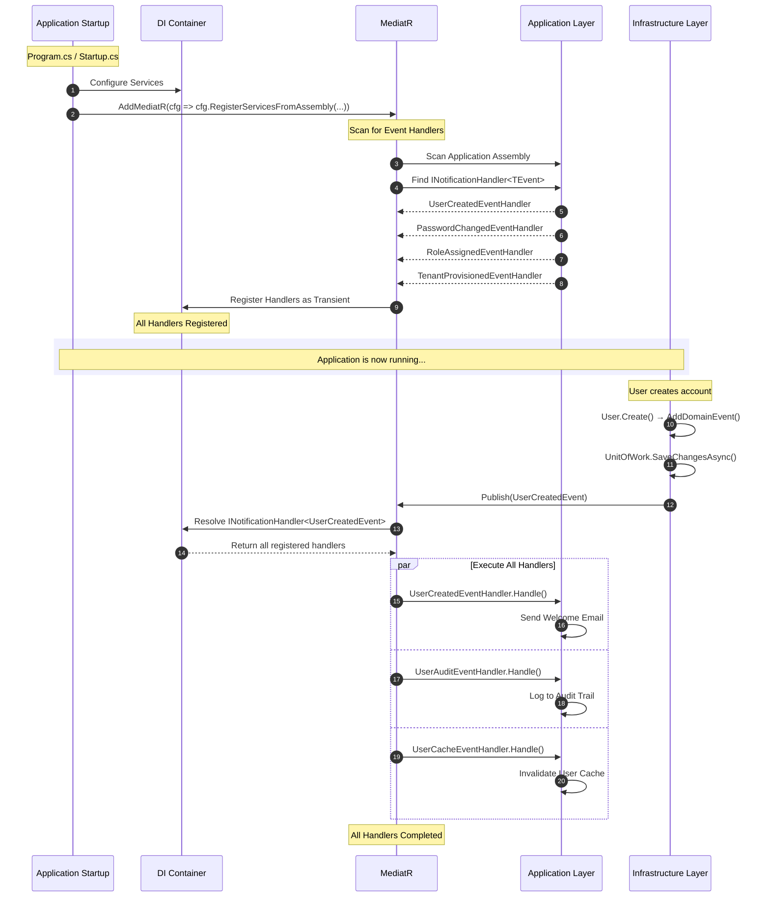
```mermaid
sequenceDiagram
    autonumber
    participant Startup as Application Startup
    participant DI as DI Container
    participant MediatR as MediatR
    participant App as Application Layer
    participant Infra as Infrastructure Layer

    Note over Startup: Program.cs / Startup.cs
    Startup->>DI: Configure Services
    Startup->>MediatR: AddMediatR(cfg => cfg.RegisterServicesFromAssembly(...))

    Note over MediatR: Scan for Event Handlers
    MediatR->>App: Scan Application Assembly
    MediatR->>App: Find INotificationHandler<TEvent>

    App-->>MediatR: UserCreatedEventHandler
    App-->>MediatR: PasswordChangedEventHandler
    App-->>MediatR: RoleAssignedEventHandler
    App-->>MediatR: TenantProvisionedEventHandler

    MediatR->>DI: Register Handlers as Transient

    Note over DI: All Handlers Registered

    rect rgb(240, 240, 255)
        Note over Startup,Infra: Application is now running...
    end

    Note over Infra: User creates account
    Infra->>Infra: User.Create() → AddDomainEvent()
    Infra->>Infra: UnitOfWork.SaveChangesAsync()
    Infra->>MediatR: Publish(UserCreatedEvent)

    MediatR->>DI: Resolve INotificationHandler<UserCreatedEvent>
    DI-->>MediatR: Return all registered handlers

    par Execute All Handlers
        MediatR->>App: UserCreatedEventHandler.Handle()
        App->>App: Send Welcome Email
    and
        MediatR->>App: UserAuditEventHandler.Handle()
        App->>App: Log to Audit Trail
    and
        MediatR->>App: UserCacheEventHandler.Handle()
        App->>App: Invalidate User Cache
    end

    Note over MediatR: All Handlers Completed
```

### Where Event Handlers Live (Code Organization)

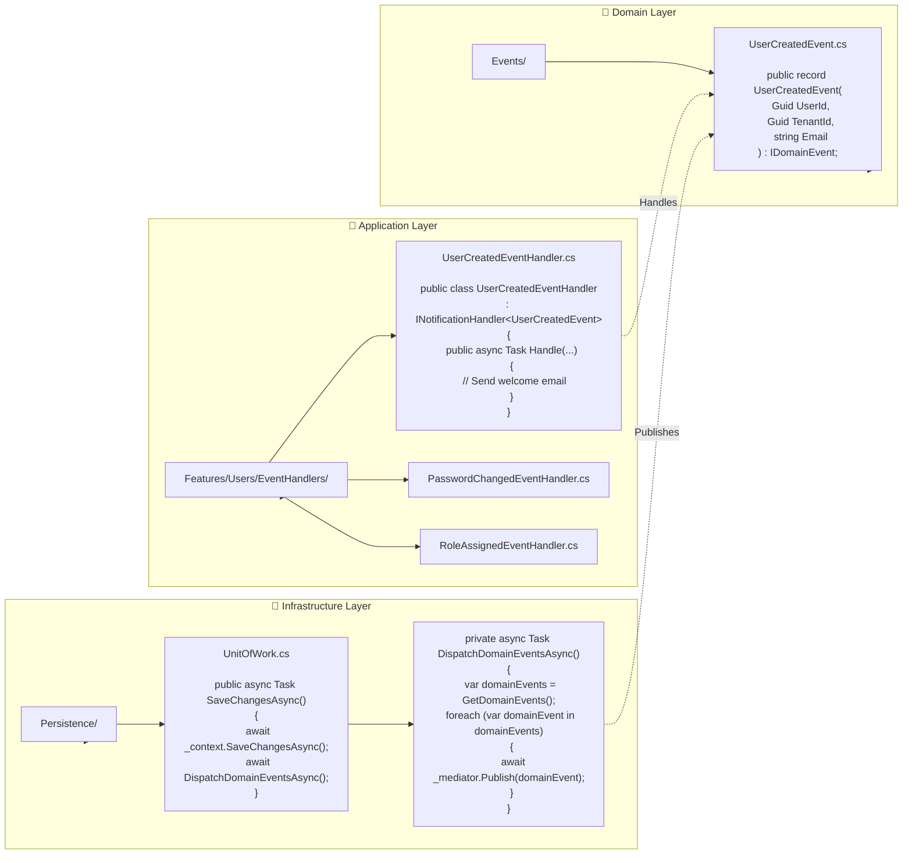
```mermaid
flowchart LR
    subgraph Application["📁 Application Layer"]
        direction TB
        EventHandlers["Features/Users/EventHandlers/"]
        UserCreatedHandler["UserCreatedEventHandler.cs<br/><br/>public class UserCreatedEventHandler<br/>: INotificationHandler&lt;UserCreatedEvent&gt;<br/>{<br/>  public async Task Handle(...)<br/>  {<br/>    // Send welcome email<br/>  }<br/>}"]
        PasswordChangedHandler["PasswordChangedEventHandler.cs"]
        RoleAssignedHandler["RoleAssignedEventHandler.cs"]
    end

    subgraph Domain["💎 Domain Layer"]
        Events["Events/"]
        UserCreatedEvent["UserCreatedEvent.cs<br/><br/>public record UserCreatedEvent(<br/>  Guid UserId,<br/>  Guid TenantId,<br/>  string Email<br/>) : IDomainEvent;"]
    end

    subgraph Infrastructure["🔧 Infrastructure Layer"]
        Persistence["Persistence/"]
        UnitOfWork["UnitOfWork.cs<br/><br/>public async Task SaveChangesAsync()<br/>{<br/>  await _context.SaveChangesAsync();<br/>  await DispatchDomainEventsAsync();<br/>}"]
        DispatchMethod["private async Task DispatchDomainEventsAsync()<br/>{<br/>  var domainEvents = GetDomainEvents();<br/>  foreach (var domainEvent in domainEvents)<br/>  {<br/>    await _mediator.Publish(domainEvent);<br/>  }<br/>}"]
    end

    Domain --> UserCreatedEvent
    Events --> UserCreatedEvent

    Application --> EventHandlers
    EventHandlers --> UserCreatedHandler
    EventHandlers --> PasswordChangedHandler
    EventHandlers --> RoleAssignedHandler

    Infrastructure --> Persistence
    Persistence --> UnitOfWork
    UnitOfWork --> DispatchMethod

    UserCreatedHandler -.Handles.-> UserCreatedEvent
    DispatchMethod -.Publishes.-> UserCreatedEvent
```

### Registration in Program.cs

```csharp
// Application Startup - Program.cs or Startup.cs

// 1️⃣ Register MediatR (scans for handlers automatically)
builder.Services.AddMediatR(cfg =>
{
    cfg.RegisterServicesFromAssembly(typeof(Application.AssemblyReference).Assembly);
    // This will find all classes implementing INotificationHandler<TEvent>
});

// 2️⃣ Register Infrastructure (UnitOfWork with event dispatching)
builder.Services.AddScoped<IUnitOfWork, UnitOfWork>();

// 3️⃣ (Optional) Register external services used by handlers
builder.Services.AddScoped<IEmailService, EmailService>();
builder.Services.AddScoped<ICacheService, CacheService>();
builder.Services.AddScoped<IAuditService, AuditService>();
```

### Example Event Handler Implementation

```csharp
// File: Application/Features/Users/EventHandlers/UserCreatedEventHandler.cs

namespace Application.Features.Users.EventHandlers;

public class UserCreatedEventHandler : INotificationHandler<UserCreatedEvent>
{
    private readonly IEmailService _emailService;
    private readonly ILogger<UserCreatedEventHandler> _logger;

    public UserCreatedEventHandler(
        IEmailService emailService,
        ILogger<UserCreatedEventHandler> logger)
    {
        _emailService = emailService;
        _logger = logger;
    }

    // ✅ This method is EXECUTED when UserCreatedEvent is published
    public async Task Handle(UserCreatedEvent notification, CancellationToken cancellationToken)
    {
        _logger.LogInformation(
            "Handling UserCreatedEvent for User {UserId} in Tenant {TenantId}",
            notification.UserId,
            notification.TenantId);

        // Send welcome email
        await _emailService.SendWelcomeEmailAsync(
            notification.Email,
            cancellationToken);

        _logger.LogInformation("Welcome email sent to {Email}", notification.Email);
    }
}
```

### Execution Timeline


```mermaid
gantt
    title Domain Event Lifecycle
    dateFormat X
    axisFormat %M:%S

    section Domain Layer
    User.Create() called           :a1, 0, 1s
    AddDomainEvent(UserCreatedEvent) :a2, 1, 2s
    Return Result<User>            :a3, 2, 3s

    section Repository
    repository.AddAsync(user)      :b1, 3, 4s

    section Unit of Work
    SaveChangesAsync() called      :c1, 4, 5s
    BEGIN TRANSACTION              :c2, 5, 6s
    INSERT INTO Users              :c3, 6, 8s
    COMMIT TRANSACTION             :c4, 8, 9s
    GetDomainEvents()              :c5, 9, 10s
    DispatchDomainEventsAsync()    :c6, 10, 11s

    section Event Dispatcher
    mediator.Publish(UserCreatedEvent) :d1, 11, 12s
    Resolve All Handlers           :d2, 12, 13s

    section Event Handlers (Parallel)
    UserCreatedEventHandler        :e1, 13, 16s
    UserAuditEventHandler          :e2, 13, 15s
    UserCacheEventHandler          :e3, 13, 14s

    section Response
    Return Success to Client       :f1, 16, 17s
```

### Key Takeaways

#### 📍 **WHERE are handlers registered?**
- **Application Startup** (Program.cs) via `AddMediatR()`
- MediatR **automatically scans** for all `INotificationHandler<TEvent>` implementations

#### 📍 **WHERE do handlers live?**
- **Application Layer**: `Application/Features/{Feature}/EventHandlers/`
- Example: `Application/Features/Users/EventHandlers/UserCreatedEventHandler.cs`

#### 📍 **WHEN are handlers executed?**
- **After successful transaction commit** in `UnitOfWork.SaveChangesAsync()`
- Triggered by `DispatchDomainEventsAsync()` method
- Uses `IMediator.Publish()` to notify all registered handlers

#### 📍 **HOW are handlers executed?**
- **Parallel execution** by default (all handlers run simultaneously)
- Can be configured for sequential execution if needed
- Each handler is resolved from DI container with its dependencies

---

## Authentication Flow

### JWT Token Authentication & Authorization

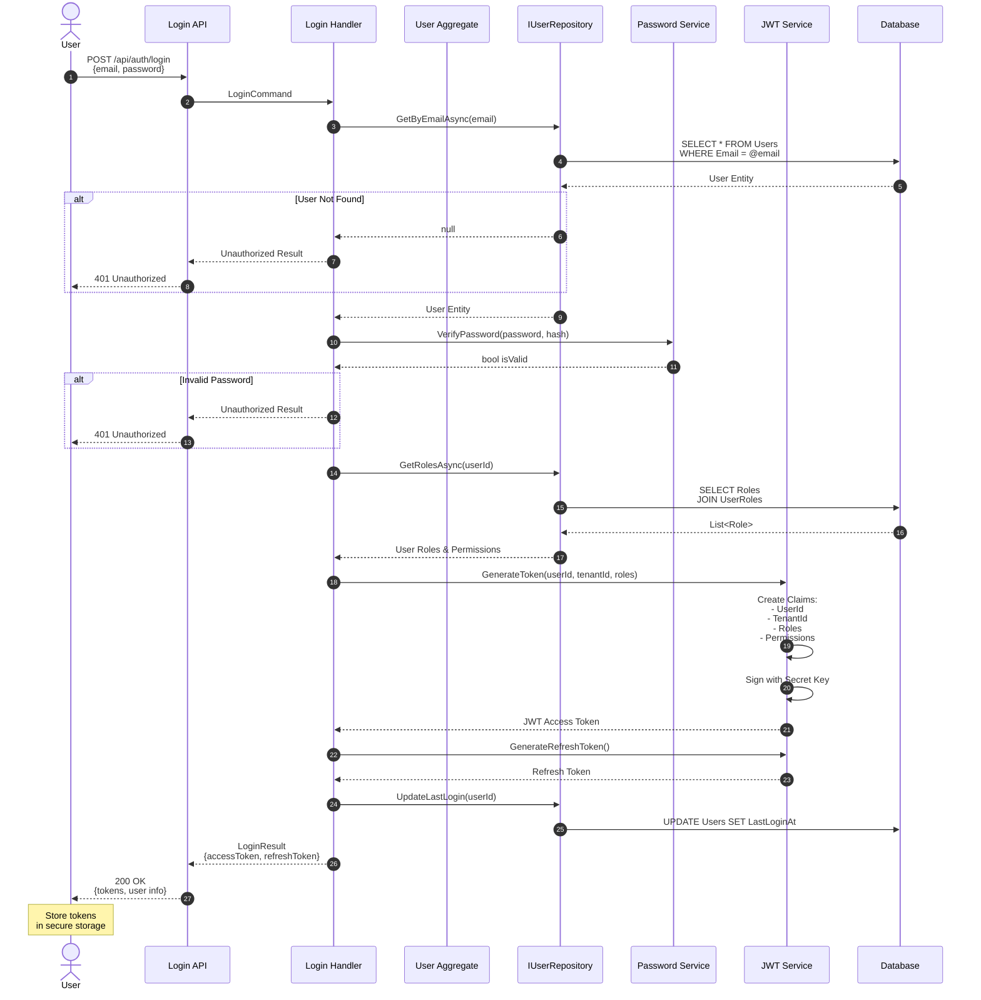
```mermaid
sequenceDiagram
    autonumber
    actor User
    participant API as Login API
    participant Handler as Login Handler
    participant Domain as User Aggregate
    participant Repo as IUserRepository
    participant PasswordService as Password Service
    participant JWT as JWT Service
    participant DB as Database

    User->>API: POST /api/auth/login<br/>{email, password}

    API->>Handler: LoginCommand

    Handler->>Repo: GetByEmailAsync(email)
    Repo->>DB: SELECT * FROM Users<br/>WHERE Email = @email
    DB-->>Repo: User Entity

    alt User Not Found
        Repo-->>Handler: null
        Handler-->>API: Unauthorized Result
        API-->>User: 401 Unauthorized
    end

    Repo-->>Handler: User Entity

    Handler->>PasswordService: VerifyPassword(password, hash)
    PasswordService-->>Handler: bool isValid

    alt Invalid Password
        Handler-->>API: Unauthorized Result
        API-->>User: 401 Unauthorized
    end

    Handler->>Repo: GetRolesAsync(userId)
    Repo->>DB: SELECT Roles<br/>JOIN UserRoles
    DB-->>Repo: List<Role>
    Repo-->>Handler: User Roles & Permissions

    Handler->>JWT: GenerateToken(userId, tenantId, roles)
    JWT->>JWT: Create Claims:<br/>- UserId<br/>- TenantId<br/>- Roles<br/>- Permissions
    JWT->>JWT: Sign with Secret Key
    JWT-->>Handler: JWT Access Token

    Handler->>JWT: GenerateRefreshToken()
    JWT-->>Handler: Refresh Token

    Handler->>Repo: UpdateLastLogin(userId)
    Repo->>DB: UPDATE Users SET LastLoginAt

    Handler-->>API: LoginResult<br/>{accessToken, refreshToken}
    API-->>User: 200 OK<br/>{tokens, user info}

    Note over User: Store tokens<br/>in secure storage
```

### Authorization Flow (Every Request)

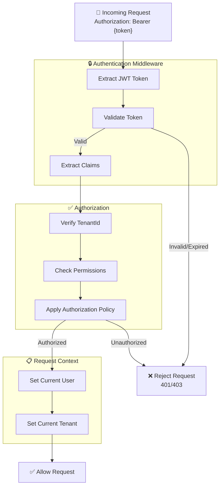
```mermaid
flowchart TB
    Request["📨 Incoming Request<br/>Authorization: Bearer {token}"]

    subgraph Middleware["🔒 Authentication Middleware"]
        Extract["Extract JWT Token"]
        Validate["Validate Token"]
        Claims["Extract Claims"]
    end

    subgraph Authorization["✅ Authorization"]
        TenantId["Verify TenantId"]
        Permissions["Check Permissions"]
        Policy["Apply Authorization Policy"]
    end

    subgraph Context["📋 Request Context"]
        SetUser["Set Current User"]
        SetTenant["Set Current Tenant"]
    end

    Success["✅ Allow Request"]
    Reject["❌ Reject Request<br/>401/403"]

    Request --> Extract
    Extract --> Validate

    Validate -->|Invalid/Expired| Reject
    Validate -->|Valid| Claims

    Claims --> TenantId
    TenantId --> Permissions
    Permissions --> Policy

    Policy -->|Authorized| SetUser
    Policy -->|Unauthorized| Reject

    SetUser --> SetTenant
    SetTenant --> Success
```

---

## Multi-Tenant Data Isolation Flow

### Tenant Isolation Strategy

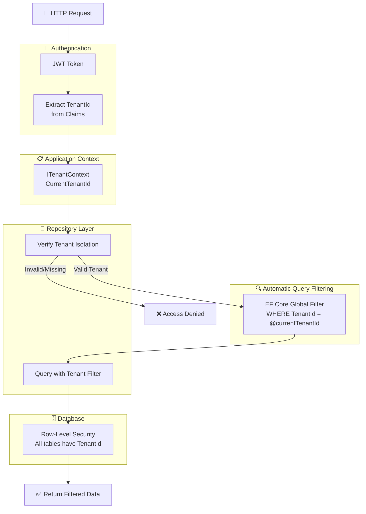
```mermaid
flowchart TB
    Request["📨 HTTP Request"]

    subgraph Auth["🔐 Authentication"]
        Token["JWT Token"]
        ExtractTenant["Extract TenantId<br/>from Claims"]
    end

    subgraph Context["📋 Application Context"]
        TenantContext["ITenantContext<br/>CurrentTenantId"]
    end

    subgraph QueryFiltering["🔍 Automatic Query Filtering"]
        GlobalFilter["EF Core Global Filter<br/>WHERE TenantId = @currentTenantId"]
    end

    subgraph Repository["💾 Repository Layer"]
        CheckIsolation["Verify Tenant Isolation"]
        Query["Query with Tenant Filter"]
    end

    subgraph Database["🗄️ Database"]
        RowLevelSecurity["Row-Level Security<br/>All tables have TenantId"]
    end

    Success["✅ Return Filtered Data"]
    Error["❌ Access Denied"]

    Request --> Token
    Token --> ExtractTenant
    ExtractTenant --> TenantContext

    TenantContext --> CheckIsolation
    CheckIsolation -->|Valid Tenant| GlobalFilter
    CheckIsolation -->|Invalid/Missing| Error

    GlobalFilter --> Query
    Query --> RowLevelSecurity
    RowLevelSecurity --> Success
```

### Tenant Isolation Example

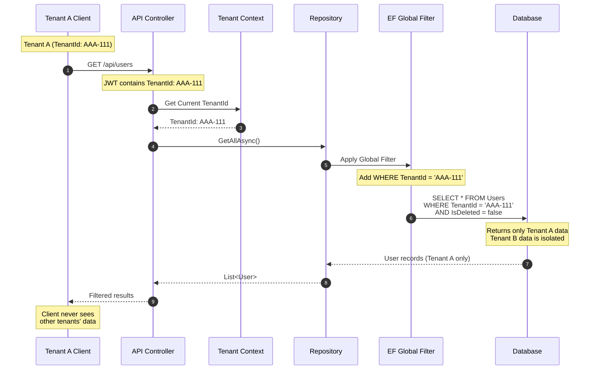
```mermaid
sequenceDiagram
    autonumber
    participant Client as Tenant A Client
    participant API as API Controller
    participant Context as Tenant Context
    participant Repo as Repository
    participant Filter as EF Global Filter
    participant DB as Database

    Note over Client: Tenant A (TenantId: AAA-111)

    Client->>API: GET /api/users
    Note over API: JWT contains TenantId: AAA-111

    API->>Context: Get Current TenantId
    Context-->>API: TenantId: AAA-111

    API->>Repo: GetAllAsync()

    Repo->>Filter: Apply Global Filter
    Note over Filter: Add WHERE TenantId = 'AAA-111'

    Filter->>DB: SELECT * FROM Users<br/>WHERE TenantId = 'AAA-111'<br/>AND IsDeleted = false

    Note over DB: Returns only Tenant A data<br/>Tenant B data is isolated

    DB-->>Repo: User records (Tenant A only)
    Repo-->>API: List<User>
    API-->>Client: Filtered results

    Note over Client: Client never sees<br/>other tenants' data
```

---

## Error Handling Flow

### Result Pattern Error Flow

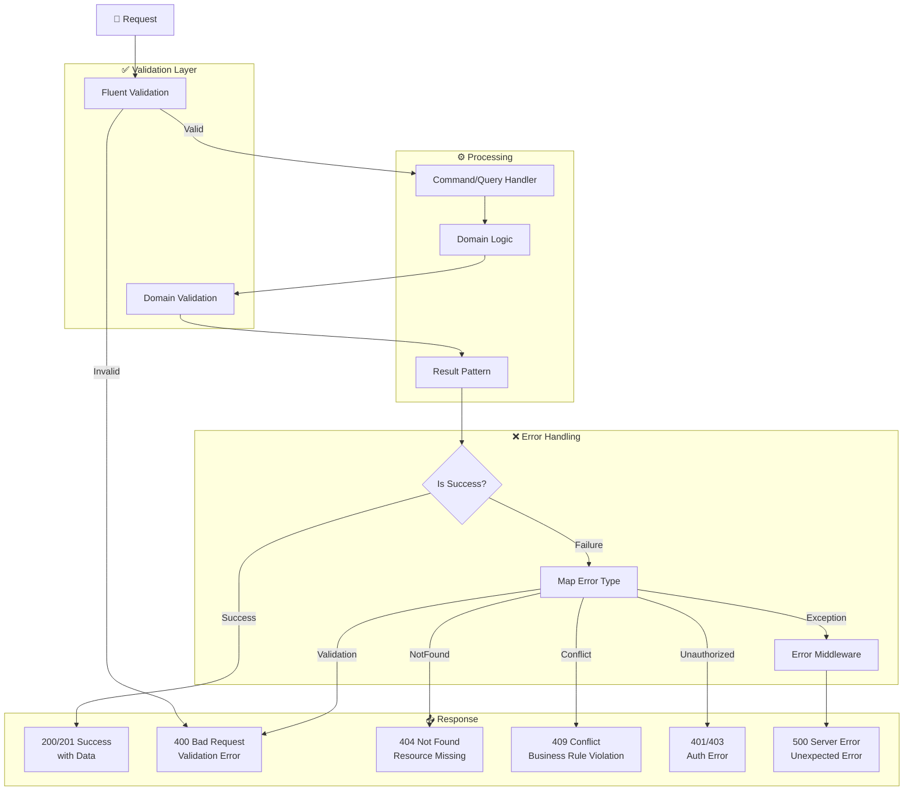
```mermaid
flowchart TB
    Request["📨 Request"]

    subgraph Validation["✅ Validation Layer"]
        FluentVal["Fluent Validation"]
        DomainVal["Domain Validation"]
    end

    subgraph Processing["⚙️ Processing"]
        Handler["Command/Query Handler"]
        Domain["Domain Logic"]
        Result["Result<T> Pattern"]
    end

    subgraph ErrorHandling["❌ Error Handling"]
        CheckResult{"Is Success?"}
        MapError["Map Error Type"]
        ErrorMiddleware["Error Middleware"]
    end

    subgraph Response["📤 Response"]
        Success["200/201 Success<br/>with Data"]
        BadRequest["400 Bad Request<br/>Validation Error"]
        NotFound["404 Not Found<br/>Resource Missing"]
        Conflict["409 Conflict<br/>Business Rule Violation"]
        Unauthorized["401/403<br/>Auth Error"]
        ServerError["500 Server Error<br/>Unexpected Error"]
    end

    Request --> FluentVal

    FluentVal -->|Invalid| BadRequest
    FluentVal -->|Valid| Handler

    Handler --> Domain
    Domain --> DomainVal

    DomainVal --> Result
    Result --> CheckResult

    CheckResult -->|Success| Success
    CheckResult -->|Failure| MapError

    MapError -->|Validation| BadRequest
    MapError -->|NotFound| NotFound
    MapError -->|Conflict| Conflict
    MapError -->|Unauthorized| Unauthorized
    MapError -->|Exception| ErrorMiddleware

    ErrorMiddleware --> ServerError
```

### Error Flow Example

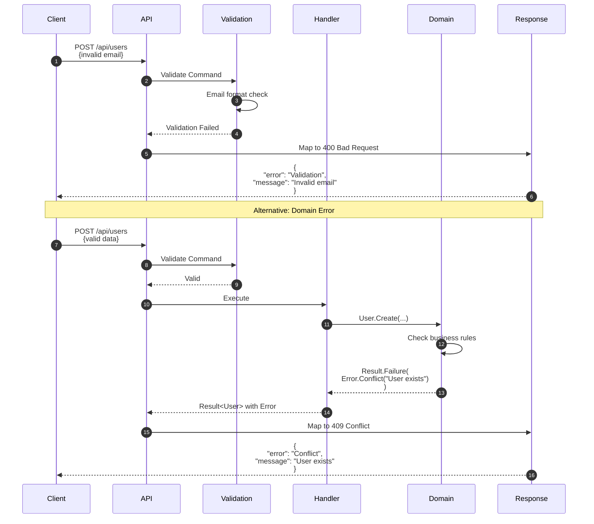
```mermaid
sequenceDiagram
    autonumber
    participant Client
    participant API
    participant Validation
    participant Handler
    participant Domain
    participant Response

    Client->>API: POST /api/users<br/>{invalid email}

    API->>Validation: Validate Command
    Validation->>Validation: Email format check
    Validation-->>API: Validation Failed

    API->>Response: Map to 400 Bad Request
    Response-->>Client: {<br/> "error": "Validation",<br/> "message": "Invalid email"<br/>}

    Note over Client,Response: Alternative: Domain Error

    Client->>API: POST /api/users<br/>{valid data}
    API->>Validation: Validate Command
    Validation-->>API: Valid

    API->>Handler: Execute
    Handler->>Domain: User.Create(...)
    Domain->>Domain: Check business rules
    Domain-->>Handler: Result.Failure(<br/> Error.Conflict("User exists")<br/>)

    Handler-->>API: Result<User> with Error
    API->>Response: Map to 409 Conflict
    Response-->>Client: {<br/> "error": "Conflict",<br/> "message": "User exists"<br/>}
```

---

## Complete Request Lifecycle

### End-to-End Request Flow

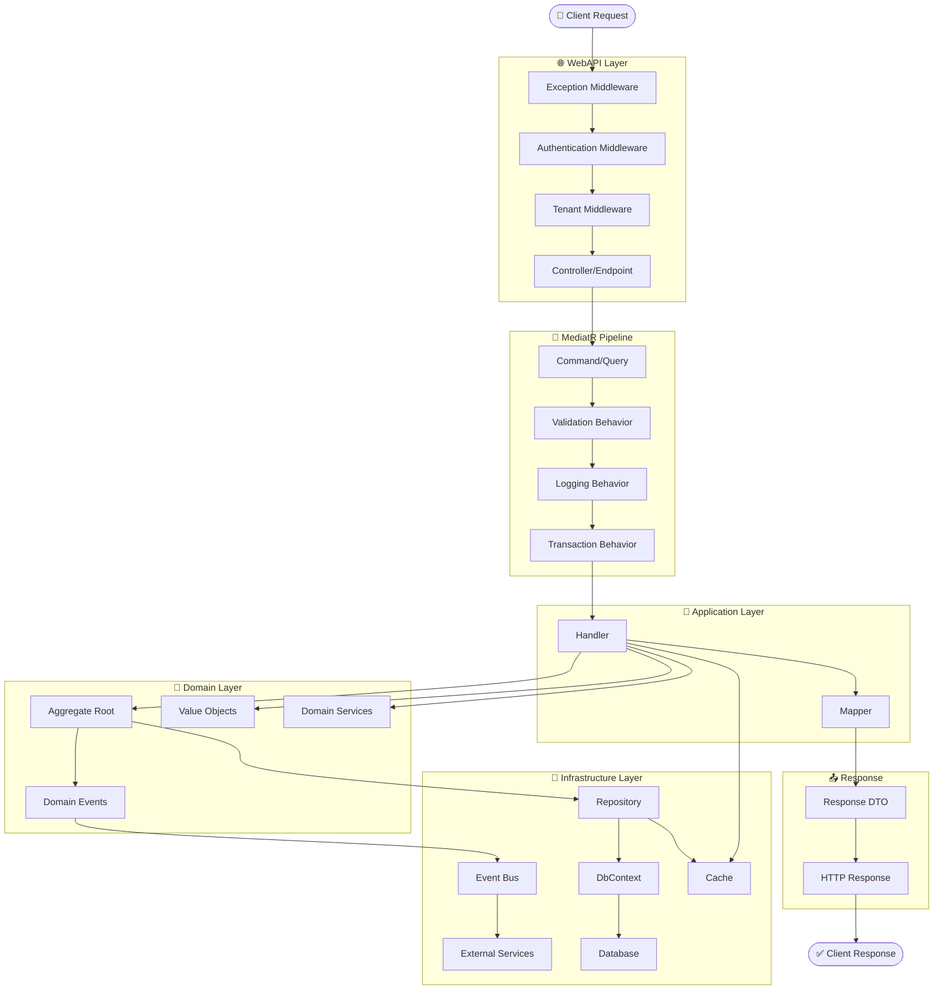
```mermaid
graph TB
    Start([👤 Client Request])

    subgraph WebAPI["🌐 WebAPI Layer"]
        Middleware1["Exception Middleware"]
        Middleware2["Authentication Middleware"]
        Middleware3["Tenant Middleware"]
        Controller["Controller/Endpoint"]
    end

    subgraph MediatR["📨 MediatR Pipeline"]
        CommandQuery["Command/Query"]
        Behavior1["Validation Behavior"]
        Behavior2["Logging Behavior"]
        Behavior3["Transaction Behavior"]
    end

    subgraph ApplicationLayer["🎯 Application Layer"]
        Handler["Handler"]
        Mapper["Mapper"]
    end

    subgraph DomainLayer["💎 Domain Layer"]
        Aggregate["Aggregate Root"]
        ValueObj["Value Objects"]
        Events["Domain Events"]
        DomainService["Domain Services"]
    end

    subgraph InfrastructureLayer["🔧 Infrastructure Layer"]
        Repository["Repository"]
        DbContext["DbContext"]
        Database["Database"]
        EventBus["Event Bus"]
        Cache["Cache"]
        ExtService["External Services"]
    end

    subgraph Response["📤 Response"]
        DTO["Response DTO"]
        HttpResponse["HTTP Response"]
    end

    End([✅ Client Response])

    Start --> Middleware1
    Middleware1 --> Middleware2
    Middleware2 --> Middleware3
    Middleware3 --> Controller

    Controller --> CommandQuery
    CommandQuery --> Behavior1
    Behavior1 --> Behavior2
    Behavior2 --> Behavior3
    Behavior3 --> Handler

    Handler --> Aggregate
    Handler --> ValueObj
    Handler --> DomainService

    Aggregate --> Events
    Aggregate --> Repository

    Repository --> DbContext
    DbContext --> Database

    Events --> EventBus
    EventBus --> ExtService

    Handler --> Cache
    Repository --> Cache

    Handler --> Mapper
    Mapper --> DTO
    DTO --> HttpResponse
    HttpResponse --> End
```

---

## Key Principles

### 1. **Unidirectional Dependency Flow**
- Dependencies point inward toward the domain
- Domain has no dependencies on outer layers
- Infrastructure implements domain interfaces

### 2. **CQRS Separation**
- Commands change state, return results
- Queries read data, return DTOs
- Different optimization strategies for each

### 3. **Event-Driven Architecture**
- Domain events capture important business occurrences
- Events enable loose coupling
- Asynchronous processing for side effects

### 4. **Result Pattern**
- No exceptions for business rule violations
- Explicit error handling through Result<T>
- Railway-oriented programming

### 5. **Multi-Tenant Isolation**
- TenantId extracted from authentication
- Automatic filtering at database level
- Row-level security enforcement

### 6. **Clean Boundaries**
- Each layer has clear responsibilities
- DTOs prevent domain leakage
- Mappers transform between layers

---

## Performance Considerations

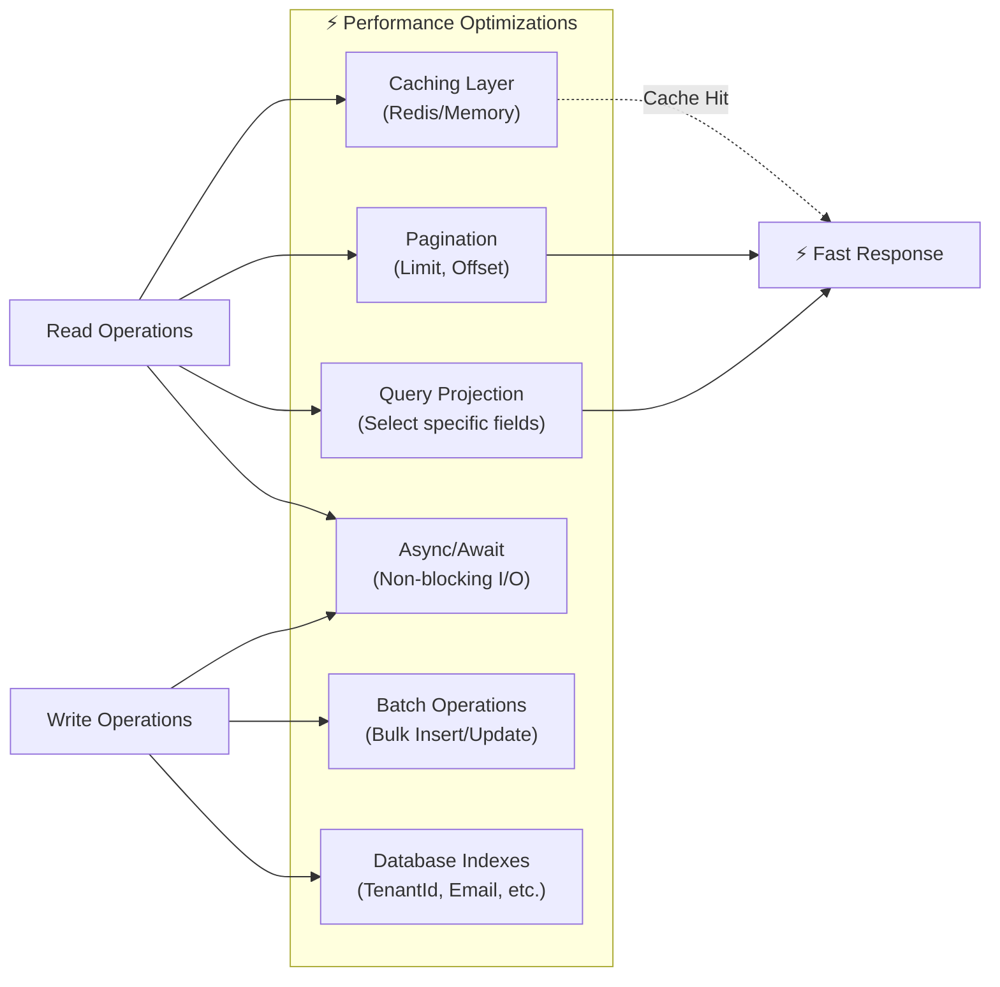
```mermaid
flowchart LR
    subgraph Optimizations["⚡ Performance Optimizations"]
        direction TB
        Cache["Caching Layer<br/>(Redis/Memory)"]
        Pagination["Pagination<br/>(Limit, Offset)"]
        Projection["Query Projection<br/>(Select specific fields)"]
        Async["Async/Await<br/>(Non-blocking I/O)"]
        Batching["Batch Operations<br/>(Bulk Insert/Update)"]
        Index["Database Indexes<br/>(TenantId, Email, etc.)"]
    end

    Read["Read Operations"] --> Cache
    Read --> Pagination
    Read --> Projection
    Read --> Async

    Write["Write Operations"] --> Batching
    Write --> Async
    Write --> Index

    Cache -.Cache Hit.-> FastResponse["⚡ Fast Response"]
    Pagination --> FastResponse
    Projection --> FastResponse
```

---

## Related Documentation

- [**ConcreteExample-CreateUser**](./ConcreteExample-CreateUser.md) - **Step-by-step code walkthrough** ⭐
- [DDD-ClassDiagrams](./DDD-ClassDiagrams.md) - Class structure diagrams
- [Phase2-Overview](./Phase2-Overview.md) - Complete DDD overview
- [DomainEntities](./DomainEntities.md) - Entity details
- [DomainEvents](./DomainEvents.md) - Event system
- [Application Layer README](../../source/Application/README.md) - CQRS implementation

---

**Last Updated:** April 02, 2026  
**Diagram Count:** 20 comprehensive data flow diagrams  
**Coverage:** End-to-end request lifecycle with DDD patterns including event handler registration and execution
